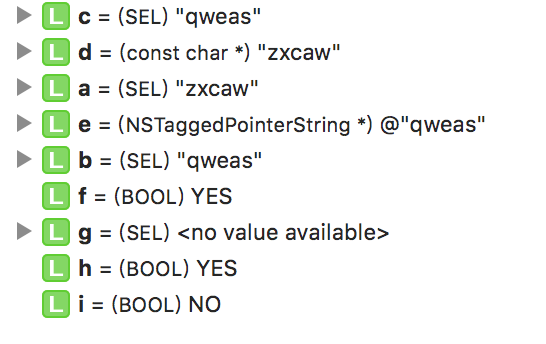

## 类中的成员变量操作方法

```objective-c
对类中成员变量的操作：
// 获取类中实例成员变量，从类对象中获取
Ivar _Nullable class_getInstanceVariable(Class _Nullable cls, const char * _Nonnull name)
// 获取类中类成员变量，从元类对象中获取
Ivar _Nullable class_getClassVariable(Class _Nullable cls, const char * _Nonnull name)
// 获取成员变量名称
const char * _Nullable ivar_getName(Ivar _Nonnull v)
// 获取成员变量的类型编码
const char * _Nullable ivar_getTypeEncoding(Ivar _Nonnull v)
// 设置成员变量值，实现私有成员变量的设置
void object_setIvar(id _Nullable obj, Ivar _Nonnull ivar, id _Nullable value)
// 获取成员变量值，实现私有成员变量的获取
id _Nullable object_getIvar(id _Nullable obj, Ivar _Nonnull ivar)
// 设置成员变量的值
void object_setIvarWithStrongDefault(id _Nullable obj, Ivar _Nonnull ivar, id _Nullable value)
// 获取当前类的成员变量列表
Ivar _Nonnull * _Nullable class_copyIvarList(Class _Nullable cls, unsigned int * _Nullable outCount)
  
// MRC下设置获取成员变量
Ivar _Nullable object_setInstanceVariable(id _Nullable obj, const char * _Nonnull name, void * _Nullable value) — 非ARC机制下使用
Ivar _Nullable object_getInstanceVariable(id _Nullable obj, const char * _Nonnull name, void * _Nullable * _Nullable outValue) —非ARC机制下使用
Ivar _Nullable object_setInstanceVariableWithStrongDefault(id _Nullable obj, const char * _Nonnull name, void * _Nullable value)。—非ARC机制下使用
```

>总结：
>
>1. object_setIvarWithStrongDefault和object_getIvar在ARC中没有区别，在未知的内存管理机制下，前者会把变量设置为strong，后者会把变量设置为unsafe_unretained
>2. 使用class_copyIvarList得到类的成员变量列表，在使用完后必须使用free()方法释放内存，否则操作内存泄漏。
>3. class_copyIvarList只能获取本类的成员变量不能获取父类成员变量。
>4. class_getInstanceVariable、class_getClassVariable、object_setIvar、object_getIvar、object_setIvarWithStrongDefault在本类中找不到成员变量会去父类中查找。


### 成员变量的读取与写入

```objective-c
  unsigned int outCount = 0;
  Ivar *vlist = class_copyIvarList(Student.class, &outCount);
  for (int i = 0; i<outCount; i++) {
    NSLog(@"%s --- %s", ivar_getName(vlist[i]), ivar_getTypeEncoding(vlist[i]));
  }
  free(vlist);
// 通过字符串获取当前类的元类的成员变量，当前元类中没有，去父元类中找。
  Ivar v1 = class_getClassVariable(Student.class, "_name"); 
  Ivar v2 = class_getInstanceVariable(Student.class, "_name"); // 通过字符串获取当前类中成员变量，当前类没有去父类中找。
  Student *pr = [[Student alloc] init];
  object_setIvar(pr, v2, @"13"); // 设置成员变量值 ,无视成员变量是否为私有
  NSString *temp = object_getIvar(pr, v2); // 获取成员变量值，无视成员变量是否为私有
  object_setIvarWithStrongDefault(pr, v2, @"14");

运行结果：
_myName --- @“NSString"
_listNum --- i
_className --- @"NSString"
```


## 类中的属性操作方法


```objective-c
成员属性操作：
// 根据获取成员属性，传入类对象获取类中的成员属性，传入元类对象获取元类中的成员属性
objc_property_t _Nullable class_getProperty(Class _Nullable cls, const char * _Nonnull name)
// 获取当前类中的成员属性，不会获得父类中的成员属性，并且使用完后需要使用free释放
objc_property_t _Nonnull * _Nullable class_copyPropertyList(Class _Nullable cls, unsigned int * _Nullable outCount)
// 获取成员属性名称
const char * _Nonnull property_getName(objc_property_t _Nonnull property)
// 获取成员属性的特征，读写、原子性、强弱引用等
const char * _Nullable property_getAttributes(objc_property_t _Nonnull property)
// 获取属性特征，返回一个数组
objc_property_attribute_t * _Nullable property_copyAttributeList(objc_property_t _Nonnull property, unsigned int * _Nullable outCount)
// 获取属性中某个特征的值
char * _Nullable property_copyAttributeValue(objc_property_t _Nonnull property, const char * _Nonnull attributeName)
```


>总结：
>
>1. class_getProperty()在当前类中找不到会去父类中查找。
>2. class_copyPropertyList会返回当前类、遵循的协议(父类协议)和分类中定义的属性，不会获取父类中的属性，使用完后需要调用free()释放内存。
>3. 属性特征见附件表1。

### 类中定义的属性读取

```objective-c
 // 通过字符串获取类中的属性
   objc_property_t p = class_getProperty(Student.class, "name"); 
  NSLog(@"%s, %s",property_getName(p), property_getAttributes(p));
  // 获取类中成员列表
  unsigned int outCount = 0;
  objc_property_t *plist = class_copyPropertyList(Student.class, &outCount);
  for (int i = 0; i<outCount; i++) {
    NSLog(@"%s --- %s", property_getName(plist[i]), property_getAttributes(plist[i]));
  }
  free(plist);  // 释放内存，防止泄漏
  // 获取属性的所有特征
  objc_property_attribute_t *attList = property_copyAttributeList(p, &outCount);
  for (int i = 0; i<outCount; i++) {
    NSLog(@"%s --- %s", attList[i].name, attList[i].value);
  }
  free(attList);  // 释放内存，防止泄漏
// 获取属性中某个特征值
  char *value = property_copyAttributeValue(p, "V");
  NSLog(@"%s", value);

执行结果：
name, T@"NSString",C,N,V_name
ext --- T@"NSString",C,N
className --- T@"NSString",C,N,V_className
hash --- TQ,R
superclass --- T#,R
description --- T@"NSString",R,C
debugDescription --- T@"NSString",R,C
myName --- T@"NSString",C,N
listNum --- Ti,N
T --- @"NSString"
C ---
N ---
V --- _name
_name
```


## 类中方法的操作

### SEL函数

```
SEL一个根据字符串生成的hash值，用来唯一标识一个类中的方法，并且提高方法查询的速度(使用SEL查询类的方法列表)。

// 根据字符串生成一个SEL
SEL _Nonnull sel_getUid(const char * _Nonnull str) 
// 根据字符串生成一个SEL，与sel_getUid()相同的方法实现，功能一模一样。
SEL _Nonnull sel_registerName(const char * _Nonnull str)
// 将SEL转换成字符串
const char * _Nonnull sel_getName(SEL _Nonnull sel)
// 判断SEL变量是否有值
BOOL sel_isMapped(SEL _Nonnull sel)
// 判断两个SEL是否相等
BOOL sel_isEqual(SEL _Nonnull lhs, SEL _Nonnull rhs) 
// 根据标识符生成一个SEL
@selector(标识符);
// 将SEL转换成一个OC字符串
NSStringFromSelector(SEL s);
```

```objective-c
SEL a = sel_getUid("zxcaw");
SEL b = sel_registerName("qweas");
SEL c = @selector(qweas);
const char * d = sel_getName(a);
NSString *e = NSStringFromSelector(b);
BOOL f = sel_isEqual(b, c);
SEL g = nil;
BOOL h = sel_isMapped(c);
BOOL i = sel_isMapped(g);
```



### Method函数

```objective-c
获取类对象和元对象方法：
// 获取类的实例方法，会以缓存、分类、原类、父类、根类这样的顺序进行查找。
Method _Nullable class_getInstanceMethod(Class _Nullable cls, SEL _Nonnull name)
// 获取类的类方法，会以缓存、分类、原类、父类、根类这样的顺序进行查找。
Method _Nullable class_getClassMethod(Class _Nullable cls, SEL _Nonnull name). 
// 获取当前类的所有已经实现的方法，包括分类中实现的方法，协议中定义和分类中定义没有实现的方法和父类的方法获取不到。
Method _Nonnull * _Nullable class_copyMethodList(Class _Nullable cls, unsigned int * _Nullable outCount) 

// 获取方法的SEL
SEL _Nonnull method_getName(Method _Nonnull m) 
// 获取方法的类型编码，返回值+参数列表
const char * _Nullable method_getTypeEncoding(Method _Nonnull m) 
// 获取参数列表中参数个数
unsigned int method_getNumberOfArguments(Method _Nonnull m)
// 获取返回值类型的类型编码—使用free()释放内存
char * _Nonnull method_copyReturnType(Method _Nonnull m)
// 获取参数列表中第n个参数类型的类型编码
char * _Nullable method_copyArgumentType(Method _Nonnull m, unsigned int index) 
// 获取方法返回值的类型编码，并保存到dst中，使用dst_len设置dst大小
void method_getReturnType(Method _Nonnull m, char * _Nonnull dst, size_t dst_len) 
// 将方法参数列表中第n个参数的类型编码保存到dst中，使用dst_len设置dst大小
void method_getArgumentType(Method _Nonnull m, unsigned int index,  char * _Nullable dst, size_t dst_len) 
// 获取方法声明
struct objc_method_description * _Nonnull method_getDescription(Method _Nonnull m) 

// 获取Method结构体中的IMP参数
IMP _Nonnull method_getImplementation(Method _Nonnull m) 
// 获取指定对象的方法地址，指定类对象则获取实例方法，指定元类对象则获取类方法，当前类、父类和根类都没有找到，则返回_objc_msgForward()
IMP _Nullable class_getMethodImplementation(Class _Nullable cls, SEL _Nonnull name)
IMP _Nullable class_getMethodImplementation_stret(Class _Nullable cls, SEL _Nonnull name)  —与上面方法区别
// 给方法设置新的IMP
IMP _Nonnull method_setImplementation(Method _Nonnull m, IMP _Nonnull imp)
// 替换两个方法的IMP
void method_exchangeImplementations(Method _Nonnull m1, Method _Nonnull m2) 
// 方法执行
void method_invoke(void /* id receiver, Method m, ... */ ) 
void method_invoke_stret(void /* id receiver, Method m, ... */ ) 
 id _Nullable method_invoke(id _Nullable receiver, Method _Nonnull m, ...) 
void method_invoke_stret(id _Nullable receiver, Method _Nonnull m, ...) 
```

>**总结：**
>
>1. 在获取类的方法(class_getInstanceMethod和class_getClassMethod方法)时，如果方法没有实现，则获取失败。
>2. 获取使用class_getMethodImplementation方式获取IMP时，如果方法没有实现，则返回消息转发方法地址_objc_msgForward()。即只有声明没有实现的方法，不会保存在类对象或者元类对象的方法列表中。
>3. class_copyMethodList只会获取到当前类的所有实现的方法，包括当前类的分类中实现的方法。
>4. 给方法设置一个新的IMP时，新方法类型编码不是旧方法类型编码的前缀，则新方法中获取到的参数会是错误的。
>5. 使用method_invoke方法时，需要对其进行强制类型转换，转换成与方法的类型编码一致的数据类型

  >v24 @0 :8  @16 ：方法参数占24个字节，第一个参数为id类型从第0位开始，第二个参数为SEL从第8位开始，第三个参数为id类型从第16位开始。

```objective-c

获取当前类中已经实现的所有方法

    unsigned int outCount = 0;
    // 获取当前类的所有已经实现的方法，包括分类中的，不会获取父类和父类分类中的方法
    Method *mlist = class_copyMethodList(Student.class, &outCount);
    for (int i = 0; i<outCount; i++) {
        NSLog(@"%@ --- %s", NSStringFromSelector(method_getName(mlist[i])), method_getTypeEncoding(mlist[i]));
    }
    free(mlist);

运行结果：
    // Student类中的方法
getClassStruct --- v16@0:8
className --- @16@0:8
setClassName: --- v24@0:8@16
    //Student类实现的协议中的方法
setMyName: --- v24@0:8@16
superProtocolFunc --- v16@0:8
firstFuncOfMyProtocol: --- v24@0:8@16
    // Student类的分类中的方法
studentExten --- v16@0:8
    // 系统方法
.cxx_destruct --- v16@0:8

获取当前类或父类中已经实现的某个方法，并查看方法详情(SEL、TypeEncoding、IMP)
    // 获取Student的父类中多个参数的类方法的信息，由于该方法只有声明没有实现获取失败
    Method testM0 = class_getClassMethod(Student.class, @selector(testWith2:second:third:));
    // 获取Student的父类中多个参数的方法的信息
    Method testM1 = class_getInstanceMethod(Student.class, @selector(testWith1:second:third:));
    // 获取方法SEL
    SEL testSEL = method_getName(testM1);
     // 获取方法的类型编码，返回值+参数列表
    const char *testMType = method_getTypeEncoding(testM1);
    // 获取返回值的类型编码
    const char *testMReturnType = method_copyReturnType(testM1);
    // 获取参数列表中参数个数
    unsigned int testMNum = method_getNumberOfArguments(testM1);
    NSLog(@"%@ --- %s --- %s --- %i",NSStringFromSelector(testSEL) , testMType, testMReturnType, testMNum);
    free(testMReturnType); // 释放内存
    for (int i = 0; i<testMNum; i++) {
        // 获取参数列表中第n个参数
        char * temp = method_copyArgumentType(testM1, i);
        if (i == testMNum-1) {
            printf("%s\n", temp);
        }else{
            printf("%s  --  ", temp);
        }
        free(temp); // 释放内存
    }
    // 获取方法声明
    struct objc_method_description * _Nonnull des = method_getDescription(testM1);
    NSLog(@"%@ --- %s", NSStringFromSelector(des->name) , des->types);

运行结果：
testWith1:second:third: --- @32@0:8i16@20i28 --- @ --- 5
@  --  :  --  i  --  @  —  i
testWith1:second:third: --- @32@0:8i16@20i28

获取当前类或父类中已经实现的某个方法的方法地址
     //第一种方式，根据Method获取方法地址，如果方法没有实现，则返回NULL
    Method m = class_getInstanceMethod(Student.class, @selector(run:));
    IMP mIMP = method_getImplementation(m);
    // 第二种方式，根据类对象和元类对象获取指定SEL的方法地址，如果方法没有实现，则返回消息转发方法地址_objc_msgForward()
    IMP testIMP1 = class_getMethodImplementation(Student.class, @selector(run:));
    IMP testIMP2 = class_getMethodImplementation(Student.class, @selector(run1:));

方法交换
    // 方法交换，将Person类中类方法的地址和对象方法地址进行交换
    Method go = class_getClassMethod(Person.class, @selector(go:));
    Method test = class_getInstanceMethod(Person.class, @selector(testWith1:second:third:));
    method_exchangeImplementations(go, test);
    [Person go:12]; // 使用类对象调用实例方法

给方法设置一个新的方法实现
-(void)run:(NSString *)name; // Person类的run方法声明

void speak1(){
    NSLog(@"speak --- ");
}

void speak2(SEL sel,id obj){
    NSLog(@"speak --- %@ --- %@", obj, NSStringFromSelector(sel));
}

NSString * speak3(id obj, SEL sel){
    NSLog(@"speak --- %@ --- %@", obj, NSStringFromSelector(sel));
    return @"321";
}

    Method m = class_getInstanceMethod(Student.class, @selector(run:));
    //替换成无参数的方法
    method_setImplementation(m, (IMP _Nonnull)speak1);
    ((void(*)(id, Method, NSString *))method_invoke)(Person.class, m, @"123"); // 传递
    //新的方法参数列表的参数类型顺序改变，导致参数类型错误
    method_setImplementation(m, (IMP _Nonnull)speak2);
    ((void(*)(id, Method, NSString *))method_invoke)([Person new], m, @"123");
    // 替换成有返回值的方法
    method_setImplementation(m, (IMP _Nonnull)speak3);
    NSString *s = ((NSString *(*)(id, Method, NSString *))method_invoke)([Person new], m, @"123");
    NSLog(@"%@ --- %s", s, method_getTypeEncoding(m));
```

>method_invoke方法的使用：
>
>1.例如调用一个方法类型编码为v@:@“NSString”，无返回值，参数列表为self、Method、字符串，前两个参数是固定的调用者和调用的方法结构体，后面的参数就是方法需要的参数列表
>((Void(*)(id, Method, NSString*))method_invoke)(Person.class, m, @“123”);
>
>2.例如调用一个方法类型编码为@“NSString”@:i，返回值为字符串，参数列表为self、Method、整型，前两个参数是固定的调用者和调用的方法结构体，后面的参数就是方法需要的参数列表
>((NSString*(*)(id, Method, int))method_invoke)(Person.class, m, 12);

### IMP函数

