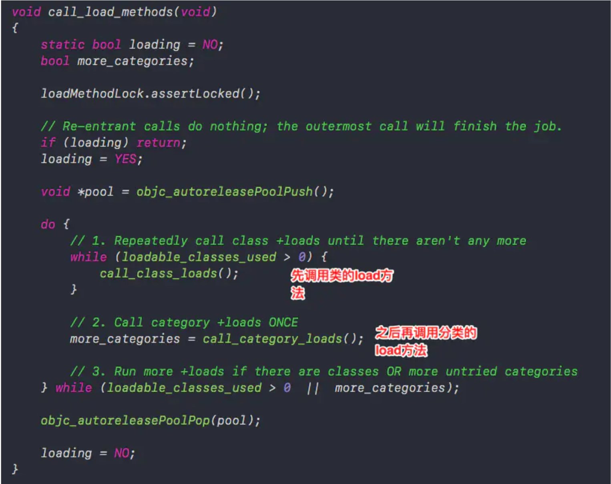

# 分类

## 分类的结构(分类为何不能添加成员变量)

### 分类结构

```objective-c
struct category_t {
    const char *name;
    classref_t cls;
    struct method_list_t *instanceMethods; // 对象方法
    struct method_list_t *classMethods; // 类方法
    struct protocol_list_t *protocols; // 协议
    struct property_list_t *instanceProperties; // 属性
    // Fields below this point are not always present on disk.
    struct property_list_t *_classProperties;

    method_list_t *methodsForMeta(bool isMeta) {
        if (isMeta) return classMethods;
        else return instanceMethods;
    }

    property_list_t *propertiesForMeta(bool isMeta, struct header_info *hi);
};
```

>从上面可以看出，分类中没有ivar_list结构体，因此分类中只保存了方法、属性和协议。
>
>分类中可以定义属性，但是没有相对应的方法实现和成员变量。

## 分类方法的调用

### 分类如何关联原类

> 分类中定义的方法是可以被原类对象使用的，它的原理：
>
> 它是借助着runtime来实现，程序启动时，会遍历当前类的所有分类，类对象中专门准备了一个`二维数组`用来保存原类和分类中的方法、属性和协议。
>
> 二维数组数组保存数据的顺序为：后编译的分类数据放在前面，然后在是先编译的分类数据，最后才是原类数据。


## load和initialize区别

>load和initialize最大的区别：
>
>1、调用方式的不同，load是直接使用地址调用，initialize是通过消息发送机制来调用的。
>
>2、调用次数的不同，程序启动时，每个类(包括分类)的load的方法都会被调用，initialize方法只会被调用一次而且是在第一次使用的时候调用，由于走消息发送机制，因此会被分类中的initialize覆盖。



>从源码可以看出程序启动时，使用while调用所有类的load方法，然后在调用所有分类中的load方法。
>
>原类中load方法的调用顺序：先编译的先调用。
>
>分类中load方法的调用顺序：先编译的先调用。