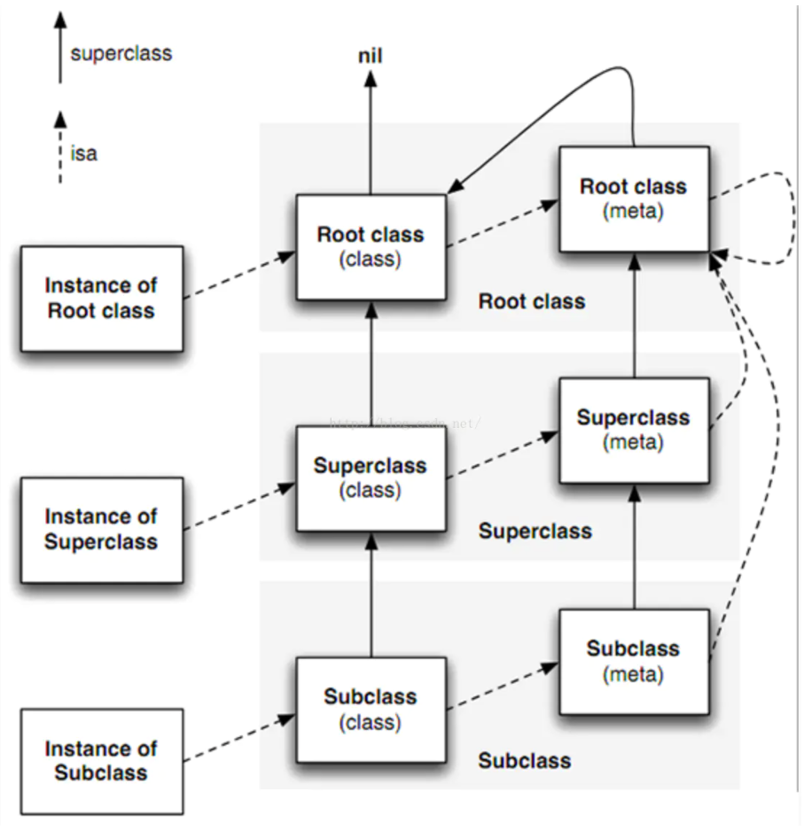

# OC类结构分析

​	OC的引用类型的数据都是使用结构体实现的，OC中调用方法时，并不能直接找到对应的方法实现地址，而是需要去查询，对象的方法都保存在类对象这个结构体的一个集合中，需要通过key来获取方法的地址。因此OC这门语言是动态语言，它借助Runtime来实现。

## OC类的继承关系图



> 上图为OC中实例对象、类对象和元类对象的关系。
>
> 实例对象通过isa指针，保存类对象的地址。
>
> 类对象中保存这个类定义的实例方法、实例属性、实例成员变量、遵循的协议。
>
> 
>
> 类对象中存在两个指针：isa和superClass
>
> 1、isa指针指向类对象的元类对象，元类对象保存着类定义的类方法、类属性。
>
> 2、superClass指针指向该类的父类类对象。
>
> 
>
> 元类对象中也存在两个指针：isa和superClass
>
> 1、isa指针指向NSObject的元类对象，NSObject的元类对象指向自己本身。
>
> 2、superClass指针指向该类的父类元类对象。


## OC类对象、元类对象和实例对象的结构

### Object结构体：

```objective-c
struct objc_object {
    Class isa  OBJC_ISA_AVAILABILITY;
};

typedef struct objc_object *id;
```

### class结构体

```objective-c
struct objc_class {
    Class _Nonnull isa  OBJC_ISA_AVAILABILITY;

#if !__OBJC2__
    Class _Nullable super_class;                                   // 父类指针
    const char * _Nonnull name;                                		 // 类名称
    long version;                                                  // 类版本
    long info;                                                     //
    long instance_size;                                            // 对象大小
    struct objc_ivar_list * _Nullable ivars;                       // 成员变量列表
    struct objc_method_list * _Nullable * _Nullable methodLists;   // 方法列表                 
    struct objc_cache * _Nonnull cache;                            // 方法缓存列表
    struct objc_protocol_list * _Nullable protocols;          		 // 遵循的协议列表
#endif

} 

typedef struct objc_class *Class;
```

### 方法结构体

```objective-c
typedef struct objc_method *Method;
typedef struct objc_selector *SEL;
typedef id (*IMP)(id, SEL, ...); 

struct objc_method {
    SEL method_name;                                          // 方法名称;
    char *method_types;                                       // 方法类型;
    IMP method_imp;          										  					 // 方法地址
}
```

### 分类结构体

```objective-c
struct category_t { 
    const char *name; 													// 扩展的类名称
    classref_t cls; 														// 扩展的类对象指针
    struct method_list_t *instanceMethods;        // 分类中添加的实例方法
    struct method_list_t *classMethods;           // 分类中添加的类方法
    struct protocol_list_t *protocols;            // 分类中遵循的协议
    struct property_list_t *instanceProperties;   // 分类中定义的实例属性
};
```


## 缓存结构体

> 类对象中的一个hash表，保存着当前类最近调用的本类实例方法和父类实例方法，当缓存空间不够时，会自动进行扩容。
>
> 如果当前类第一次调用父类实例方法时，但父类实例对象调用过多次，此时会访问父类的cache表，获取该方法的地址，并将该方法缓存到本类的cache中，下次调用不在需要去父类寻找。

## OC方法调用过程

	>[Person getName]这个方法的消息发送流程：
	>
	>1. 首先将代码变成objc_msgSend()，传入调用者、目标SEL和方法参数。
	>2. 检查SEL是否需要忽略，在macOS系统因为有垃圾回收机制，不需要再调用release和retain方法，因此会直接忽略。
	>3. 检查调用者是否为nil，OC允许调用者为nil，并且不会Crash。
	>4. 根据调用者的isa指针找到类对象或者元类对象。
	>5. 首先查找cache中是否记录过与目标SEL匹配的Method，如果记录了直接从缓存中获取Method，并执行对应的IMP。
	>6. 如果没有则从mehtod_list中寻找与目标SEL匹配的Method。
	>7. 如果没有则从通过superclass获取父类地址，重复3和4两步。
	>8. 如果还是没有则通过superclass获取到根类地址，重复3和4两步。
	>9. 如果还是找不到，则进入转发机制获取方法，如果还是找不到程序崩溃。


## Runtime方法


### 获取类信息

```
object_getClass(Class Clazz)    // 获取类对象
objc_getMetaClass(Class clazz)  // 获取类对象的元类对象
class_getSuperclass(Class clazz) // 获取父类类对象
[ZPPerson new].class == ZPPerson.class // 获取类对象
```

