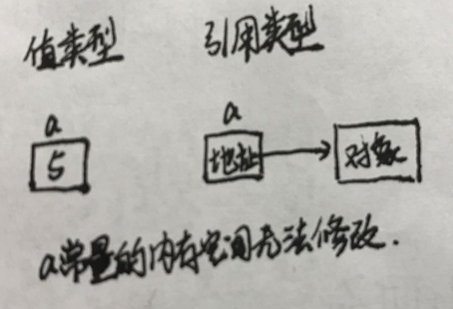
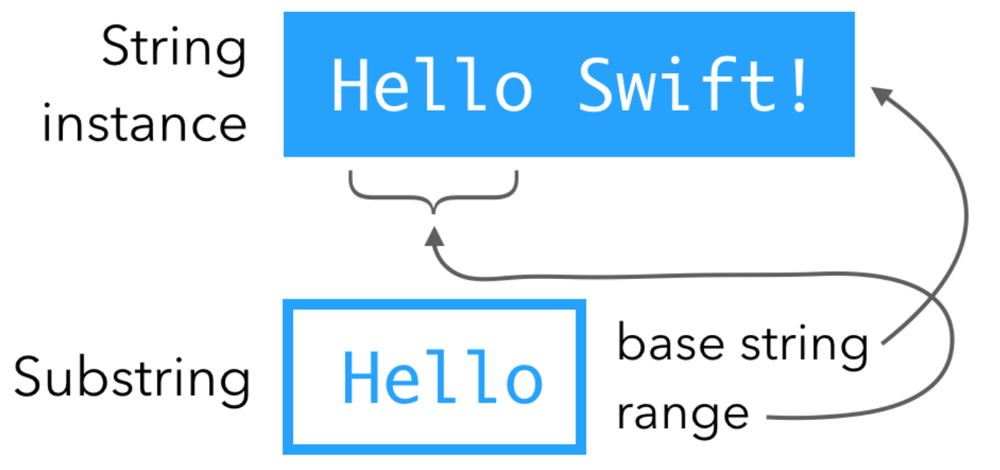

# swift中的两类数据类型


> 值类型：变量和常量的存储空间`直接保存数据值`。
>
> 引用类型：变量和常量的存储空间保存`存储数据值的内存地址`。
>
> swift中的值类型：
>
>  	1. 基本数据类型：Int、Float、Double、Character、String
>  	2. 集合数据类型： `Array`、`Set`、`Dictory`
>  	3. 其他数据类型：`枚举`、`结构体`
>
> swift中的引用类型：类
>
> `数组、Set集合、字典进行常量或变量赋值、函数参数传递时，是值拷贝`
>
> 


验证数组是值类型

```swift
var arr1 = [1,2,3,4,5]
var arr2 = arr1
arr1[0] = 12
print("\(arr1) ---- \(arr2)")

执行结果：[12, 2, 3, 4, 5] ---- [1, 2, 3, 4, 5]

代码分析：
从上面打印结果可以看出swift数组是直接进行值拷贝，而不是引用拷贝
```


## 变量、常量、字面量

变量：使用var声明的标识符为变量

常量：使用let声明的标识符为常量

字面量：像"123"、12、"c"都是字面量

### 常量、变量的三种状态

三种状态：未初始化状态、初始化状态、nil

> 未初始化状态：只申请完内存空间，还没有给内存空间设置初值
>
> 初始化状态：给内存空间设置完初始值
>
> nil：已经对内存空间初始化完毕，只是初始值为空

### 常量保存值类型和引用类型区别

常量保存值类型时，直接将数据保存到常量对应的内存空间中，因此无法修改常量内存中的值。

常量保存引用类型时，常量内存空间中保存的是引用类型的地址，因此常量空间无法修改，但是引用类型地址指向的内存空间可以修改。



> 常量保存集合类型数据时，由于集合数据是值类型，因此不能对集合中的数据进行修改。


## 整型与浮点型

swift提供的数字类型：

整型：Int、Int8、Int16、Int32、Int64，UInt、UInt8、UInt16、UInt32、UInt64

浮点型：Float和double


### 类型转换

>字符串转换成数字注意：
>
>1. 转换后获得的都是可选类型，因为存在转换失败的情况
>2.  将小数字符串转换成整型时，不能直接转换，需要`先转换成浮点型然后转换成整型`，`直接转换为nil`。

```swift

// 整型和浮点型相互转换
var iNum:Int = Int(2.334) // Float -> Int
var fNum:Float = Float(23) // Int -> Float
var dNum:Double = Double(234)  // Int -> Double

// 字符串转换成数字，得到的是可选类型
var iNum1:Int? = Int("23")
var fNum1:Float? = Float("23.56")
var dNum1:Double? = Double("23.56")

// 如果字符串内容是小数，不能直接转换，需要先转换成浮点型然后转换成整型，直接转换为nil。
var iNum2:Int? = Int(Float("23.56") ?? 0)
```


### 数字之间的运算

```swift
// 长度不同的数据类型需要进行转换后才能进行运算
var iNum1:Int8 = 8
var iNum2: Int16 = 16
var iNum3:Int16 = iNum2 + Int16(iNum1)

var uNum1:UInt8 = 8
var uNum2: UInt16 = 16
var uNum3:UInt16 = uNum2 + UInt16(uNum1)

// 有符号和无符号无法运算
var iNum1:Int8 = -8
var uNum2:UInt8 = 8
var iNum3:Int8 = iNum1 + Int8(uNum2)

// 整数和浮点数
var iNum1:Int8 = 8
var fNum2:Float = 2.3
var fNum3:Float = fNum2 + Float(iNum1)
var dNum4:Double = Double(fNum2) + Double(iNum1)

// 字面量无需进行转换
var x:Double = 12 + 2.356

```


> 数字类型常量或者变量无法进行运算的原因：
>
> 1. 两者长度不同，例如Int8和Int16，由于长度不同，需要转换成相同长度的数据才能相加。
> 2. 两者代表的数字集群不同，例如有符号Int和无符号UInt无法进行运算，需要进行转换。
> 3. 两者数据类型不同，浮点数和整数无法运行，需要进行类型转换。
>
> 
>
> 字面量直接运算时，无需进行类型转换


## 元组

一种复合的数据类型，可以将多个不同的数据类型组合成整体，有点像结构体，元组中可以保存`值类型和引用类型数据`

```swift
class Person{
    var name = "aaa"
    init(_ name:String) {
        self.name = name
    }
}

// 第一种定义方式
var i = (Person("Tom"), 12, "山东省")
print("\(i.0.name) --- \(i.1)  ---\(i.2)")

// 第二种定义方式
var j = (person:Person("John"), age:18, address:"湖北省")
print("\(j.person.name) --- \(j.age) --- \(j.address)")

// 第三种定义方式
var k:(p:Person, age:Int, address:String) = (Person("Mary"), 16, "NewYork")
print("\(k.p.name) --- \(k.age) --- \(k.address)")
```


>元组常用的地方：一般用在函数返回值中，实现函数返回多个数据。对于定义的无返回值函数其实是有返回值的，返回值是`Void`。
>
>`public typealias Void = ()`，系统中Void类型就是一个空元组


## Character、String、SubString

Character：代表单个字符，使用双引号。

String：代表字符串，使用双引号

SubString：从字符串中截取的一段，与原字符串共享内存，只保存一个类似Range的结构体(记录起始位置和长度)。

> 由于使用Unicode编码，因此一个汉字不再是两个字符，而是一个字符，使用count计算的也是按照字符来计算长度。

### 字符串方法

swift字符串截取使用的是下标，str[0..<4]截取字符串前4位

```swift
// 字符串长度
var str1 = "cn"
var str2 = "中国"
print("\(str1.count) --- \(str2.count)")


// 字符串拼接
var str3 = str1 + str2
str1.append(contentsOf: "123")
var str4 = str1.appendingFormat("%@ --- %@", str2, "s")
print("\(str3) --- \(str4)")

// 字符串遍历
for item in str3{
    print(item, separator: "", terminator: " ")
}
print()

// 判断是否包含
print("\(str4.contains("c")) --- \(str4.contains("cn"))")

// 截取
var str5 = "cn123中国年"
var t1:Substring = str5.prefix(4)  // 截取前4位
var t2:Substring = str5.suffix(4) // 截取后4位
var startIndex = str5.index(str5.startIndex, offsetBy: 1)
var endIndex = str5.index(str5.endIndex, offsetBy: -1)
var t3:Substring = str5[startIndex..<endIndex] //截取范围
print("\(t1) --- \(t2) --- \(t3)")
str5 = ""
print("\(str5) --- \(t3)")

// 替换
var str6 = " 1 2 3 4 5 "
print(str6)
print(str6.replacingOccurrences(of: " ", with: "")) // 删除字符串中的空格
print(str6.trimmingCharacters(in: CharacterSet.whitespaces)) // 删除首尾空格
print("分割: \(str6.components(separatedBy: " "))") // 将字符串按照空格分割并保存到数组中
let str6_1 = ["1", "2", "3", "4"]
print("\(str6_1.joined(separator: "_"))") // 将字符数组拼接成字符串

// 插入
t3.insert("d", at: t3.index(t3.startIndex, offsetBy: 4))
print(t3)
t3.insert(contentsOf: "cba", at: t3.index(t3.startIndex, offsetBy: 5))
print(t3)

// 删除
var str7 = "中23国123456"
str7.remove(at: str7.index(str7.startIndex, offsetBy: 1))
print(str7)
let range = Range(NSRange(location: 0, length: 2), in: str7)
str7.removeSubrange(range!)
print(str7)

```


### String与SubString关系

String是一个结构体，内部并不保存字符串，而是使用指针指向保存字符串的内存空间。

SubString是通过String截取获得的，SubString是字符串的一个片段，并共享字符串内存空间。



只有当string和substring变量都释放时，字符串内存空间才会释放，否则不会释放。例如上面代码中的str5和t3，t3是从str5中截取的字符串片段，当str5设为空字符串时，t3还是原来的值。


`尽量少使用SubString，由于共享内存的特性，只有还有SubString使用字符串，字符串所在内存空间就不会释放`

