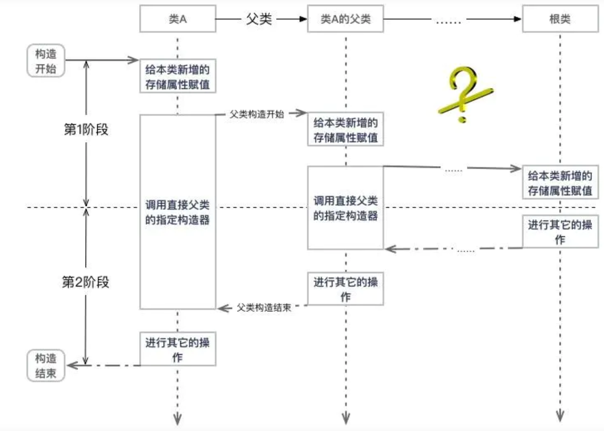
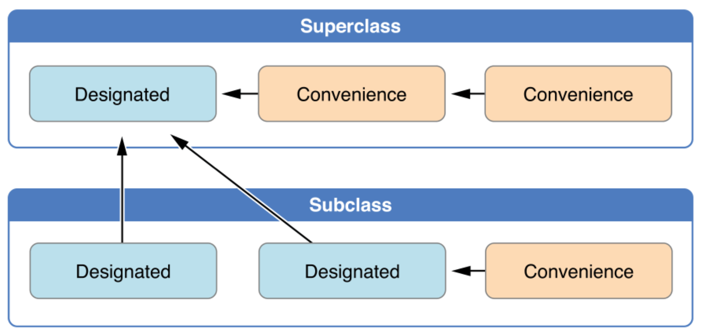

# 数据类型初始化方式

​		swift中，所有数据类型对应的实例必须初始化完成，才能使用。例如`类实例`、`结构体`中`所有的非可选类型的存储属性`必须在`构造方法执行完成前初始化完毕`，否则报错。

​		因此swift提供了两种初始化方式，直接在`属性定义时设置初始值`，或者`使用构造函数`。

## 直接设置属性默认值

对于类或者结构体中的常量或者不会修改的变量，一般使用直接设置默认值的方式，方便并且减少构造方法代码量，让构造方法更整洁。

### 通过字面量

在`非可选类型的存储属性`定义时设置初始值

```swift
class Person{
  var name:String = "Peter"
  var age:Int = 18
  var address:String?
  var description:String{
    return name+"\(age)"
  }
}

解释：
定义了name和age两个非可选类型存储属性，使用直接设置默认值方式，保证创建类实例时，非可选存储属性都初始化了
定义了address可选类型属性，可以不用设置初始值，系统默认初始化为nil
```


### 通过函数或者闭包

在属性定义时，设置一个闭包或者函数，在实例构造时执行。但是`闭包中不能使用self访问类中成员`，因为它们有的可能还没有初始化完毕。

使用闭包或者函数初始化属性时，`后面需要跟着()`，否则编译器认为该属性保存的是一个闭包或者函数指针。

```swift
class Person{
  var name:String = {
    return "Peter"
  }()
  var age:Int = {
    return 18
  }()
}
```


## 构造方法

​		一般需要由外部定制类或者结构体属性值时，使用构造方法初始化。

​		在构造函数中初始化类中所有的`常量`或者`变量`存储属性。

​		

> 构造函数初始化属性注意：
>
> 1. 构造方法必须保证`覆盖类中所有非可选类型属性`的初始化，否则编译报错。
> 2. 本类构造函数不能初始化父类的属性，在哪里定义的属性就在哪里初始化。


> swift提供的构造方法：
>
> 1. 指定初始化器
>    1. 默认构造方法，当定义类或者结构体时，没有设置任何构造方法，系统会默认添加一个构造方法。
>    2. 自定义构造方法：用户根据业务逻辑添加的定制构造方法。
>    3. 可失败构造函数：允许创建实例失败的构造方法，返回一个nil。
>    4. 必要构造函数：使用`required`关键字修饰的构造函数。
> 2. 便捷构造方法：`convenience`关键字修饰的构造方法，`必须在其中调用自定义构造方法`。
>
> 
>
> 每个类中必须至少有一个指定初始化器。


 ### 构造方法定义格式

构造方法统一使用`init`作为方法名，是一个无返回值的函数。

```swift
class SomeClass{
  
  	init(参数列表){
      
    }
}
```

### 构造函数委托

构造函数委托：在构造函数中调用其他的构造函数，实现构造函数代码的复用。

```swift
class Person{
	var name:String
	var age:Int
	
	init(name:String, age:Int){
		self.name = name
		self.age = age
	}
	
	// 利用构造函数委托充分复用以前的代码，复用init(name,age)构造函数。
  init(name:String){
    self.init(name:name, age:18)
  }
	
}
```


#### 值类型构造函数委托

像结构体、枚举这种值类型的构造函数委托，直接在构造函数中使用`self.init`调用其他构造方法就行，非常简单。

```swift
struct Point{
  var x:int
  var y:int
  
  // 使用构造函数委托
  init(){
    self.init(x:0, y:0)
  }
  
  init(x:Int, y:Int){
    self.x = x
    self.y = y
  }
}
```


#### 类类型构造函数委托

对于类类型这种构造函数委托，由于涉及到继承的问题，需要使用`super.init`调用父类构造函数完成从父类中继承的属性的初始化。

> swift中的属性初始化原则：父类的属性`必须`交由父类构造函数初始化，子类属性`必须`交由子类构造函数初始化


##### 类类型初始化的两段式过程

> 初始化第一阶段步骤(属性初始化)：
>
> 1. 在子类构造函数中，给子类中`所有非可选类型存储属性`设置初始值。
> 2. 使用`super.init`调用父类构造函数，在父类构造函数中，对父类`所有非可选类存储属性`设置初始值。
>
> 初始化第二阶段步骤(定制属性值，或者调用类中其他方法)：
>
> 1. 父类构造函数设置完所有属性初始值后，可以修改父类属性值，或者调用父类的一些其他方法。
> 2. 父类构造函数执行完毕，返回到子类构造函数中，可以修改子类或者父类属性值，或者调用子类或父类的方法。

```swift
class SuperClass{
  var superName:String
  var superCount:Int
  init(superName:String, superCount:Int){
    self.superName = superName
    self.superCount = superCount
    // ----初始化第一阶段完成，定制属性值或者调用方法 ----
    self.superName.append("s")
		self.superFun(str:"Super")
  }
  
  func superFun(str:String){
    print("SuperClass --- superfun --- \(str)");
  }
}

class SubClass: SuperClass{
  var subName:String
  
  init(subName:String, name:String, count:Int){
    self.subName = subName
    super.init(superName:name, superCount:count)
    // ----- 初始化第一阶段完成，定制属性值或者调用方法 ----
    self.subName.append("s")
    self.superFun(str:"sub")
		self.subFun(str:"sub")
  }
  
  func subFun(str:String){
    print("SubClass --- subFun --- \(str)")
  }
}

var ssa = SubClass1(subName: "aa", name: "bb", count: 3)

打印结果：
SubClass构造函数
SuperClass构造函数
SuperClass --- superfun --- Super
SuperClass --- superfun --- sub
SubClass --- subFun --- sub
```




##### 构造函数调用规则


> 调用规则：
>
> 1. 所有类如果有父类，必须在指定初始化器中调用父类的指定初始化器，并且只有指定初始化器才能调用父类构造方法，便携构造函数不行。
> 2. 指定初始化器不能调用本类或者父类的便携构造函数。
> 3. 所有类中的便携构造函数，必须先调用本类的其他构造函数完成属性初始化。
> 4. 类中的便携构造函数最终必须调用本类的指定初始化器，因为便携构造函数无法进行属性初始化。
> 5. 便携构造函数不能调用父类构造函数。




> 上图用来表述构造函数调用规则，或者说是委托规则，所有类的便携构造函数最终必须调用本类的指定初始化器，所有类的指定初始化器必须调用父类的初始化器。


### 构造函数继承与重写

#### 构造函数继承

swift中，子类一般不会继承父类的构造函数。

> swift让子类继承父类构造函数两种情况：
>
> 1. 子类没有定义任何指定初始化器，此时子类会继承父类所有构造函数。
> 2. 子类重写父类所有指定初始化器，此时子类会继承父类所有便携构造函数。


```swift
class SuperClass1{
    var name:String
    
    init(name:String) {
        self.name = name
    }
    
    convenience init(ping:String){
        self.init(name: ping)
    }
}

class SubClass1:SuperClass1{
    
}

class SubClass2:SubClass1{
    convenience init() {
        self.init(name: "sd")
    }
}

class SubClass3:SubClass1{
    override init(name:String) {
        super.init(name: name)
    }
}

var sub1 = SubClass1(name: "aaa")
sub1 = SubClass1(ping: "aaa")
var sub2 = SubClass2()
sub2 = SubClass2(name: "bbb")
var sub3 = SubClass3(ping: "ccc")

结果分析：
SubClass1类没有实现任何构造函数，因此继承父类所有构造函数(指定初始化器+便携构造函数)。
SubClass2类虽然有便携构造函数，但是没有指定初始化器，因此继承父类所有构造函数。
SubClass3类重写父类所有指定初始化器，因此继承父类所有构造函数(指定初始化器+便携构造函数)。
```


#### 构造函数重写

> 构造函数重写条件：
>
> 1. 子类重写父类的指定初始化器时，可以重写为`指定初始化器`或者`便携构造函数`，但必须添加`override`关键字。
> 2. 子类重写父类的便携构造函数时，不需要添加`override`关键字。


```swift
class SuperClass1{
    var name:String
    
    init(name:String) {
        self.name = name
    }
    
    convenience init(ping:String){
        self.init(name: ping)
    }
}

class SubClass1:SuperClass1{
    // 重写父类指定初始化器
    override init(name: String) {
        super.init(name: name)
    }
}

class SubClass2:SuperClass1{
    // 重写父类指定初始化器，但必须调用本类的指定初始化器，从而初始化父类属性
    convenience override init(name: String) {
        self.init(s: name)
        
    }
    init(s: String) {
        super.init(name: s)
    }
}


class SubClass3:SuperClass1{
    override init(name: String) {
        super.init(name: name)
    }
    
    init(ping:String){
        super.init(name: ping)
    }
}

代码分析：
SubClass1类重写父类指定初始化器
SubClass2类将父类指定初始化器重写为便携构造函数
SubClass3类将父类便携构造函数重写为指定初始化器，但是SubCLass3重写父类所有指定初始化器，因此继承父类所有构造函数(包括便携构造函数)，该类应该有两个同名同类型的便携构造函数才对，但是没有报错。
```

### 构造函数种类介绍

#### 默认构造函数

结构体或者类不定义指定初始化器时，系统默认会添加一个指定初始化器。

> 默认初始化器：
>
> 1. 结构体指定初始化器为：init(存储属性参数列表)，例如init(x:Int, y:Int)
>
> 2. 类指定初始化器为：init()

> 定义类时，不添加任何指定初始化器时，必须将所有非可选存储属性设置默认值，否则报错。
>
> 定义结构体但不添加任何指定初始化器时，有两种类型初始化器：
>
> 1. 定义属性时设置默认值，则系统提供一个无参构造函数，init()。
> 2. 定义属性时不设置默认值，则系统提供一个成员构造函数，init(成员参数列表)，例如：init(x:Int, y:Int).


```swift
// 默认构造方法
struct Point {
    var x
	  var y
}
var p1 = Point(x: 1, y: 1)
var p2 = Point();


class Point{
    var x = 0.0, y = 0.0
}

class Point{
  var x = 0
  var y = 0
  
  convenience init(x:int, y:int){
    self.init()
    self.x = x
    self.y = y
  }
}

```


#### 自定义构造函数

init前面任何关键字的构造函数，就是自定义构造函数。


#### 便捷构造函数

使用`convenience`关键字修饰的构造函数为便捷构造函数。不具有初始化属性的功能，只能通过调用指定初始化器来初始化类中的属性。


```swift
class SuperClass1{
    var name:String
    init(name:String) {
        self.name = name
    }
    func superTest(){
        print("SuperClass --- superTest")
    }
}

class SubClass1: SuperClass1 {
    
    init() {
        super.init(name: "")
    }
    
    convenience init(t: String) {
        self.init()
        // ---- 实例已经初始化完 ---
        self.superTest() // 可以调用父类方法
        print("\(self.name)")
    }
    
    convenience init(s: String) {
        self.init(t: s)
    }
    
}

代码分析：
1. 在便捷构造函数中，第一个代码必须调用当前类的其他构造函数(便捷函数或者指定初始化器)，例如SubClass1类中的init(t)和init(s)两个便捷构造函数。
2. 便捷构造函数中不能调用父类的任何构造方法，当初始化第一段完成后，可以访问父类中的方法和属性，例如SubClass1类中的init(t)。
```


#### 可失败构造函数

​		可失败构造函数：允许创建类实例不成功的情况，例如外部传入的参数不合法，业务逻辑不允许等等。


可失败构造函数规则：

> 1. 使用可失败构造函数创建的实例对象，都是`可选类型`。
> 2. 子类可失败构造函数调用父类可失败构造函数时，只有一层构造失败了，返回的都是nil。
> 3. 普通构造函数调用可失败构造函数时，需要使用`init(参数列表)!`，对其强制解包(相当于对可选类型变量强制解包)，如果解包失败，程序崩溃。
> 4. 可以将可失败构造函数重写成普通构造函数，反之不行。

```swift
class SuperClass1{
    var a:String
    var b:String?
    var c:String?
    
    init(a:String) {
        self.a = a
    }
    
    init?(a:String, b:String?){
        // 设置name必须先写，保证构造失败时，其他正常属性都已经初始化，否则编译失败，报name未初始化
        self.a = a
        if (b == nil){
            return
        }
        self.b = b
    }
    
    init?(a:String, b:String?, c:String?){
        // 设置name必须先写，保证构造失败时，其他正常属性都已经初始化，否则编译失败，报name未初始化
        self.a = a
        if (b == nil || c == nil){
            return
        }
        self.b = b
        self.c = c
        
    }
}

class SubClass1: SuperClass1 {
    var title:String?
    
    // 可失败构造函数调用父类的非可失败构造函数
    init?(title:String?, name:String){
        if title == nil{
            return nil
        }
        super.init(a: name)
    }
    
    // 可失败构造函数调用父类可失败构造函数
    init?(tt:String?) {
        if tt == nil {
            return nil
        }
        
        super.init(a: "aa", b: "bb", c: "cc")
    }
  
  	// 调用父类可失败构造函数，需要强制解包，解包失败程序崩溃
    init(ss: String) {
        super.init(a: "a", b: "b")!
    }
    
    // 重写父类可失败构造函数，变成非可失败构造函数
    override init(a: String, b: String?) {
        super.init(a: a, b: b)!
    }
    
    // 重写父类可失败构造函数，变成便携构造函数
    convenience override init(a: String, b: String?, c: String?) {
        self.init(a: "", b: "")
      	self.c = c
    }
}
```


#### 必要构造函数

使用`required`关键字修改的构造函数为必要构造函数。被`required`关键字修饰的构造函数，子类必须重写一遍，不需要添加override关键字。

	> 子类的`两种`重写必要构造函数方式：
	>
	> 1. 创建子类时，不添加任何指定构造器，利用swift继承机制，继承父类的必要构造函数。
	> 2. 重写必要构造函数。

```swift
class SuperClass{
  var a:String
  required init(a:String){
    self.a = a
  }
}

class SubClass : SuperClass{
  required init(a:String)
		super.init(a:a)
}
```


