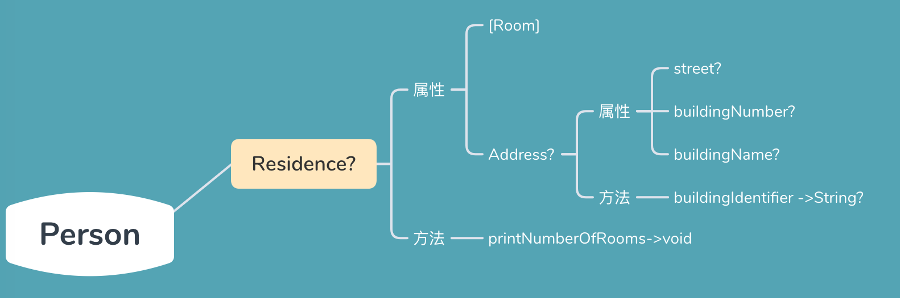

# 何为可选链

可选链其实就是一条方法调用链，如果调用链的某个节点是可选类型时，我们需要强制解包才能使用，如果解包后为nil，程序崩溃，因此引入了不强制解包的机制，在可选类型实例后面添加`?`表示可选访问，如果实例为nil时，这条语句就此结束，并返回nil。

>可选链规则：
>
>1. 所有使用可选链返回的数据类型都是`可选类型`，即使属性类型或者方法返回值类型是非可选类型。
>2. 可选链中只要有一个可选类型为nil，则终止语句执行，并返回nil。
>3. 在这个方法调用链中，只有当节点的返回值(`访问实例的属性，其实是调用getter方法 `)是可选类型时，才在后面添加`?`，返回值不是可选类型不加？。


swift中，属性设值语句的返回值为void，属性设值语句存在可选链则返回值为`void?`或者`nil`；方法不存在返回值时，返回的是空元组void，方法调用中存在可选链则返回值为`void?`或者`nil`。


## 可选链例子代码

```swift
class Person {
    var residence: Residence?
}

class Residence {
    var rooms = [Room]()
    var numberOfRooms: Int {
        return rooms.count
    }
    subscript(i: Int) -> Room {
        get {
            return rooms[i]
        }
        set {
            rooms[i] = newValue
        }
    }
    func printNumberOfRooms() {
        print("The number of rooms is \(numberOfRooms)")
    }
    var address: Address?
}

class Room {
    let name: String
    init(name: String) { self.name = name }
}

class Address {
    var buildingName: String?
    var buildingNumber: String?
    var street: String?
    func buildingIdentifier() -> String? {
        if buildingName != nil {
            return buildingName
        } else if buildingNumber != nil && street != nil {
            return "\(buildingNumber) \(street)"
        } else {
            return nil
        }
    }
}
```



## 可选链访问属性


### 设置属性值

`设置属性时(赋值运算符也是可选链的一部分)：`

1. 失败情况，当可选链中只有有一个可选属性为nil时，整个赋值语句失败，并返回nil。
2. 成功情况当可选链中所有可选属性不为nil时，返回void?

`获取属性值时:`

1. 失败情况，当可选链中只要有一个可选属性为nil时，返回为nil。
2. 成功情况，当可选链中所有可选属性不为nil时，返回访问属性的可选类型

```swift
var p = Person()

// residence属性为nil时，设置属性值
p.residence?.rooms = [Room]()

if (p.residence?.rooms = [Room]()) != nil{
  print("room赋值成功")
}else{
   print("room赋值失败")
}

// residence属性为nil时，获取属性值
if(let t = p.residence?.rooms){
  print("可选链执行失败")
}else{
  print("可选链执行成功")
}

// 可选链中没有nil时，设置可选值
p.residence = Residence()
if (p.residence?.rooms = [Room]()) != nil{
  print("room赋值成功")
}else{
   print("room赋值失败")
}

```


## 可选链访问方法

不论方法返回值是否是可选类型，只要在可选链上调用的方法，返回的一定是可选类型返回值。

> 注意：可选链中使用方法返回值直接调用其他方法时，方法括号后面添加`?`。

```swift
var p = Person()

if p.residence?.printNumberOfRooms() != nil {
    print("可选链执行成功.")
} else {
    print("可选链执行失败")
}

p.residence = Residence()
p.residence.address = Address()

if let s = p.residence.address.buildingIdentifier(){
   print("可选链执行成功.")
}else{
   print("可选链执行失败.")
}

// 注意使用方法返回值调用其他函数时，？的编写位置
if let s = p.residence.address.buildingIdentifier()?.hasPrefix("The"){
   print("可选链执行成功.")
}else{
   print("可选链执行失败.")
}

```


## 可选链访问下标

> 可选链中出现下标访问时，`?放在[ ]前面`。

```swift
var p = Person()
// 注意“ ？”的摆放位置
var room:Room? = p.residence?[2]
```


## 总结可选链中‘ ? ’添加位置

```swift
1. 函数本身是可选类型，则`?`添加在函数名和括号之间
var funcTest:((Int)->Void)? = { (num: Int) in }
funcTest?()

2. 函数返回值是可选类型，并使用返回值调用新的方法或属性时，`?`添加在括号后面
var funcTest:((Int)->String?) = { (num: Int) -> String in return "aaa" }
funcTest()?.appends("bbb")

var funcTest:((Int)->String?)? = { (num: Int) -> String? in return "aaa" }
var s = funcTest?(12)?.count

3. 对于下标时，`?`添加在实例对象名与中括号之间
var room:Room? = p.residence?[2]

4. 对于属性时，如果需要通过属性调用新的属性或方法时，`?`添加在属性名后面
var temp = p.residence?.printNumberOfRooms()

```


