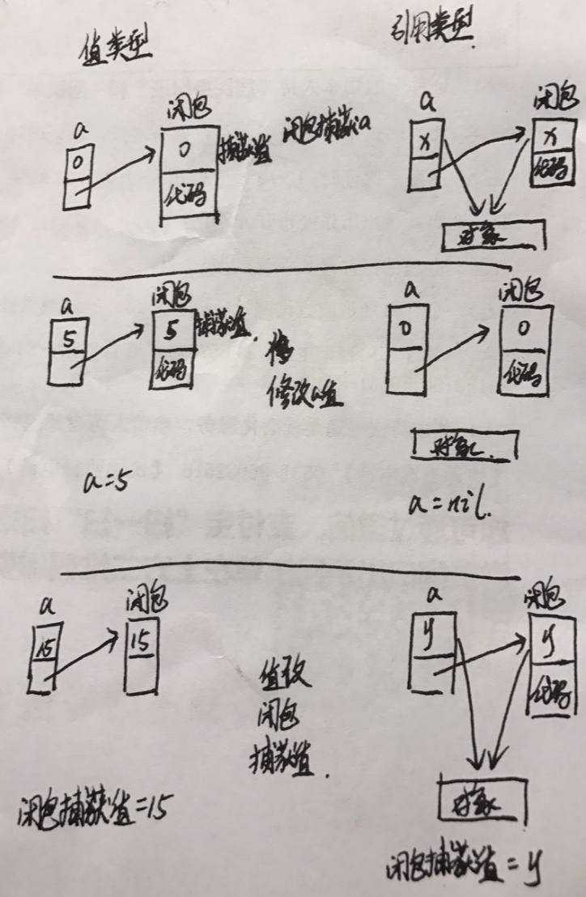

# ARC管理

`引用计数器：`

​		针对`引用类型的实例对象`，对象内部有一个计数器，用来记录当前对象的内存空间被多少个变量使用，当计数器为0时，对象会自动将其占用的内存空间释放。


`强引用与弱引用：`

​		 变量或者常量在指向引用类型的实例对象时，存在强引用与弱引用之分，当强引用常量或者变量指向实例对象时，对象的引用计数器会+1，即持有该对象，当弱引用常量或者变量指向实例对象时，对象的引用计数器不会+1，并且对象的引用计数器为0时，变量或者常量自动设为nil。

`弱引用变量一定是可选类型`。


# 循环引用

循环引用发生条件：

1. 两个引用类型的实例对象，值类型不会发生强引用，因为是值拷贝。
2. 实例对象内部属性相互使用强引用变量或者常量指向对方。

循环引用会造成相互引用的实例对象的引用计数器都不为0，导致它们的内存空间无法释放。


## 类类型循环引用解决方式

### weak

#### weak特点

1. 只有`变量`才能声明为弱引用，并且因为可以为nil，因此都是`可选类型`
2. 访问但不持有实例对象的内存空间，当指向的实例对象引用计数器为0时，变量自动设为nil。


```swift
class Person{ }
weak var p2:Person?
func test(){
    let p1 = Person()
    p2 = p1
    print(p2)
}
test()
print(p2)

打印结果：
Optional(Test.Person)
nil

代码分析：
当函数执行完毕后，p1变量释放，Person实例对象自动计数器为0，实例对象被释放，并且p2被设置为nil。

```


#### weak解决循环引用

weak解决循环引用的方式，一方使用强引用，一方使用弱引用

```swift
class Person{
    var name:String
    var house:Apartment?
    init(name:String){
        self.name = name
    }
    
    deinit{
        print("Person.name = \(name)被释放")
    }
}

class Apartment{
    var name:String
    weak var person:Person?
    init(name:String){
        self.name = name
    }
    
    deinit{
        print("Apartment.name = \(name)被释放")
    }
}

var p:Person? = Person(name: "john")
var h:Apartment? = Apartment(name: "SkyDoor")
p?.house = h
h?.person = p

p = nil
h = nil

打印结果：
Person.name = john被释放
Apartment.name = SkyDoor被释放
```


### unowned

#### unowned特点

1. 修饰的都是`变量`，并且都是`非可选类型`
2. 和weak一样不会持有对象，但是规定变量指向的对象在变量的生命周期中不会释放。强行释放指向的对象，会导致变量变成野指针，使用后程序崩溃

unowned就像OC语言中的assign一样。

```swift
class Person{ }
var p1:Person? = Person()
unowned var p2:Person = p1!
print(p2)

p1 = nil
// error: Attempted to read an unowned reference but object 0x100e0a5c0 was already deallocated
print(p2)

代码分析：
当实例对象释放时，p2由于使用unowned修饰，因此会变成野指针，使用后程序崩溃

```


#### unowned解决循环引用

如果想使用unowned，则必须保证相互引用的两者必须做到同年同月同日生死。

```swift
class Person{
    var name:String
    var idCard:Identity?
    init(name:String) {
        self.name = name
    }
}

class Identity{
    var name:String
    unowned var person:Person
    init(name:String, person: Person) {
        self.name = name
        self.person = person
    }
}

var p = Person(name: "John")
p.idCard = Identity(name: "John_IDCard", person: p)

代码分析：
人与中国身份证的关系：人可以没有中国身份证，但是身份证必须对应一个人，因此两者不同生但同死，很适合使用unowned解决。
```


unowned与隐式可选类型配合，去除循环引用中的可选类型

```swift
class Person{
    var name:String
    var idCard:Identity!
    init(name:String) {
        self.name = name
    }
}

class Identity{
    var name:String
    unowned var person:Person
    init(name:String, person: Person) {
        self.name = name
        self.person = person
    }
}

var p = Person(name: "John")
p.idCard = Identity(name: "John_IDCard", person: p)
```


## 闭包的循环引用

当闭包使用外部变量的方式：

1. 通过形式参数传入闭包中，闭包进行值拷贝，值类型拷贝数据，引用类型拷贝地址，闭包执行后释放。
2. 闭包捕获外部变量，从而成为闭包的一部分，只有闭包对象存在，捕获的变量不会释放。

### 闭包捕获值猜想

在闭包中直接使用外部变量时，他们相互影响，外部变量修改会影响到闭包中值，闭包中值的修改会影响外部变量

```swift
import Foundation
var a = 0
var block = { (num: Int) in
    print("闭包内部：\(a)")
    a = a + num
}
// 闭包捕获外部变量a并修改，外部变量跟着修改，从而得出捕获并不是值拷贝
block(12)
print(a)
// 外部变量a修改后，闭包内捕获的变量也发生改变。
a = 5
block(0)

打印结果：
闭包内部：0
12
闭包内部：5
```


闭包捕获外部变量后，延长外部变量的生命周期

```swift
var block:((Int)->Void)?
func test1(){
    var a = 0
    block = { (num: Int) in
        a = a + num
        print("闭包内部：\(a)")
    }
}
test1()
// 局部变量a在test1执行完毕应该已经释放，但是在block中还是能使用
block?(12)
block?(13)

打印结果：
闭包内部：12
闭包内部：25
```


> 猜想：
>
> 当闭包捕获外部变量并被强引用时，闭包会从栈拷贝到堆中，并且捕获的变量值也被转移到堆中，外部变量在操作时，会使用堆中的变量值，而不在使用原来内存地址中的数据，因此解释了上面代码中不管修改外部变量值还是闭包中值，都会影响另一方的原因。



对于值类型和引用类型，闭包捕获都是一样对待，可以看成共享内存空间，变量a修改或者闭包中捕获值的修改都会影响对方。下面用代码验证：

```swift
class Person{
    var name:String
    lazy var funcTest:((Person?)->Void) = {_ in
        print(self.name)
    }
    init(name:String) {
        self.name = name
    }
    deinit {
        print("\(name)对象被释放")
    }
}

func test1(){
    var p2:Person?
    p2 = Person(name: "Tom")
    p2?.funcTest = { (p:Person?) -> Void in
        // 当捕获值为nil时，将其指向一个对象
        if p2 == nil && p != nil {
            p2 = p!
            print(p2?.name)
        }
    }
    p2?.funcTest(nil)
    // 当前person对象计数器为2，当外部变量不在持有对象时，对象是否释放，还是由闭包持有
    p2 = nil
}

func test2(){
    var p2:Person?
    p2 = Person(name: "Tom")
    p2?.funcTest = { (p:Person?) -> Void in
        if p2 == nil && p != nil {
            p2 = p!
            print(p2?.name)
        }
    }
    p2?.funcTest(nil)
    var temp = p2
    p2 = nil
    // 给闭包捕获值设置持有对象时，p2是否也指向该对象。
    temp?.funcTest(temp)
    print("p2.name = \(p2?.name)")
    
}
test1()
print("-----")
test2()


打印结果：
Tom对象被释放
-----
Optional("Tom")
p2.name = Optional("Tom")
```

>test1中：外部变量设为nil时，闭包捕获值也为nil，对象释放。
>
>test2中：外部变量为nil，闭包捕获值也为nil时，给闭包捕获值设置对象，外部变量也会指向该对象。

### 闭包捕获列表写法

利用的原理与解决实例对象之间循环引用一样，就是将一方的引用改成弱引用或者无主引用。

>捕获列表参数写法：
>
>1. 使用外部捕获的参数名
>
>   `[unowned self]` 和 `[weak self]`
>
>2. 给捕获列表中的参数起新名
>
>   `[unowned mySelf = self]`和`[weak weakSelf = self]`
>
>   
>
>捕获的外部变量没有限制，可以是可选类型，也可以是非可选类型


```swift
捕获列表格式：
{[捕获列表] (参数列表) -> 返回值 in
	内容代码
}

lazy var someClosure: () -> String = {
    [unowned self, weak delegate = (self.delegate ?? nil)] in
    // closure body goes here
}

```


>写不写delegate都一样，因为闭包中调用实例对象的属性时，捕获的是self，而不是每个属性，因此`weak delegate = self.delegate!`是一句废话。
>
>上面的例子只是展示如何将捕获值改成weak和unowned。


### 闭包捕获列表实例

> ff闭包中的`[weak p]`很重要，如果不写直接导致Person对象无法释放。


```swift
class Person{
    var name:String
    var funcTest:(()->Void)?
    
    init(_ name:String) {
        self.name = name
    }
    deinit {
        print("\(name)对象被释放")
    }
}


func tt(){
		// 捕获非可选类型
    let p:Person = Person("Tom")
    p.funcTest = { [weak p] in
        print("person.name = \(p?.name)")
    }
    p.funcTest!()
  
  	// 捕获可选类型
    let ps:Person? = Person("Tom")
    ps?.funcTest = { [weak ps] in
        print("person.name = \(ps?.name)")
    }
    ps?.funcTest!()
}

tt()
```


### *Weak-Strong* Dance In Swift

原理：对weak变量进行可选绑定，获取到该变量的强引用

```swift
class Person{
    var name:String
    var funcTest:(()->Void)?
    
    init(_ name:String) {
        self.name = name
    }
    deinit {
        print("\(name)对象被释放")
    }
}


func tt(){
    let p:Person = Person("Tom")

    p.funcTest = { [weak p] in
				// 使用可选绑定实现weak-strong Dance
        if let strongP = p{
            print("person.name = \(strongP.name)")
        }
    }
    p.funcTest!()
}

tt()
```


### 闭包捕获值的时机

> 闭包是在创建时就捕获外部的值，还是只有执行闭包时才会捕获

```swift
class Person{
    var fun:(()->())?
    func person(){
      // 创建闭包，内部捕获self
        self.fun = {
            self.test()
        }
    }
    func test(){ }
    
    deinit {
        print("Person对象释放内存")
    }
}

func t(){
    let p = Person()
    p.person()
}

t()
print("ss")
while true{}

打印结果：
ss
```

> 从上面代码可以看出，在定义闭包时，闭包就捕获到外部的值了，而不是执行闭包才捕获外部值。


# 内存冲突

 内存冲突：同一时间同一个内存地址，进行读写、或者写写操作就会导致内存冲突，例如在多线程中多个线程同时访问一个内存地址。

造成内存冲突的条件：

1. 只是有一个是写操作
2. 同一个时间段
3. 针对同一个内存地址

## 线程的内存冲突问题

> 造成单线程内存冲突的情况：
>
> 1. 在使用输入输出参数的函数中，访问输入输出指向的原始数据时，会造成内存冲突。
> 2. 函数参数列表中有多个输入输出参数时，使用同一个实际参数时，会造成内存冲突。
> 3. 全局函数参数列表中多个输入输出参数时，修改值类型的属性，会造成内存冲突。

从上面列举的三个情况可以看出，涉及到单线程内存冲突都是与`输入输出参数`有关。


### 情况一

在函数中同时访问输入输出参数以及该参数指向的原始变量，这样导致内存访问冲突。

```swift
var stepSize = 1
func test1(t: inout Int){
    t = stepSize
}

test1(t: &stepSize)

代码分析：
在test1函数中，对t(或者叫做stepSize)进行写操作，对stepSize进行读操作
```

### 情况二

多个输入输出参数设置同一个原始变量，编译器直接报错

```swift
var p1 = 1
func test1(a: inout Int, b: inout Int){
    a = 4
    b = 5
}
test1(a:&p1, b:&p1)

代码分析：
同时对同一个变量进行多次写操作
```

### 情况三

使用输入输出参数修改值类型，存在两种情况：

1. 参数列表中有输入输出参数的函数，在局部代码块中访问值类型。
2. 参数列表中有输入输出参数的函数，在全局中访问值类型


```swift
全局访问值类型

struct Point {
    var x:Int
    var y:Int
}

func setPoint(x: inout Int, y: inout Int) {
    x = 10
    y = 12
}

var p = Point(x: 0, y: 0)
setPoint(x: &p.x, y: &p.y) 

代码分析
在全局中调用setPoint函数，程序运行崩溃
```


```swift
局部代码块中访问值类型
struct Point {
    var x:Int
    var y:Int
}

func setPoint(x: inout Int, y: inout Int) {
    x = 10
    y = 12
}

var p = Point(x: 0, y: 0)
func test(){
  setPoint(x: &p.x, y: &p.y) 
}
test()

代码分析：
在局部代码块中调用setPoint函数，程序不会崩溃

```

