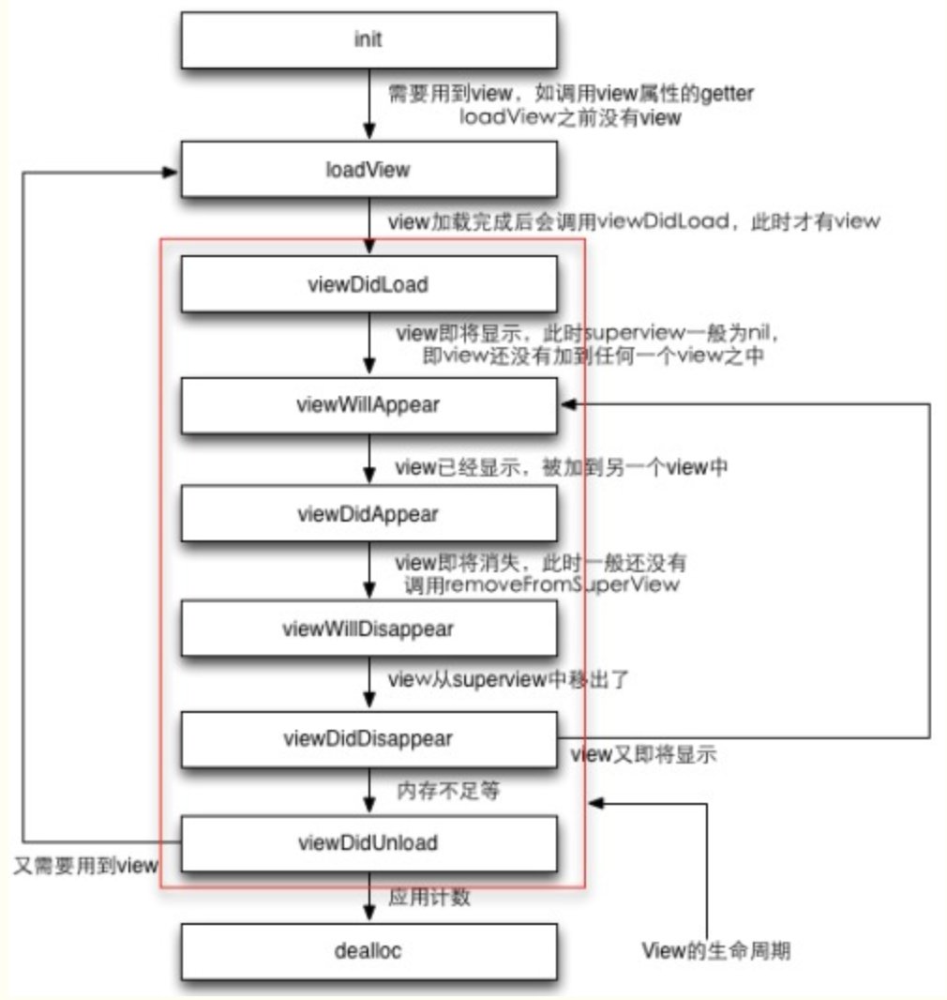

# ViewController生命周期

## ViewController生命周期方法介绍

> loadView：跳转控制器时，controller生命周期的第一个方法，创建Controller的根View。
>
> viewdidLoad：view创建完毕后，添加一些其他设置，在该方法中搭建页面样式。
>
> viewWillAppear：控制器的View将要显示，做一些处理操作
>
> viewDidAppear：控制器的View已经显示，做一些处理操作
>
> viewWillDisappear：控制器的View将要移除手机屏幕：做一些操作
>
> viewDidDisappear：控制器的View已经移除手机屏幕
>
> didReceiveMemoryWarning：当系统内存吃紧吃紧时，系统会触发该方法，用来释放内存。
>
> viewWillUnload：内存吃紧警告时，调用该方法，通知控制器，系统将要释放控制器的根View。
>
> viewDidUnload：内存吃紧警告时，调用该方法，通知控制器，系统已经释放控制器的根View。
>
> dealloc：控制器对象内存释放时，调用dealloc方法，释放内存前的操作。


## ViewController生命周期执行过程



> 正常viewController的生命周期：
>
> loadView -->  viewDidLoad --> viewWillAppear --> viewDidAppear --> viewWillDisappear --> viewDidDisappear --> dealloc
>
> 
>
> 内存警告时生命周期：
>
> didReceiveMemoryWarning --> viewWillUnload --> viewDidUnload


### loadView过程

loadView方法内部的操作步骤：

1. 它会先去查找与controller相关联的xib文件，通过加载xib文件来创建controller的view

   1. 如果在初始化controller指定了xib文件名，就会根据传入的xib文件名加载对应的xib文件

   ```objective-c
   [[ZPViewController alloc] initWithNibName:@"ZPViewController" bundle:nil];
   ```

   1. 如果没有明显地传xib文件名，就会加载跟controller同名的xib文件

   ```objective-c
   [[ZPViewController alloc] init];
   ```

   

2. 如果没有找到相关联的xib文件，就会创建一个空白的UIView，然后赋值给controller的view

```objective-c
self.view = [[UIView alloc] initWithFrame:[UIScreen mainScreen].applicationFrame];
```


>总结：有xib则使用xib创建，没有xib则使用代码创建


### 重写loadView

由于明白了系统loadView内部的执行过程，因此在重写时不需要调用`[super loadView]`方法了，因为父类会首先尝试使用xib创建viewcontroller，因此浪费时间。

```objective-c
-(void)loadView{
  self.view = [ZPView alloc] initWithFrame:[UIScreen mainScreen].bounds];
}
```


### 页面跳转过程

页面跳转涉及到4个方法：

1. `viewWillAppear`、
2. `viewDidAppear`、
3. `viewWillDisappear`、
4. `viewDidDisappear`

firstViewController `push` secondViewController

```objective-c
firstViewController --- viewWillDisappear
SecondViewController --- viewWillAppear
SecondViewController --- viewDidAppear
firstViewController --- viewDidDisappear
```

secondViewController `pop` firstViewController

```objective-c
SecondViewController --- viewWillDisappear
firstViewController --- viewWillAppear
firstViewController --- viewDidAppear
SecondViewController --- viewDidDisappear
```

总结：

> 当前页面跳转到其他页面时，当前页面的will和did方法像大括号一样，包含其他页面的will和did方法


### viewDidLoad方法触发时机

当controller的根view创建完成时，就会触发viewDidLoad方法。

1. 跳转到当前控制器页面时，会触发viewDidLoad。
2. 当controller的根view被释放后，被重新显示在屏幕中时，会重新执行loadView和viewDidload方法。


### didReceiveMemoryWarning与viewDidUnload区别

当手机内存警告时，系统会向App发送lowMemory消息，app会向内存中保存的所有ViewController对象发送didReceiveMemoryWarning消息，在viewcontroller的didReceiveMemoryWarning方法中释放不需要内存空间。

iOS6之前，调用didReceiveMemoryWarning方法后，如果ViewController的View不在屏幕中时，系统直接释放view，并调用viewWillUnload和viewDidUnload方法。

iOS6之后，调用didReceiveMemoryWarning方法后，系统不会在释放不在屏幕中显示的ViewController的View了，因此viewWillUnload和viewDidload方法已经废弃。

