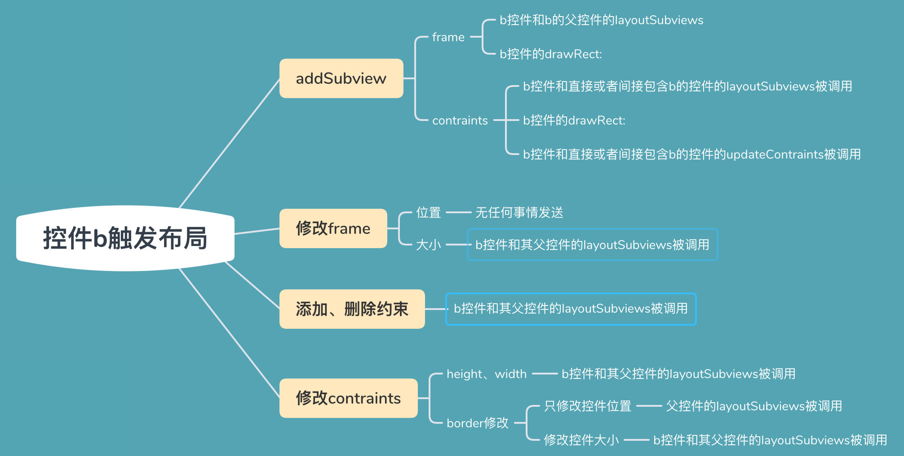

# iOS布局流程

页面显示时调用的：

1. viewWillLayoutSubviews
2. 根view的layoutSubviews
3. 需要更新约束视图的updateConstraints
4. viewDidLayoutSubviews
5. 按视图层级从外到里调用layoutSubviews
6. 按视图层级从外到里调用drawRect:方法


> 控件布局的三个步骤：
>
> 1. 设置constraints，从subView到Superview，一步步设置
> 2. 设置layout，从SuperView到subView，一步步设置。
> 3. 执行display，系统调用`drawRect:`将视图绘制到屏幕上。


# 布局方法

## viewWillLayoutSubviews与viewDidLayoutSubviews介绍

这是控制器的生命周期方法，可以在其中布局控制器根视图的子视图位置大小。

## layoutSubViews介绍

iOS5.1和之前版本，layoutSubViews方法是一个空方法，不实现任何功能，由用户自己决定功能。

iOS5.1之后的版本则添加默认实现，根据约束或者设置的frame，来对所有的儿子视图布局，孙子视图由儿子视图的layoutSubviews方法设置。


### setNeedsLayout和layoutIfNeed方法

setNeedsLayout：用来标签当前视图需要调用layoutSubviews方法，更新子视图的frame，等下一个runloop循环。

layoutIfNeed：用来立即执行被setNeedsLayout方法标签的视图的layoutSubviews方法。


#### 约束动画

使用setNeedsLayout和layoutIfNeed方法实现约束动画

```objective-c
    [self.autoView mas_updateConstraints:^(MASConstraintMaker *make) {
        make.left.top.equalTo(self.view).offset(40);
    }];

    [self.view setNeedsLayout];
    [UIView animateWithDuration:3 animations:^{
        [self.view layoutIfNeed];
    }];
```


>1. 将layoutIfNeed方法放在UIView动画中，可以实现约束动画效果。
>2. 不要使用self.autoView调用这两个方法，这两个方法意思是运行调用者的layoutSubviews方法，因为约束是保存在父控件中，因此需要调用父控件的两个方法。

## updateConstraints介绍

该方法只能有系统调用，不能自己调用，可以通过setNeedsUpdateConstraints和updateConstraintsIfNeeded方法来间接调用updateConstraints方法。

>  对于自定义控件你可以重写updateConstraints方法，来优化你的约束，但是该方法的最后一句代码必须调用父类方法。
>
> ```objective-c
> -(void)updateConstraints{
>     // 你的约束代码
>     [super updateConstraints];
> }
> ```


### setNeedsUpdateConstraints和updateConstraintsIfNeeded

与setNeedsLayout和layoutIfNeed方法一样，前者是标记，后者是让系统立即调用updateConstraints方法。


# 布局触发条件

1. 调用该view的`setNeedsLayout`和`layoutIfNeed`，直接调用layoutSubviews
2. 使用addsubview向该view添加view时，触发layoutSubviews
3. 改变view的frame时，触发layoutSubviews
4. UIScrollView和其子类在滚动时，会触发layoutSubviews
5. 旋转Screen会触发父UIView上的layoutSubviews事件



> 不管`添加视图`、`修改frame`还是`更新约束`，都会相应的触发父控件的layoutSubviews方法的调用，父控件的layoutSubviews方法中子控件frame还没有改变。（frame修改子视图位置除外）