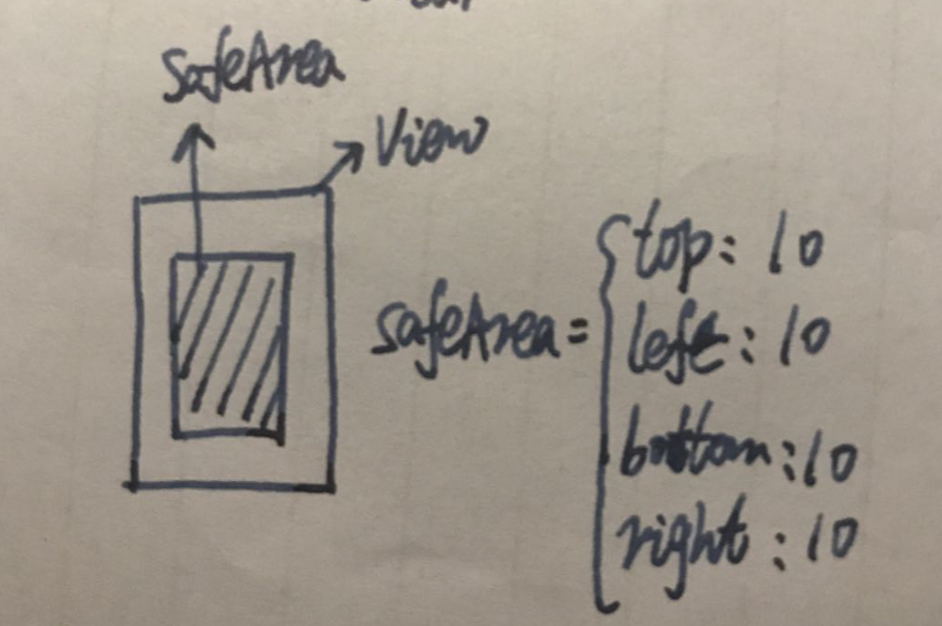
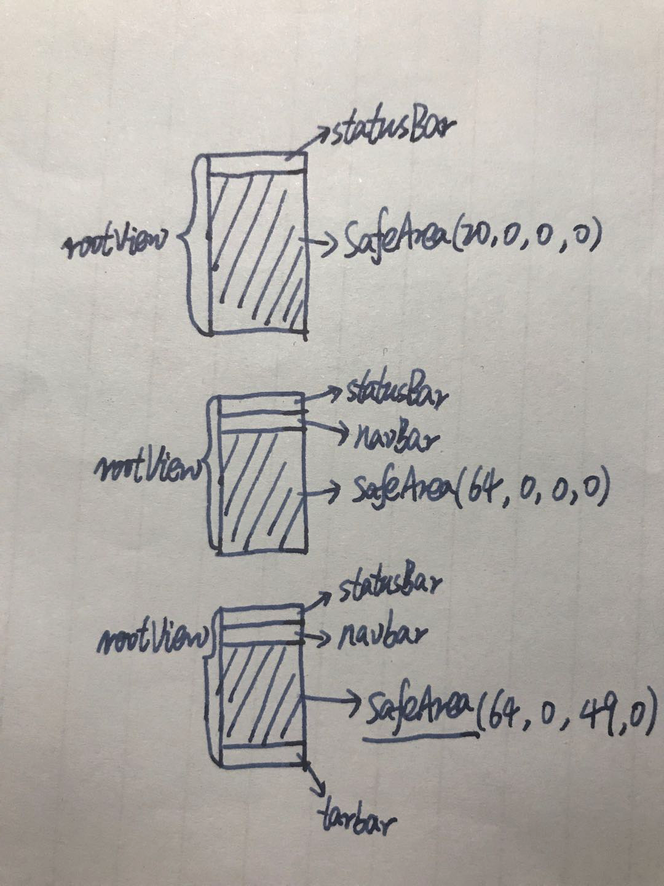
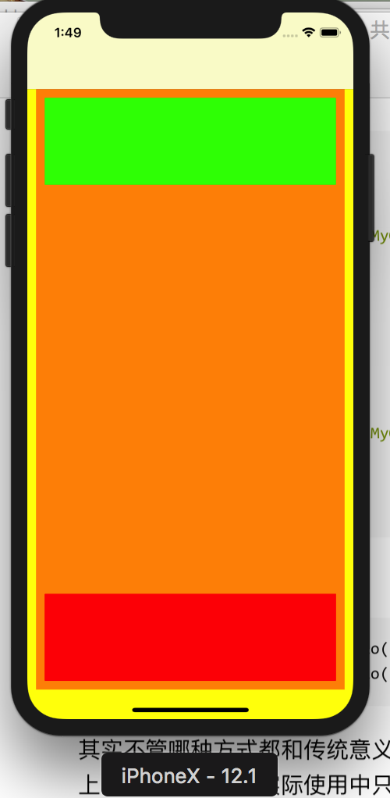
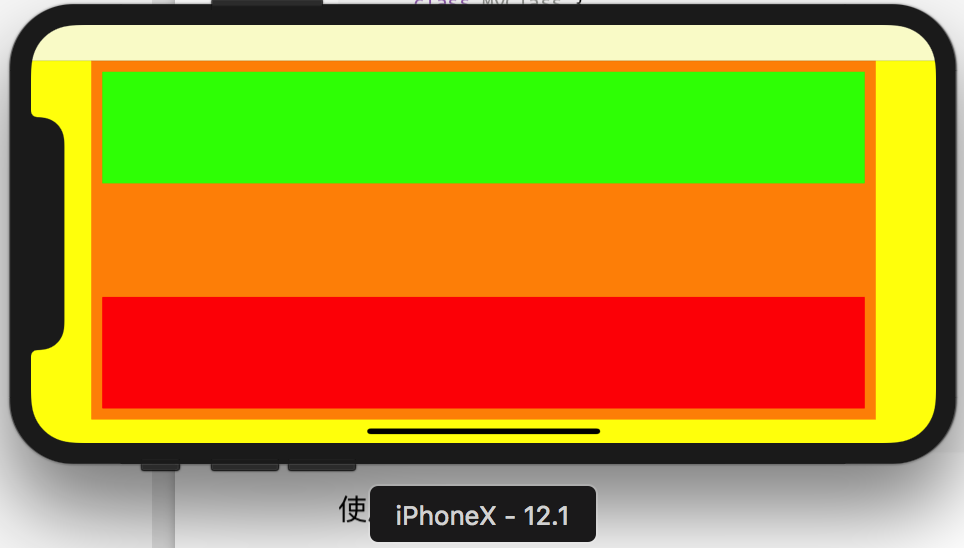

# 什么是SafeArea

SafeArea又名安全范围，是iOS11提出的新概念，用来适配iphoneX使用的，防止视图被状态栏、导航栏或者TarBar所覆盖。SafeArea由系统计算出当前视图`未被遮盖的区域`，`系统只会计算控制器上View的SafeArea`。

## safeAreaInsets属性

`safeAreaInsets`是UIView类的一个属性，用来描述当前视图的安全范围，记录安全范围的边界。因此可以看出SafeArea并不能直接调整视图位置，只是圈定一个范围。




## 视图的5种SafeArea

> 1. RootView没有任何其他视图遮盖，SafeArea = (top:0,  left:0,  bottom:0,  right:0)
>
> 2. RootView被StatusBar遮盖，SafeArea = (top:20,  left:0,  bottom:0,  right:0)
> 3. RootView被NavBar遮盖，SafeArea = (top:64,  left:0,  bottom:0,  right:0)
> 4. RootView被TarBar遮盖，SafeArea = (top:0,  left:0,  bottom:49,  right:0)
> 5. RootView被NavBar、TarBar遮盖，SafeArea = (top:64,  left:0,  bottom:49,  right:0)
>
> 下图只画了3种，2、3、5。




## additionalSafeAreaInsets

`additionalSafeAreaInsets`是UIViewController的一个属性，由于`safeAreaInsets`属性是一个只读属性，如果像设置一个更小或者更大的安全范围时，无法进行修改，因此可以使用`additionalSafeAreaInsets`属性改变`safeAreaInsets`的值。

> safeAreaInsets = safeAreaInsets + additionalSafeAreaInsets


### 横竖屏safeAreaInsets计算公式

> 竖屏SafeAreaInsets = (
>
> ​		top: topBar.height + additionalSafeInsets.top
>
> ​		left: 0 + additionalSafeInsets.top
>
> ​		bottom: bottomBar.height + additionalSafeInsets.bottom
>
> ​		right: 0 + additionalSafeInsets.right
>
> )
>
> 横屏SafeAreaInsets = (
>
> ​		top: topBar.height + additionalSafeInsets.top
>
> ​		left: statusBar.height + additionalSafeInsets.top
>
> ​		bottom: HomeIndicatorAreaHeight + additionalSafeInsets.bottom
>
> ​		right: statusBar.height + additionalSafeInsets.right
>
> )
>
> `HomeIndicatorAreaHeight`就是iphoneX底部的那个上划退出app的小横线


```
SafeAreaInsets = (top: heightForTopBars + additionalSafeAreaInsets.top,
                 left: 0 + additionalSafeAreaInsets.left,
               bottom: heightForBottomBars + additionalSafeAreaInsets.bottom,                
                 right: 0 + additionalSafeAreaInsets.right)                      
//横屏SafeAreaInsets = (top: heightForTopBars + additionalSafeAreaInsets.top,
                 left: StatusBarHeight + additionalSafeAreaInsets.left,
               bottom: HomeIndicatorAreaHeight + additionalSafeAreaInsets.bottom,                
                 right: StatusBarHeight + additionalSafeAreaInsets.right) 
```


##  `safeAreaInsets`调用时机

safeAreaInsets并不是控制器创建时就有值，它是在控制器的某个生命周期方法调用前被设置的，因此需要在何时的地方使用。


在控制器的各个生命周期查看`safeAreaInsets`：

```objective-c
loadView() SafeAreaInsets :(top: 0.0, left: 0.0, bottom: 0.0, right: 0.0)
viewDidLoad() SafeAreaInsets :(top: 0.0, left: 0.0, bottom: 0.0, right: 0.0)
viewWillAppear() SafeAreaInsets :(top: 0.0, left: 0.0, bottom: 0.0, right: 0.0)
viewDidLayoutSubviews() SafeAreaInsets :(top: 44.0, left: 0.0, bottom: 34.0, right: 0.0)
viewDidAppear() SafeAreaInsets :(top: 44.0, left: 0.0, bottom: 34.0, right: 0.0)
```

> 从上面打印控制器生命周期可以看出，safeAreaInsets是在`ViewDidLayoutSubviews`方法中被计算出来的，因此想要使用`safeAreaInsets`，则需要在该方法中或者该方法之后使用。


## viewSafeAreaInsetsDidChange

UIViewController中的方法，当控制器视图的安全范围发生变化时，该方法会被调用。系统监听了SafeAreaInsets属性。


# 实战演练

```swift
class ViewController: UIViewController {
    fileprivate weak var contentView:UIView?
    fileprivate weak var topView:UIView?
		fileprivate weak var bottomView:UIView?
    override func viewDidLoad() {
        super.viewDidLoad()
        self.view.backgroundColor = UIColor.yellow
        configSubView()
    }
  
  	// 在该方法中获得控制器视图的安全范围，然后基于安全范围设置子控件的约束。
    override func viewDidLayoutSubviews() {
        self.verticalScreenConfig()
    }
  
    func configSubView(){
      
      // 底部自定义View
        let contentView = UIView()
        contentView.backgroundColor = UIColor.orange
        self.view.addSubview(contentView)
        self.contentView = contentView
      
        var bottomView = UIView()
        self.bottomView = bottomView
        self.bottomView?.backgroundColor = UIColor.red
        contentView.addSubview(bottomView)
        
        let topView = UIView(frame: CGRect.zero)
        topView.backgroundColor = UIColor.green
        contentView.addSubview(topView)
        self.topView = topView

      	// 缩写ViewController.view的安全范围
        self.additionalSafeAreaInsets.left = 10
        self.additionalSafeAreaInsets.right = 10
    }
  
  // 监听安全范围改变，当发生横竖屏转换时，ViewController.view的安全范围会发生变化，并调用该方法
    override func viewSafeAreaInsetsDidChange() {
        // 竖屏时，基于安全范围调整contentView约束
        if UIApplication.shared.statusBarOrientation == UIInterfaceOrientation.portrait {
            self.contentView?.snp.remakeConstraints({ (make) in
                make.left.equalToSuperview().offset(Int(self.view.safeAreaInsets.left))
                make.right.equalToSuperview().offset(-Int(self.view.safeAreaInsets.right))
                make.top.equalToSuperview().offset(Int(self.view.safeAreaInsets.top))
                make.bottom.equalToSuperview().offset(-Int(self.view.safeAreaInsets.bottom))
            })
        }else{
          // 横屏时，基于安全范围调整contentView约束
            self.contentView?.snp.remakeConstraints({ (make) in
                make.left.equalToSuperview().offset(Int(self.view.safeAreaInsets.left))
                make.right.equalToSuperview().offset(-Int(self.view.safeAreaInsets.right))
                make.top.equalToSuperview().offset(Int(self.view.safeAreaInsets.top))
                make.bottom.equalToSuperview().offset(-Int(self.view.safeAreaInsets.bottom))
            })
        }
    }
  
      func verticalScreenConfig(){

        self.contentView?.snp.makeConstraints({ (make) in
            make.left.equalToSuperview().offset(Int(self.view.safeAreaInsets.left))
            make.right.equalToSuperview().offset(-Int(self.view.safeAreaInsets.right))
            make.top.equalToSuperview().offset(Int(self.view.safeAreaInsets.top))
            make.bottom.equalToSuperview().offset(-Int(self.view.safeAreaInsets.bottom))
        })
        
        self.bottomView?.snp.makeConstraints({ (make: ConstraintMaker) in
            make.left.equalToSuperview().offset(10)
            make.right.equalToSuperview().offset(-10)
            make.bottom.equalToSuperview().offset(-10)
            make.height.equalTo(100)
        })
        
        self.topView?.snp.makeConstraints({
            $0.left.equalToSuperview().offset(10)
            $0.right.equalToSuperview().offset(-10)
            $0.top.equalToSuperview().offset(10)
            $0.height.equalTo(100)
        })
    }
  
}
```


## 运行结果



