# iOS布局方式

iOS提供了三种布局方式：

1. frame
2. autoResizing
3. Autolayout + sizeClass

> frame绝对布局，autolayout相对布局。

## autoResizing

autoResizing是apple针对早期手机屏幕尺寸少，界面简单做开发一种适配技术，利用frame+autoResizing来实现app适配问题。

autoResizing解决的是子控件与父控件的关系，当父控件变大时，子控件如何去适应父控件。autoResizing给出了7个枚举值，来约束子控件。

autoResizing提供的7个枚举：

```objective-c
UIViewAutoresizingNone // 就是不自动调整。
// 自动弹性的调整与superView左边的距离，保证与superView右边的距离不变。
UIViewAutoresizingFlexibleLeftMargin
// 自动弹性的调整与superView的右边距离，保证与superView左边的距离不变。
UIViewAutoresizingFlexibleRightMargin 
// 自动弹性d调整与superView顶部的距离，保证与superView底部的距离不变。
UIViewAutoresizingFlexibleTopMargin 
// 自动弹性的调整与superView底部的距离，也就是说，与superView顶部的距离不变。
UIViewAutoresizingFlexibleBottomMargin 
// 自动弹性的调整自己的宽度，保证与superView高度比不变。
UIViewAutoresizingFlexibleWidth 
// 自动弹性的调整自己的高度，保证与superView宽度比不变。
UIViewAutoresizingFlexibleHeight 
```

>注意：使用纯代码设置autoResizing时，枚举值和storyboard中的autoresizing虚线是相反对应。例如UIViewAutoresizingFlexibleLeftMargin表示左边距灵活，就是右边固定位置
>
>

各种autoResizing组合：

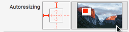Right | Bottom

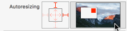 Bottom | Left 

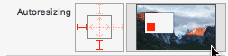Right | Top

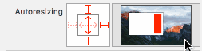Left | Top | Bottom | Width

Right | Bottom

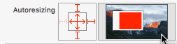 Top | Bottom | Left | Width | Height

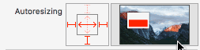Left | Right | Height | Top

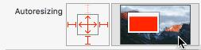Top | Right | Left | Width | Height

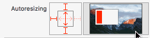Top | Bottom | Right | Height

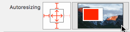Top | Bottom | Right | Width | Height

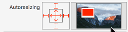Left | Right | Top | Width | Height

> 缺点：只能设置父子控件的约束，无法设置兄弟控件之间的约束，导致不能适配复杂页面。
>
> 面对各个尺寸的手机和复杂的页面，这种适配技术已经不在适用了。


## autolayout

自动布局，在autoResizing技术后，推出了新适配方案，解决多复杂页面中autoResizing无法约束兄弟控件的情况。两种技术是`互斥`的，使用一种就必须关闭另一种。

默认纯代码中使用autoResizing技术，xib和storyboard使用的是autoLayout。

> UIView控件有一个`translatesAutoresizingMaskIntoConstraints`属性，Yes表示该控件使用autoResizing布局，NO表示该控件使用autoLayout布局。


`思考题目1`

> A控件是B控件的父控件，设置B控件的约束时，需要开启autoLayout的控件是谁？
>
> [BView mas_makeConstraints:^(MASConstraintMaker *make) {
>     make.left.top.equalTo(AView).offset(20);
>     make.height.width.mas_offset(100);
> }];	


### autoLayout约束公式

```objective-c
// 公式模版
A控件.attribute = multiplier ⨉ B控件.attribute + constant

// a控件顶部位置 = b控件顶部位置+20px
a.top = 1 * b.top + 20
```

### autoLayout约束规则

> 1. width和height约束保存在当前控件中。
> 2. 兄弟控件之间的约束，保存在最近的父控件中。
> 3. 父子控件之间的约束，保存在父控件中。


### autoLayout的局限性

autoLayout是基于一个特定形状的屏幕进行控件布局的，因此当屏幕形状发生变化时，直接使用基于先前屏幕的约束时，就会导致控件的位置错乱。

例如：iphone的横竖屏问题，ipad屏幕问题，一般app的UI原型图都是基于竖屏来设置的，当变成横屏时，就会导致控件位置错乱。

 竖屏-->竖屏变横屏


## sizeClass

iOS8中，提出了sizeClass技术，sizeClass就是为了解决适配多种类型的屏幕。

> 原理：对屏幕进行分类，针对每种类型屏幕，设计出一套约束来。


### sizeClass的屏幕分类

屏幕类型不同，其实就是宽高比不同，例如手机明显`height>width`，ipad宽高比例差不多1:1。

sizeClass将屏幕宽高抽象成3种类型：compant(紧凑)、Regular(宽松)、Any(宽松和紧凑)。因此宽有3种类型，高有3种类型，一共组合成了9种类型，其中游有用的就特定的几种。

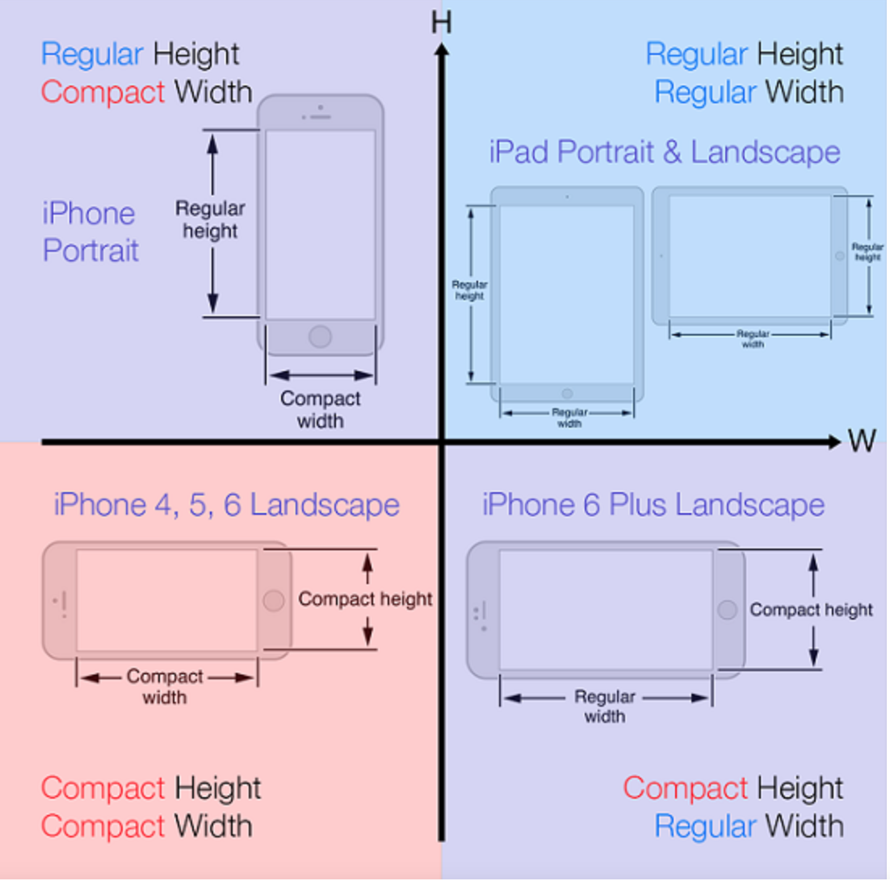

> sizeClass将屏幕分为4中类型：
>
> W(C)-H(R)：iphone手机竖屏形态
>
> W(C)-H(C)：iphone手机横屏形态，iphone4、5、6、7、8、X、XS
>
> W(R)-H(C)：特定iPhone手机横屏形态，iphonePlus手机，iphoneXR、iphoneXMax
>
> W(R)-H(R)：iPad屏幕形态

因此如果要适配所有iphone手机，需要设置3套autoLayout，一套竖屏，两套横屏。


### xib配置sizeClass

#### sizeClass编辑模式

通过xcode底部一栏选择屏幕形态，并开启当前屏幕形态下的编辑模式，在该模式下添加的所有视图和约束只能在该屏幕形态中可见。

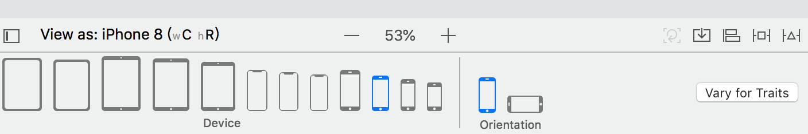

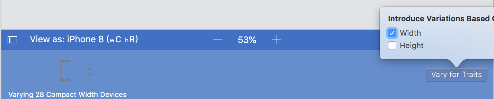

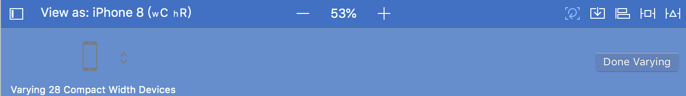

> 1. 选择Device和Orientation，配置好设备和方向，就会出现屏幕类型，当前图片中选择的是iphone8(wC hR)，iphone竖屏形态。
> 2. 点击Vary for Traits按钮，只选Width表示(wC hAny)，只选Height表示(wAny hR)，都选表示(wC hR)。
> 3. 选择完成后点击空白处，进入编辑状态(第三张图)，此时添加的视图和约束都是在当前屏幕形态下添加的，切换成其他屏幕形态后，视图和约束就会消失。点击Done Varying完成编辑，退出选择的屏幕形态。

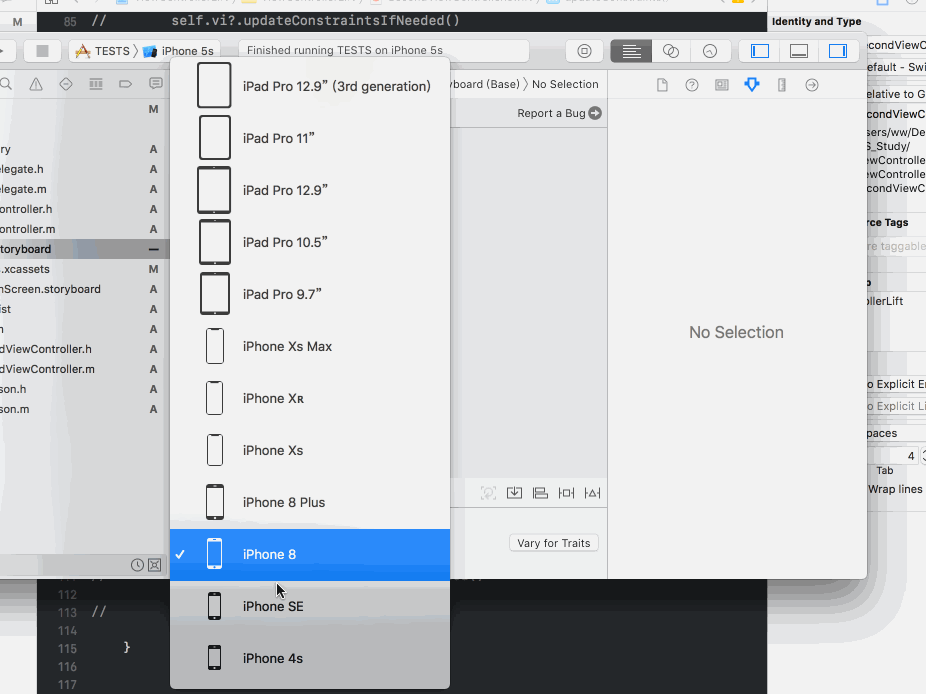


#### 单独设置每个视图和约束的屏幕形态

选择视图，在Xcode的`attribute inspactor`的最后，可以选择该视图在哪个屏幕模式下显示。

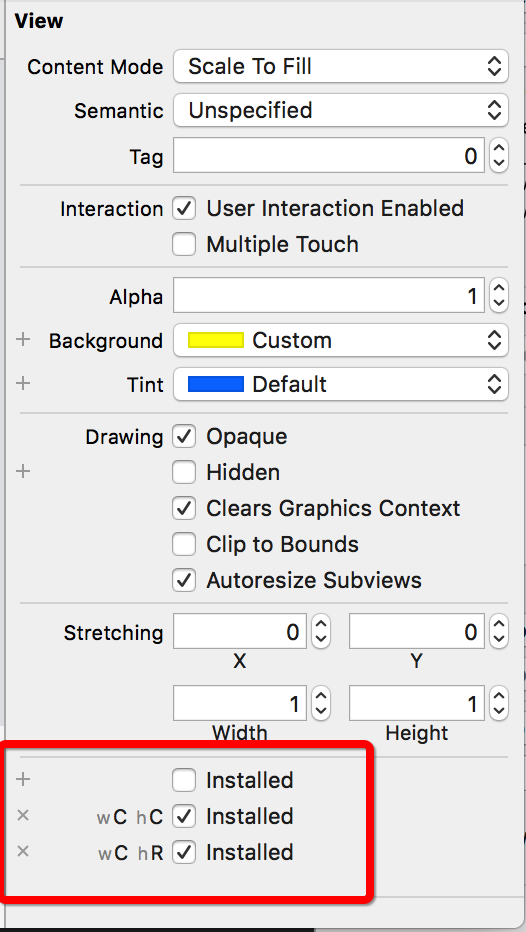


选择相应约束，在Xcode的`attribute inspactor`的最后，可以选择该约束在哪个屏幕模式下显示。

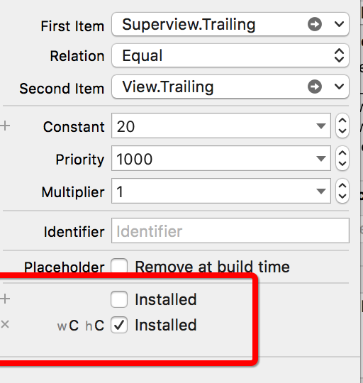


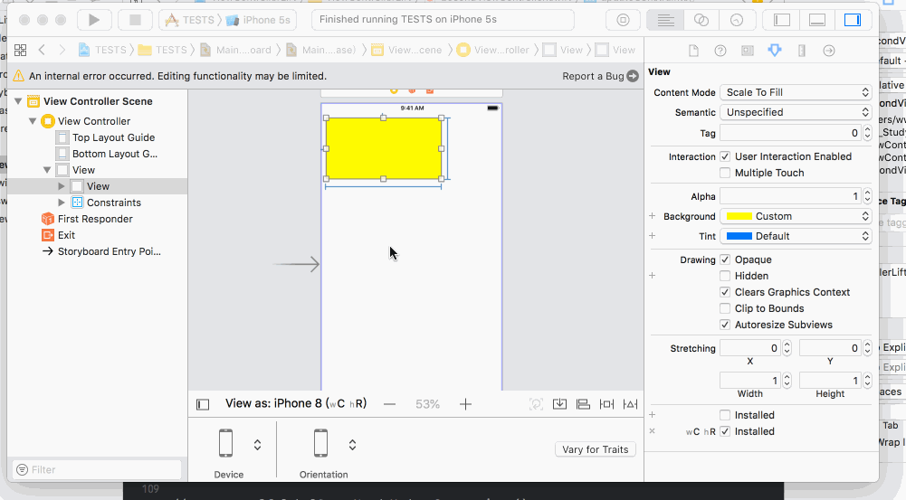


### 纯代码配置sizeClass

UIViewController和UIView都遵循UITraitEnvironment协议，可以通过协议中声明的`traitCollection`查看当前sizeClass。

```swift
// 在控制器中重写该方法，当sizeClass变化时，系统会调用该方法，例如从竖屏到横屏
func willTransition(to newCollection: UITraitCollection, with coordinator: UIViewControllerTransitionCoordinator)

//
class ZPViewController: UIViewController{
      override func willTransition(to newCollection: UITraitCollection, with coordinator: UIViewControllerTransitionCoordinator) {
        
      super.willTransition(to: newCollection, with: coordinator)
        coordinator.animate(alongsideTransition: {
            
            if ($0.horizontalSizeClass == UIUserInterfaceSizeClass.compact && $0.verticalSizeClass == UIUserInterfaceSizeClass.regular){
                print("进入竖屏状态")

            }else if($0.horizontalSizeClass == UIUserInterfaceSizeClass.compact && $0.verticalSizeClass == UIUserInterfaceSizeClass.compact){
                print("进入横屏状态")
            }
            
        }) { (context: UIViewControllerTransitionCoordinatorContext) in
            
        }
        
    }
}
```


# iOS适配方案

## 使用autolayout按比例缩放

由于大部分iphone手机宽高比相同，因此根据一个机型进行autolayout布局，其他机型根据宽高比换算出来。

> iphone4：320 * 480  -->. 1.5
>
> iphone5/5s/5c/SE：320 * 568 -->   1.775
>
> iphone6/7/8：375 * 667 --> 1.7787
>
> iphonePlus：414 * 736  --> 1.7778
>
> iphoneX/XS：375 * 812 -->  加长版的iphone6，加长145个点
>
> iPhoneXMax：414 * 896 --> 加长版的iphone6P，加长160个点

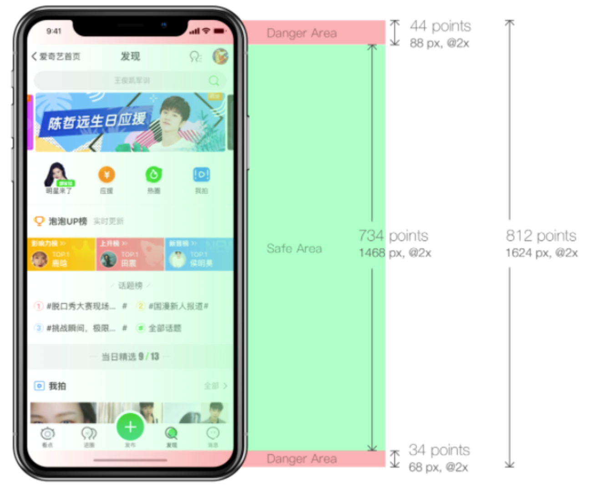


## iphonePlus 放大模式

放大镜模式：修改手机系统修改了屏幕的逻辑点，例如iphone6逻辑点为375*667，在放大镜模式下变成了320*568

> iphone手机的三种放大镜尺寸：
>
> 1. Iphone6：320 * 568
> 2. iphoneP：375 * 667
> 3. iphoneXMax：375 * 812
>
> 根据手机屏幕逻辑尺寸来判断手机系统是否处于放大模式。


# 思考题答案

## 思考题1

>哪个控件需要建立约束，那么就开启那个控件的autoLayout，由于设置B控件约束，虽然A控件保存了B控件的约束信息，但是并不是给A控件设置约束，因此只要开启B控件的autolayout就行，即`B.translatesAutoresizingMaskIntoConstraints = NO`。