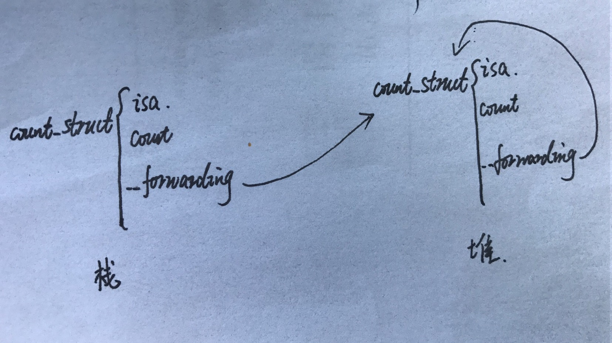

# Block

block是OC中提供的一种闭包实现，可以将一个环境(函数+外部变量)作为参数传递。

## Block使用

```objective-c
// 作为属性
@property(nonatomic, copy) void(^blockName)(int, NSString *);

// 作为成员变量
void (^blockName)(int, NSString);

// 作为函数或者方法参数
-(void)funName:(void(^)(int, NSString)) blockName;

// 给block起别名
typedef (void)(^blockName)(int, NSString);

```

## Block访问外部变量

​	block可以捕获值类型和引用类型，但是不可以进行“修改”。

```objective-c
ZPPerson类结构{
    NSString *name;
}

int a = 12;
NSMutableArray * arrm = [NSMutableArray array];
ZPPerson * p = [ZPPerson new];

void(^block)(int, NSString *) = ^(int a, NSString * b){
    NSLog(@"%ld", a);
    [arrm addObject:@"12"];
    p.name = @"11";
    
    
    // 下面是不允许的，因为捕获的变量都是使用const修饰，换句话说就是常量。对于引用类型，可以修改其中的属性或者集合中的元素。
    a = 1; 
    arrM = [NSMutableArray array];
    p = [ZPPerson new];
}
```

## Block访问特殊变量(静态变量)


```objective-c
int global_val = 10; // 全局变量
static int static_global_val = 20; // 静态全局变量

int main() {
    static int static_val = 30; // 静态局部变量

    void (^myLocalBlock)(void) = ^{
        global_val *= 1;
        static_global_val *= 2;
        static_val *= 3;

        printf("static_val = %d, static_global_val = %d, global_val = %d\n",static_val, static_global_val, static_val);
    };

    myLocalBlock();

    return 0;
}
```

转换成C++语言

```objective-c
struct __main_block_impl_0 {
    struct __block_impl impl;
    struct __main_block_desc_0* Desc;
    int *static_val;
    __main_block_impl_0(void *fp, struct __main_block_desc_0 *desc, int *_static_val, int flags=0) : static_val(_static_val) {
        impl.isa = &_NSConcreteStackBlock;
        impl.Flags = flags;
        impl.FuncPtr = fp;
        Desc = desc;
    }
};

static void __main_block_func_0(struct __main_block_impl_0 *__cself) {
    int *static_val = __cself->static_val; // bound by copy
    global_val *= 1;
    static_global_val *= 2;
    (*static_val) *= 3;

    printf("static_val = %d, static_global_val = %d, global_val = %d\n",(*static_val), static_global_val, (*static_val));
}
```

>特殊变量分为：**静态局部变量**、**静态全局变量**、**全局变量**。
>
>对于全局变量和静态全局变量，直接访问，不会被block捕获。
>
>对于静态局部变量，会被block捕获，并且使用一个指针指向该变量。


## __Block的使用

​	为了可以实现对外部变量的修改，可以使用__block修饰符修饰变量，从而对变量本身进行修改。

```
ZPPerson类结构{
    NSString *name;
}

int __block a = 12;
NSMutableArray * __block arrm = [NSMutableArray array];
ZPPerson * __block p = [ZPPerson new];

void(^block)(int, NSString *) = ^(int a, NSString * b){
    a = 1; 
    arrM = [NSMutableArray array];
    p = [ZPPerson new];
}
```


## Block原理

​	block其实是OC类型，或者准确的说是带有isa指针的结构体，拥有引用计数器，可以被存放到堆中。

### Block类型与自动copy

​	OC有三种类型block：

> NSGlobalBlock: 全局block。
>
> NSStackBlock：存放在栈中的block。
>
> NSMallocBlock：存放在堆中的block。

​	OC如何创建这三种类型：

> 1、只要没有在block中使用外部变量，则无论什么情况创建的block都是GlobalBlock。
>
> 2、在block中使用外部变量，但是只要满足下面一个条件的，block就会被`系统自动`拷贝到堆中，变成MallocBlock：
>
> ​	1). 被`__strong`修饰的变量引用.
>
> ​	2). 调用copy。
>
> ​	3). 作为函数或方法的返回值
>
> ​	4). 作为函数或者方法的参数时，只有两种情况会被系统自动拷贝到堆中。
>
> ​		1>. 使用GCD的方式时，系统会自动将函数参数中的block拷贝到堆中。
>
> ​		2>. 含有`usingBlock`名称的系统方法，系统拷贝到堆中。
>
> 3、在block中使用外部变量，但是不满足上述4条的任何一条的block就是stackBlock。

> MallocBlock条件的，需要手动将其拷贝到堆中，例如向某个方法或者函数中传递block参数时，需要自己调用`copy或者mutableCopy`方法将其拷贝到堆中。

### Block底层结构

OC代码的编译：OC语言-->C语言-->汇编语言-->机器语言


#### 未使用__block修饰捕获的变量时

```objective-c
int main(){
    int count3 = 10;
    void (^blk2)(int, int) = ^(int a, int b){
        NSLog(@"%d", count3);//打印：In Block:20
        NSLog(@"%d --- %d", a, b);//打印：In Block:20
    };
    
    blk2(12, 13);
    return 0;
}
```

```objective-c
// blk2定义
struct __main_block_impl_1 {
  struct __block_impl impl;
  struct __main_block_desc_1* Desc;
  int count3;
  __main_block_impl_1(void *fp, struct __main_block_desc_1 *desc, int _count3, int flags=0) {
    impl.isa = &_NSConcreteStackBlock;
    impl.Flags = flags;
    impl.FuncPtr = fp;
    Desc = desc;
    count3 = _count3;

  }
};

// block实现结构体
struct __block_impl {
  void *isa;  //isa指针，指向block类型，默认创建的block为_NSConcreteStackBlock
  int Flags;
  int Reserved;
  void *FuncPtr; // block体，保存需要执行的代码
};

// block体
static void __main_block_func_1(struct __main_block_impl_1 *__cself, int a, int b) {
  int count3 = __cself->count3; // bound by copy

        NSLog((NSString *)&__NSConstantStringImpl__var_folders_lk_j_6zdnh10mq88h1m54l5q1zh0000gn_T_main_e26848_mi_1, count3);
        NSLog((NSString *)&__NSConstantStringImpl__var_folders_lk_j_6zdnh10mq88h1m54l5q1zh0000gn_T_main_e26848_mi_2, a, b);
    }

// block的描述
static struct __main_block_desc_1 {
  size_t reserved;
  size_t Block_size;
} __main_block_desc_1_DATA = { 0, sizeof(struct __main_block_impl_1)};

int main(){
	int count3 = 10;
    void (*blk2)(int, int) = ((void (*)(int, int))&__main_block_impl_1((void *)__main_block_func_1, &__main_block_desc_1_DATA, count3));

    ((void (*)(__block_impl *, int, int))((__block_impl *)blk2)->FuncPtr)((__block_impl *)blk2, 12, 13);
	return 0;
}


```


#### 使用__block修饰捕获的变量时

```objective-c
__block int count1 = 10;
__block int count2 = 11;
void (^ blk)() = ^(){
	count1 = 20;
	count2 = 30;
	NSLog(@"In Block:%d", count1);//打印：In Block:20
	NSLog(@"In Block:%d", count2);//打印：In Block:20
};

count1++；
count2++;
blk();
```


上面代码转化后的代码

```objective-c
int main(){
  __Block_byref_count1_0 count1 = {0, &count1, 0, size, 10};
  __Block_byref_count1_0 count2 = {0, &count2, 0, size, 11};
  // 定义block
  void (*blk)() = &__main_block_impl_0(__main_block_func_0, __main_block_desc_0, &count1, count2);
  
  // 在外部修改变量值时，其实修改的是堆中结构体的属性值
  (count1.__forwarding->count1) ++;
  (count2.__forwarding->count2) ++;
  blk->FuncPtr();
}

// blk定义
struct __main_block_impl_0 {
  struct __block_impl impl;
  struct __main_block_desc_0* Desc;
  __Block_byref_count1_0 *count1; // block捕获的参数count1
  __Block_byref_count2_1 *count2; // block捕获的参数count2
  
  // block的构造函数
  __main_block_impl_0(void *fp, struct __main_block_desc_0 *desc, __Block_byref_count1_0 *_count1, __Block_byref_count2_1 *_count2, int flags=0){
    impl.isa = &_NSConcreteStackBlock;
    impl.Flags = flags;
    impl.FuncPtr = fp;
    Desc = desc;
    count1 = _count1->__forwarding;
    count2 = _count2->__forwarding;
  }
};

// block实现结构体
struct __block_impl {
  void *isa;  //isa指针，指向block类型，默认创建的block为_NSConcreteStackBlock
  int Flags;
  int Reserved;
  void *FuncPtr; // block体，保存需要执行的代码
};

// block的描述
static struct __main_block_desc_0 {
  size_t reserved;
  size_t Block_size;
  void (*copy)(struct __main_block_impl_0*, struct __main_block_impl_0*);
  void (*dispose)(struct __main_block_impl_0*);
}

// 使用__block修饰符修饰的变量，会被转换成结构体
struct __Block_byref_count1_0 {
  void *__isa;
__Block_byref_count1_0 *__forwarding;
 int __flags;
 int __size;
 int count1;
};
// 使用__block修饰符修饰的变量，会被转换成结构体
struct __Block_byref_count2_1 {
  void *__isa;
__Block_byref_count2_1 *__forwarding;
 int __flags;
 int __size;
 int count2;
};

// block体
static void __main_block_func_0(struct __main_block_impl_0 *__cself) {
  __Block_byref_count1_0 *count1 = __cself->count1; // bound by ref
  __Block_byref_count2_1 *count2 = __cself->count2; // bound by ref
				// 堆中的__forwarding指针指向的是自己。
        (count1->__forwarding->count1) = 20;
        (count2->__forwarding->count2) = 30;
        NSLog(@"In Block:%d", count1->__forwarding->count1);// 这句代码为简化版本
        NSLog(@"In Block:%d", count2->__forwarding->count2);// 这句代码为简化版本
        
        // 下面这两句为上面NSLog方法的实际代码。
        // NSLog((NSString *)&__NSConstantStringImpl__var_folders_lk_j_6zdnh10mq88h1m54l5q1zh0000gn_T_Test_767187_mi_0, (count1->__forwarding->count1));
        // NSLog((NSString *)&__NSConstantStringImpl__var_folders_lk_j_6zdnh10mq88h1m54l5q1zh0000gn_T_Test_767187_mi_1, (count2->__forwarding->count2));
    }
    
```

> 从上面的例子可以看出，block捕获外部变量时，其实是将它们添加到自己的结构体中，成为一个属性。
>
> 对于使用`__block`修饰的外部`值类型`变量，会被转换成结构体，拥有isa指针(获得引用计数器)，成为block的属性，由于`该属性没有任何显示的修饰符修饰，因此默认为__strong`因此block会强引用该值类型数据。

### __forwarding

​	使用`__block`修饰的变量，在block外修改时，block中也跟着修改，block中修改时，block外也会被修改。iOS是通过`__forwarding`实现的。




>​	被`__block`修饰的变量会转换成结构体，随着捕获它的block一起被拷贝到堆中，栈中的结构体的`__forwarding`指向堆中变量结构体。
>
>​	修改时外部使用`count.__forwarding->count`来实现变量值的修改。block内部使用`count->__forwarding->count`来实现变量值的修改。
>
>​	栈中的`__forwarding`指向的是堆中的结构体，堆中的`__forwarding`指向的是自己本身。


## block的循环引用

​	OC对象底层本质就是结构体，结构体中其中一个属性就是`isa`指针，isa指针指向的结构体保存着该对象的`引用计数器和类对象`。被`__block`修饰的值类型会被转换成结构体，其中也有isa指针，因此这个值类型也被赋予了引用计数器，被block强引用。

	> 值类型：
	>
	> 1、直接被block捕获时，block会在自己结构体中开辟一个内存空间，用来保存这个值类型数据。
	>
	> 2、值类型被`__block`修饰后，会被转换成结构体，block会在自己结构体中开辟一个内存空间，用来保存指向这个变量结构体的地址，并且让这个变量的引用计数器+1(强引用)。
	>
	> 
	>
	> 引用类型：
	>
	> 直接被block捕获时，block会在自己结构体中开辟一个内存空间，用来保存指向这个对象的地址，并让这个对象引用计数器+1(强引用)。

​	因此对象存在block属性，并且在block中使用该对象时，就会出现循环引用的情况，导致内存泄露，下面的情况就属于循环引用，ZPPerson对象引用着block1，block1又引用着ZPPerson对象。

```objective-c
@interface ZPPerson: NSObject
@property(nonatomic, copy) void(^block1)();
@property(nonatomic, copy) NSString *name;
@end

@implementation ZPPerson

-(void)test{
	self.block1 = ^(){
			NSLog(@"%@", self.name);
	}
}
@end
```


### 循环引用的处理-ARC

​	使用weak-strong dance方式来避免循环引用。

```objective-c
@interface ZPPerson: NSObject
@property(nonatomic, copy) void(^block1)();
@property(nonatomic, copy) NSString *name;
@end

@implementation ZPPerson

-(void)test{
  // 保证block不会强引用该对象
 __weak typedef (self)weakSelf = self;
	self.block1 = ^(){
    // 在作用域中声明一个强引用变量引用self，保证在block执行时，不会被释放掉。
    __strong typedef (weakSelf)strongSelf = weakSelf;
			NSLog(@"%@", strongSelf.name);
	}
}
@end
```


#### block捕获用weak修饰的变量

```objective-c

struct __main_block_impl_0 {
    struct __block_impl impl;
    struct __main_block_desc_0* Desc;
    Person *__weak weakPerson; // 可以看出block使用__weak修饰属性
  
    __main_block_impl_0(void *fp, struct __main_block_desc_0 *desc, Person *__weak _weakPerson, int flags=0){
        impl.isa = &_NSConcreteStackBlock;
        impl.Flags = flags;
        impl.FuncPtr = fp;
        Desc = desc;
    }
};

```


### 循环引用的处理-MRC

​	在MRC中使用`__block`修饰变量，防止循环引用。

	> MARC中`__block`的作用：
	>
	> 1、告诉编译器这个变量可以被改变，即生成一个结构体。
	>
	> 2、告诉编译器，不要对被`__block`修饰的变量做retain操作。