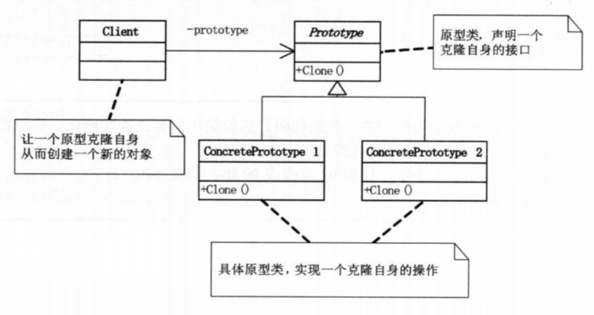

# 原型模式

原型模式又称克隆模式，为了实现快速对实例对象的创建。对于复杂类，如果需要新的实例对象与已存在的实例对象在属性值上没有太大差别，那么让客户端直接创建非常麻烦，使用原型模式，只要一句代码就能创建一个与已存在的对象相同的对象。

## 模式结构



## 代码

```swift
protocol clone{
  func clone()->Any
}

class Person: clone{
  var name:String
  var age:Int
  init(name:String, age:Int){
    self.name = name
    self.age = age
  }
  
  func clone()->Any{
    var p = Person()
    p.name = self.name
    p.age = self.age
		return p
  }
}

func main(){
  let p = Person()
  let c = p.clone()
}
```


## 现实例子

java中的Cloneable协议，OC、swift的NSCopying协议，大部分面向对象语言都使用了原型模式。这个模式在平常的开发中天天使用。

## 深拷贝与浅拷贝

原型模式就是对数据的拷贝，由于数据分为值类型和引用类型，因此拷贝存在深拷贝和浅拷贝之分。

> 浅拷贝：将保存数据的地址复制到新的内存空间中。
>
> 深拷贝：将数据本身复制到新的内存空间中。
>
> 数据分为值类型和引用类型，值类型都是深拷贝，而引用类型默认都是浅拷贝，共享一个数据。
>
> 想要对引用类型深拷贝需要自己实现，重新创建一个新对象，并将其中属性复制给新对象，如果属性也是引用类型，根据情况确定属性是否也需要深拷贝。

