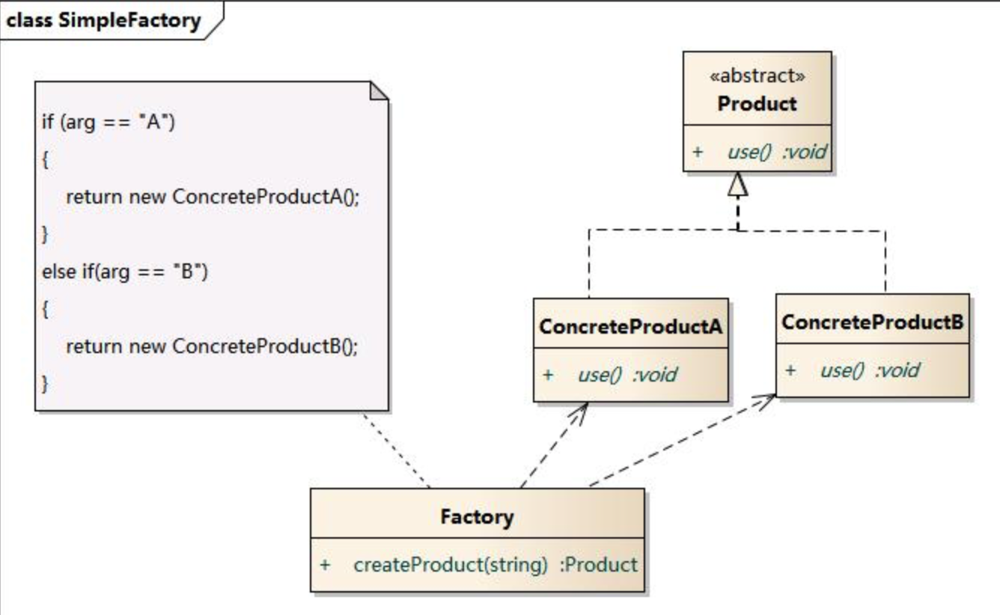
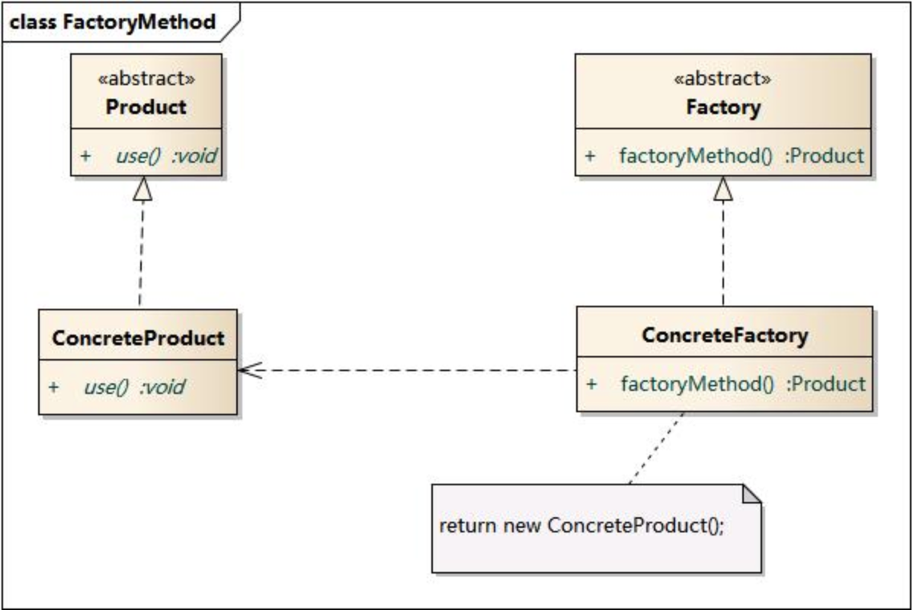
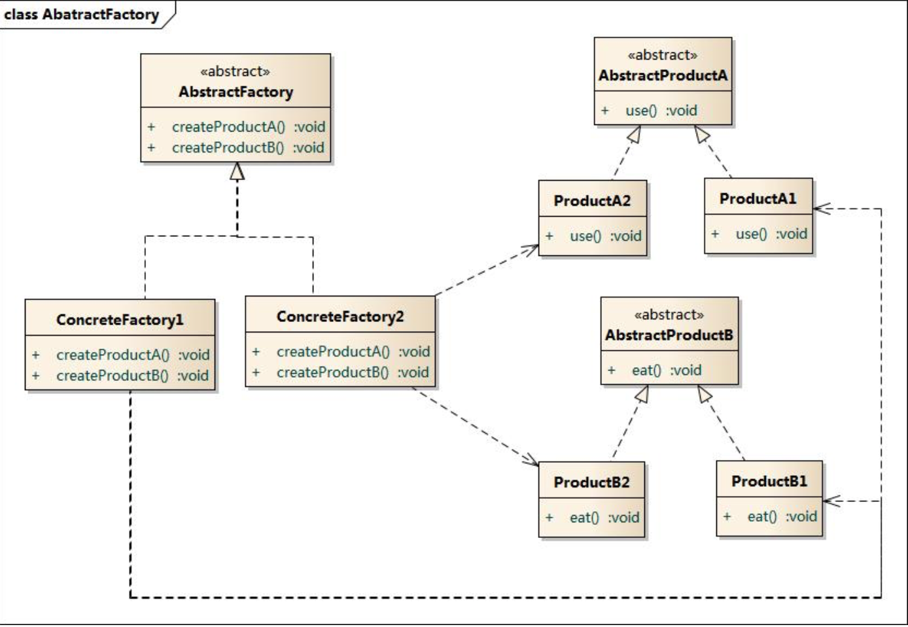

# 工厂模式

## 工厂模式解决的问题

工厂模式解决`类的实例创建`和`类的实例使用分离`的问题。

> 降低创建和替换实现类时的成本。

工厂模式举例：创建不同样式的按钮、创建不同数据库管理对象、创建不同缓存管理对象(内存、本地磁盘、远程服务器)。


## 三种工厂模式

> 1. 简单工厂模式：类的多个`子类`的实例创建过程集中在一个工厂类中。
> 2. 工厂方法模式：类的多个`子类`的实例创建过程放在对应的工厂类中。
> 3. 抽象工厂模式：多个类的多个子类的创建过程放在对应工厂类中，每个工厂类可以创建不同的类实例。


### 简单工厂模式

使用类方法包含该工厂可以生产的所有产品的生产过程。即将所有产品的创建代码保存在工厂类的类方法中。



### 工厂方法模式

将工厂抽象成接口，针对具体的产品由对应的工厂生产，例如海尔电视由海尔工厂生产，海信电视由海信工厂生产。



### 抽象工厂模式

工厂方法模式针对的是某一个产品的不同品牌，例如手机这个产品的不同品牌，因此每个工厂只能生产一个产品。

而抽象工厂模式将其扩展，实现工厂可以生产多个产品，例如海尔工厂可以生产电视机、电冰箱、空调等产品。



```swift
// 抽象产品 -- 电脑
protocol Computer{
	func handleEvent()
}

class MacBookPro: Computer{
	func handleEvent() {
		print("Apple")
	}
}

class Thinkpad: Computer {
	func handleEvent() {
		print("Thinkpad")
	}
}

// 抽象产品 -- 电视机
protocol TV{
	func openShow()
}

class HaierTV: TV {
	func openShow() {
		print("haier TV")
	}
}

class HaixinTV: TV {
	func openShow() {
		print("Haixin TV")
	}
}

// 抽象工厂 -- 该工厂可以生产电视机和电脑两个产品
protocol Factory{
	func produceComputer() -> Computer?
	func produceTV() -> TV?
}


class AppleFactory: Factory {
	func produceComputer() -> Computer? {
		return MacBookPro()
	}
	
	// 该工厂如果不能生产则返回nil
	func produceTV() -> TV? {
		return nil
	}
}

class LenovoFactory: Factory {
	func produceComputer() -> Computer? {
		return Thinkpad()
	}
	
	func produceTV() -> TV? {
		return nil
	}
}

class HaierFactory: Factory {
	func produceComputer() -> Computer? {
		return nil
	}
	
	func produceTV() -> TV? {
		return HaierTV()
	}
}

class HaixinFactory: Factory {
	func produceComputer() -> Computer? {
		return nil
	}
	
	func produceTV() -> TV? {
		return HaixinTV()
	}
}

func main(){
	let computer = AppleFactory().produceComputer()
	computer?.handleEvent()
	HaierFactory().produceTV()?.openShow() 
}
```


解决的问题

在软件开发过程中，由于业务逻辑的多选择性，导致程序下一步的操作方式的多样性，这些多选择性取决于用户的输入，其他软件的消息，因此根据不同的场景选择不同的类的实例对象来处理。

例如：日志记录的保存选择(内存、本地磁盘、远程服务器)，数据库切换(oracle、MySQL、SQLServer)、根据不同的业务逻辑显示不同样式的按钮等等。


## 工厂模式缺点

> 简单工厂：
>
> 1. 由于所有产品都集中在一个工厂类中，违背开闭原则，扩展新产品需要修改工厂类.
> 2. 由于产品的集中，导致产品能否正常生产取决于工厂类是否正常，如果工厂类瘫痪，则无法创建产品，最终系统可能瘫痪。

> 工厂方法模式：
>
> 1. 虽然将产品分离到各个工厂中，扩展新产品只需要添加新工厂和新产品，但是类数量会成倍增加，系统会变得非常复杂。

> 抽象工厂模式：
>
> 1. 工厂方法只能实现生产同个产品的不同品牌，而抽象工厂对工厂进行扩展，每个工厂可以生产多个产品，但是如果想要给工厂添加新产品，那么所有工厂类都需要修改，维护成本太高。