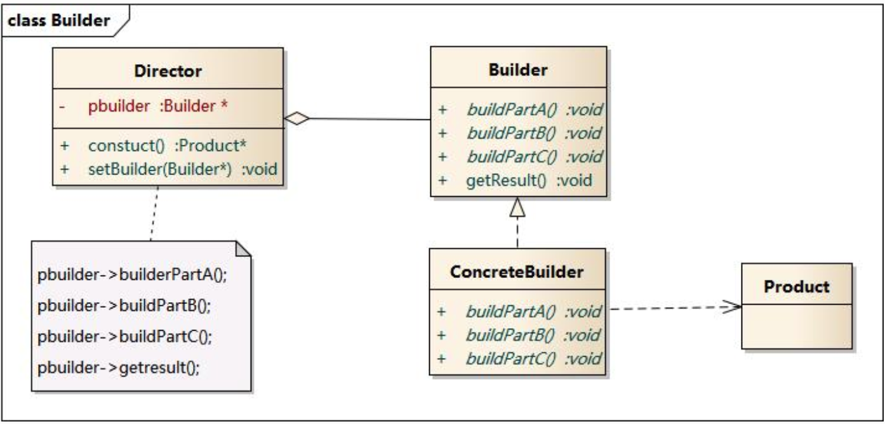

# 建造者模式

## 建造者模式组成结构

> Director:指挥者，封装生产工序，隔离上层与产品具体生产过程。
>
> Builder:建造者，定义产品生产过程中的一个个生产工序，即如何组装产品
>
> Produce:上层需要的产品



```swift
// 抽象产品
protocol SQL{
    var item:[String]{get set}
    var table:[String]{get set}
    var whereItem:[String]{get set}
}

// 具体产品
class MySQL: SQL{
    var item:[String] = []
    var table:[String] = []
    var whereItem:[String] = []
}

// 抽象建造者
protocol Builder{
    var sql:SQL{get set}
    func addItem(_ item:String) -> Builder
    func addTable(_ table: String) -> Builder
    func addWhereItem(_ item: String) -> Builder
    func getSQL() -> SQL
    
}

// 具体建造者
class SQLBuilder: Builder{
    var sql:SQL = MySQL()
    func addItem(_ item:String) -> Builder{
        self.sql.item.append(item)
        return self
    }
    
    func addTable(_ table: String) -> Builder {
        self.sql.table.append(table)
        return self
    }
    
    func addWhereItem(_ item: String) -> Builder{
        self.sql.whereItem.append(item)
        return self
    }
    
    func getSQL() -> SQL {
        return self.sql
    }
    
}

// 指挥者
class Director{
    var build:Builder?
    
    
    func constuct(block:(Builder)->Void) -> SQL{
        self.build = SQLBuilder();
        block(SQLBuilder())
        return (self.build?.getSQL())!
    }
}


var d = Director()
var sql = d.constuct { (make) in
 _ = make.addItem("stu_id").addItem("stu_name").addItem("stu_age").addTable("Student").addWhereItem("stu+id=\"2002131\"")
}


```


## 建造者模式与工厂模式区别

工厂模式目的为了分离产品的生产和使用，并不关心产品的生产细节，只是为了快速方便的使用产品。

建造者模式目的为了掌控产品生产流程，关注产品生产的每个节点。

> 举个例子：
>
> 工厂模式生产的产品就像品牌台式机，配置就是固定的几类，而建造者模式生产的产品就像DIY主机，需要自定义配置，根据自己需求制造出有个性的主机。

## 实例

iOS著名的约束框架Masonry就是使用建造者模式创建模式。


> MASConstraint: 产品
>
> MASConstraintMaker:建造者