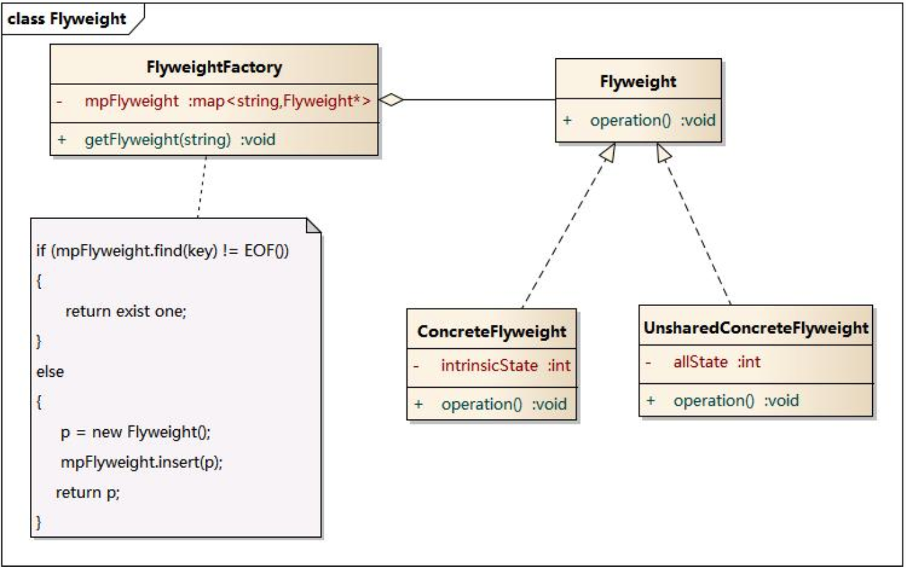

# 享元模式

享元模式：顾名思义共享数据，由于程序运行时，存在使用同类型同数据的情况，如果在已存在现有对象的情况下，重新创建的话太浪费存储空间和cpu时间，因此可以直接使用现有对象，`缓存`就是对享元模式的最好诠释

## 模式结构

- Flyweight: 抽象享元类
- ConcreteFlyweight: 具体享元类
- UnsharedConcreteFlyweight: 非共享具体享元类
- FlyweightFactory: 享元工厂类




## 模式代码

```swift
// 享元工厂类
class NetManager{
  // 共享的数据
  private var requestCache:[String:URLResponse]=[:]
  
  func requestNet(urlStr:String) -> URLResponse{
    let response = self.requestCache[urlStr]
    if response == nil{
      let request = URLRequest(URL(urlStr)!)
      return self.net(resquest)
    }
    return response
  }
  
  func net(request:URLRequest)->URLResponse{
    return URLResponse()
  }
}

上面代码就使用了享元模式，建立Cache，共享网络响应数据。
```


## 实例

现实开发中的享元模式无处不在，在对程序进行优化的第一项就是降低内存消耗和数据重复使用率。在不知不觉中就使用到了享元模式。

享元模式使用地方`线程池`、`数据库连接池`、`数据缓存`