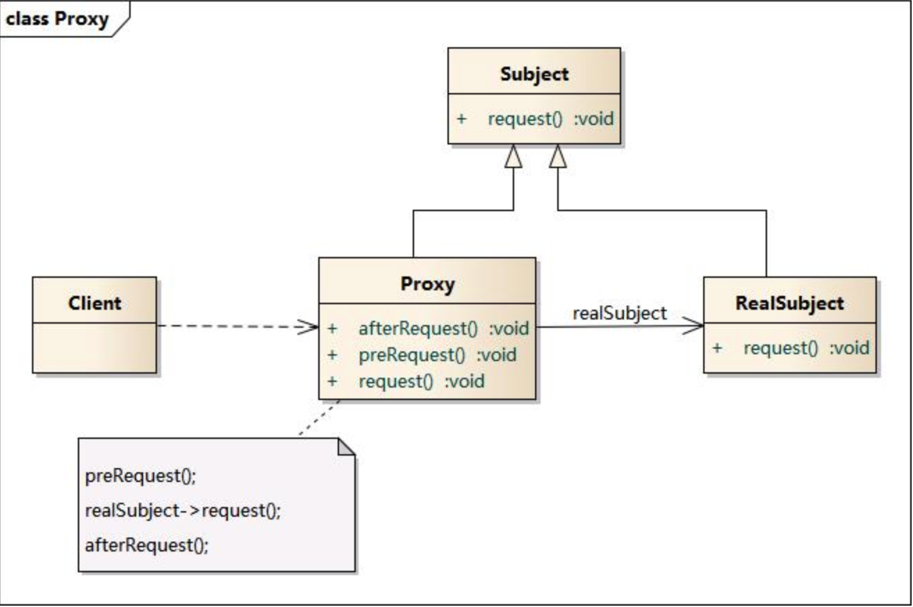

# 代理模式

隐藏真实对象，使用代理代替真实对象与外界交互。

## 委托与代理区别

>委托：客户端让底层代码帮其完成一些功能，例如业务逻辑层委托数据层提取数据。
>
>代理：底层创建一个替身与客户端进行交互，例如客户端通过代理服务器访问真实服务器。
>
>因此可以看出，委托者是实际处理问题的人，而代理者并不会处理问题，只是给双方传递消息。

> 举个例子：法庭打官司，原告委托律师帮忙打官司，而律师代理原告处理官司，被告通过原告的代理者律师，与原告进行协商。

代理者夹在双方之间，从一方看是委托，那么从另一方看就是代理。

## 代理模式组成

> Subject: 抽象主题角色
>
> Proxy: 代理主题角色
>
> RealSubject: 真实主题角色



##代码实现

```swift
// 将真实对象中可以暴露给外界的成员放在协议中，让代理者遵循。
protocol DBProtocol{
  func select(){ }
}
class DBManager: DBProtocol{
  func select(){ }
  func insert(){ }
  func update(){ }
  func delete(){ }
}

// 代理者遵循协议，并调用真实对象实现相应的功能
class DBProxy: DBPrtocol{
  private var manager:DBManager
  func select(){
    self.manager.select()
  }
}

代理者并不能处理问题，它只是一个传话筒。
```


## 常见代理场景

> 远程(Remote)代理：为一个位于不同的地址空间的对象提供一个本地的代理对象，这个不同的地址空间可以是在同一台主机中，也可是在另一台主机中，远程代理又叫做大使(Ambassador)。

> 虚拟(Virtual)代理：如果需要创建一个资源消耗较大的对象，先创建一个消耗相对较小的对象来表示，真实对象只在需要时才会被真正创建。

> 保护(Protect or Access)代理：控制对一个对象的访问，可以给不同的用户提供不同级别的使用权限。

> 缓冲(Cache)代理：为某一个目标操作的结果提供临时的存储空间，以便多个客户端可以共享这些结果。

> 防火墙(Firewall)代理：保护目标不让恶意用户接近。

> 同步化(Synchronization)代理：使几个用户能够同时使用一个对象而没有冲突。

>智能引用(Smart Reference)代理：当一个对象被引用时，提供一些额外的操作，如将此对象被调用的次数记录下来等。

> Copy-on-Write代理：它是虚拟代理的一种，把复制（克隆）操作延迟 到只有在客户端真正需要时才执行。一般来说，对象的深克隆是一个 开销较大的操作，Copy-on-Write代理可以让这个操作延迟，只有对象被用到的时候才被克隆。

> 图片代理：一个很常见的代理模式的应用实例就是对大图浏览的控制。
>
> 用户通过浏览器访问网页时先不加载真实的大图，而是通过代理对象的方法来进行处理，在代理对象的方法中，先使用一个线程向客户端浏览器加载一个小图片，然后在后台使用另一个线程来调用大图片的加载方法将大图片加载到客户端。当需要浏览大图片时，再将大图片在新网页中显示。如果用户在浏览大图时加载工作还没有完成，可以再启动一个线程来显示相应的提示信息。