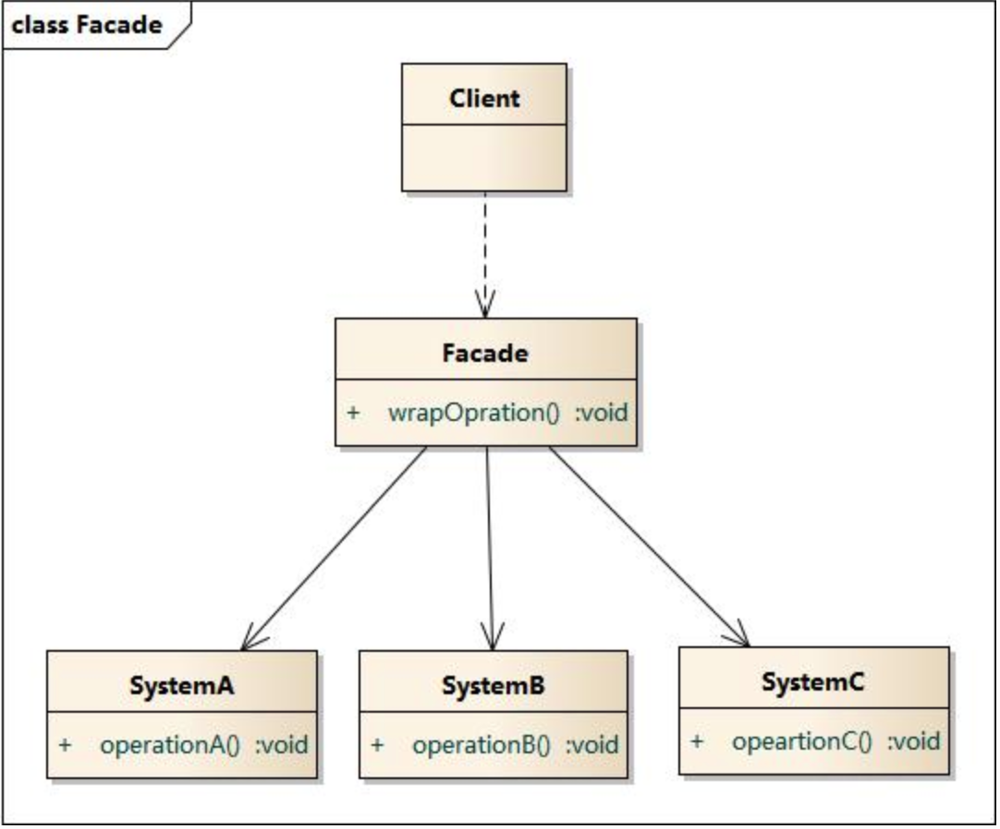

# 外观模式

外观模式又称门面模式，开发中经常与该模式打交道，例如我们使用其他开发者开发的框架时，会看看该框架的API文档，这就是框架暴露给外部的功能，或者说这就是外观模式。

外观模式：将框架的实现细节封装在内部，通过几个类向外部说明框架可以实现的功能。

## 外观模式结构



## 外观模式代码

```swift
class Person{
  private var IDCard:String
  var name:String
  var age:Int
  private var address:String
  private var iphone:String
  
  func work(){  }
  fileprivate func doFamilyThing(){ }
}

上面Person类其实就是一个简化版的外观模式，将数据和功能封装在一个类中，通过访问控制权限向外部说明可以使用的属性和方法。
```


## 实例

设计软件时一般都分为三层，`服务层`(为上层提供数据，网络数据、本地数据库数据)、`业务逻辑层`(对数据加工成用户想要的数据)、`表示层`(UI界面，展示数据)，每层都会整理可以暴露给上层的接口并放在一起，这就是外观模式。


面向对象的封装思想其实就是外观模式，将类中数据和方法封装起来，通过头文件或者访问控制权限向外部暴露可以使用的功能和属性。