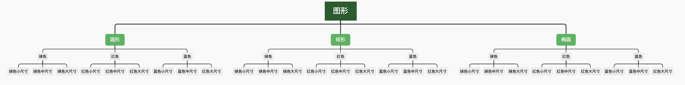
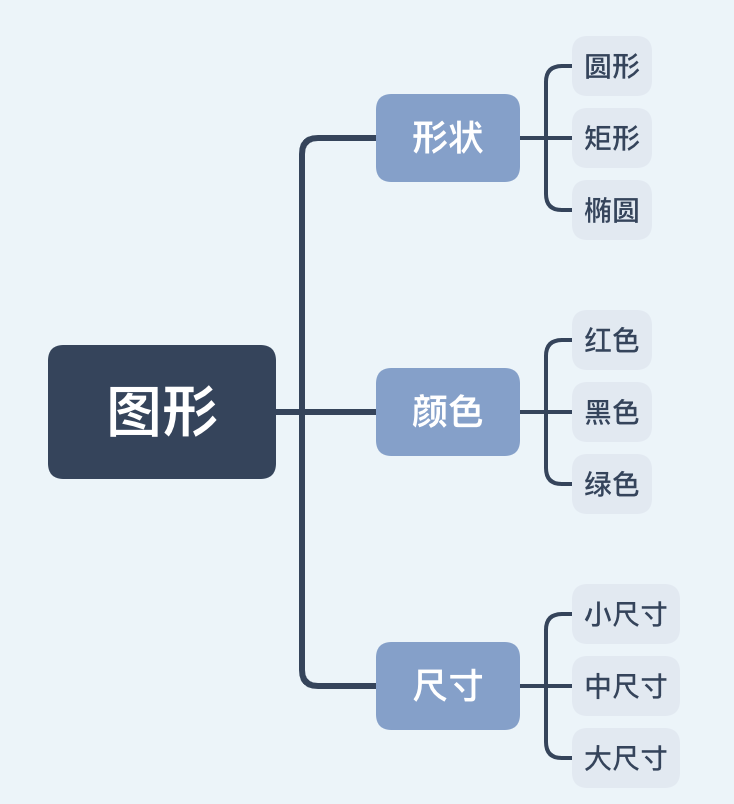
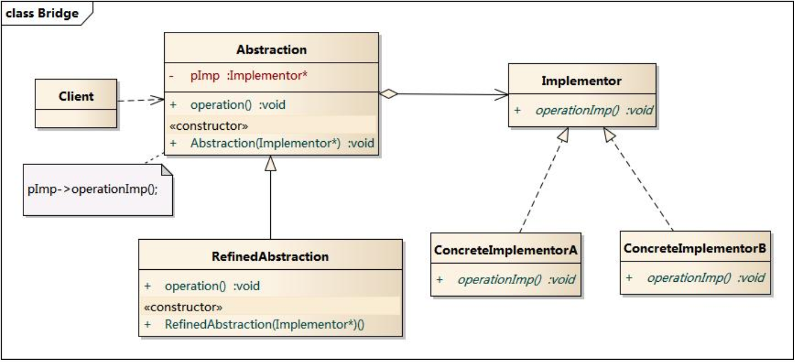

# 桥接模式

桥接模式顾名思义就是使用桥梁将两者关联在一起。面向对象思想关联两者使用继承的方式，

## 桥接与继承方式

例如建立图形，图形有颜色、形状和尺寸上的变化，下面有两种方式实现将这三种维度关联起来

> 继承方式：
>
> 使用继承的方式将三者关联起来，相当于对三者进行笛卡尔积运算。需要创建27个类来表示不同形状不同尺寸不同颜色的图形，类族相当庞大，如果形状再扩展时类个数成倍增加。




> 桥接方式(聚合方式):
>
> 使用聚合方式，将形状、颜色和尺寸作为图形的属性，这样将变化从图形中抽取处理，独立变化，哪个属性需要扩充不会像继承那样影响其它属性，例如形状添加一个五角星形时，只需要创建一个五角星类，颜色和尺寸直接复用之前的。这种组合方式大大提高了灵活性。



## 桥接模式结构




## 模式代码

```swift
protocol Shape{ }
class Circle: Shape{ }
class Rectangle: Shape{ }
class Ellipse: Shape{ }

protocol Color{ }
class Red: Color{ }
class Green: Color{ }
class Blue: Color{ }

protocol Size{ }
class SmallSize{ }
class MiddleSize{ }
class LargeSize{ }

protocol Graphics{
  var shape:Shape{get set}
  var color: Color{get set}
  var size: Size{get set}
}

使用桥接方式，或者叫做使用聚合方式建立事物之间的联系
```


## 实例

开发中经常会用到聚合方式，当遇到一个事物在多个维度上进行变化，每个维度的变化都会直接让事物产生变化，例如上面的例子中图形有三个维度上的变化(形状、尺寸、颜色)，如果使用继承方式则非常麻烦，使用桥接方式轻松解决。

> 使用桥接好处：
>
> 1. 减少创建的类。
> 2. 建立事物之间的逻辑关系，提高代码可读性。
> 3. 客户端只需要基于接口编程就行，降低耦合性

## 适用场景

- 如果一个系统需要在构件的抽象化角色和具体化角色之间增加更多的灵活性，避免在两个层次之间建立静态的继承联系，通过桥接模式可以使它们在抽象层建立一个关联关系。
- 抽象化角色和实现化角色可以以继承的方式独立扩展而互不影响，在程序运行时可以动态将一个抽象化子类的对象和一个实现化子类的对象进行组合，即系统需要对抽象化角色和实现化角色进行动态耦合。
- 一个类存在两个独立变化的维度，且这两个维度都需要进行扩展。
- 虽然在系统中使用继承是没有问题的，但是由于抽象化角色和具体化角色需要独立变化，设计要求需要独立管理这两者。
- 对于那些不希望使用继承或因为多层次继承导致系统类的个数急剧增加的系统，桥接模式尤为适用。