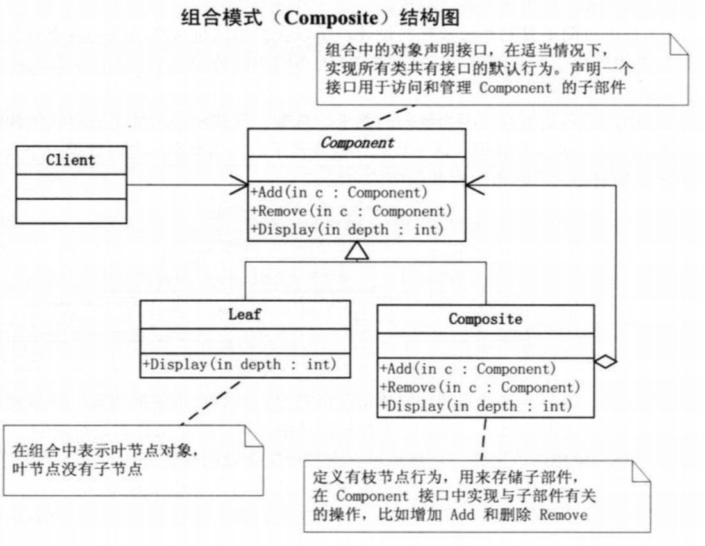

# 组合模式

组合模式：对于一组`树形结构`保存的数据，不同节点的数据不同，想要将这些数据`看成同一类数据`，方便处理，这就使用到组合模式。

> 组合模式就是为了模糊不同的事物之间的差异，当成同一种使用来使用，这不就是面向对象中的抽象吗，提取事物中相同的部分放到父类中。
>
> 从父类角度看这些事物都是相同的，这样就抹除了事物的差异性，这样在处理时就非常方便。

> 举个例子解释忽略事物差异性，看成一个事物处理：
>
> 买菜、买水果、买零食、买主食，这四件事买的东西不同，如果看成4件事，那么需要出去买四次，如果看成一件事(出去买吃的)，那么就出去买一次就行。


> 组合模式使用条件：
>
> 1. 需要处理一组事物，并且事物的数据结构为树状结构。
> 2. 想要忽略这些事物差异性，看成同一类事物来处理。

## 模式结构



> 别理解错误意思，组合模式为了`解决一组具有树形结构的数据用的，将分支和叶子当成一个相同的事物来处理(都看成父类)`。不是建立一个继承结构的类就是使用了组合模式。

```swift
class Person{  }
class Student: Person{ }

向这样并不是组合模式，而是类的继承，因为它没有处理一组树形结构数据。

class Person{
  func addPerson(p:Person){ }
  func remove(p:Person){ }
  func show(){}
}
class ClassPerson: Person{
  var managePersons:[Person]
  func addPerson(p:Person){ }
  func remove(p:Person){ }
  func show(){
    for(item in managePersons){
      item.show()
    }
  }
}

class StudentManager: Person{
    var managePersons:[Person]
  func addPerson(p:Person){ }
  func remove(p:Person){ }
  func show(){
    for(item in managePersons){
      item.show()
    }
  }
}

class Student: Person{
  func show(){ print("学生") }
}

这个就是组合模式，符合上面使用组合模式的条件，树形结构、忽略差异性。
```


## 代码

```swift
class View{
  var id:String
  var frame:CGRect
  var backgroundColor:Color
  var childSubView:[String:View]
  var superView:View
  
  // 添加子控件
  func addSubView(subView:View){
    self.childSubView[subView.id] = subView
  }
  
  // 删除子控件
  func removeSubView(subView:View){
    self.childSubView[subView.id] = nil
  }
  
  // 从父类中删除自己
  func removeFromSuperView(){
    self.superView[self.id] = nil
  }
}

class Button: View{ }
class TextViw: View{ }
class Label: View{ }

func main(){
  let root = View()
  let btn = Button()
  root.addSubView(btn)
}

按钮、文本框等都是视图的子类，我们在添加或者删除时都将其看出视图来处理。
```


## 实例

前端开发、移动端开发天天遇到组合模式，例如我们UIView和子类就是使用的组合模式。

本地文件处理时，使用组合模式来遍历文件和文件夹。