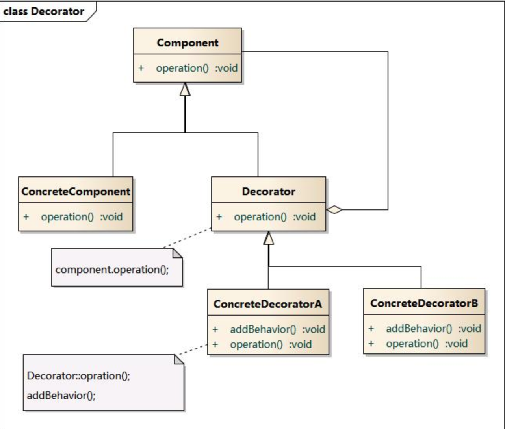

# 装饰模式

当某一类族的功能不符合新的业务需求时，我们需要重写该类族的部分的功能，一般的处理情况有两种：

`在该类的各个子类中添加新功能`：修改一个类族，修改地方太多。

`创建新类族并在其中添加功能`：会导致添加大量功能差不多的新类。

>装饰模式好处：将新增功能与需要添加功能的类分离，并且代码只会有一份，就像衣服一样，可以装饰任何人，却不会成为人的属性(身外之物)。


## 模式结构

创建某个父类的子类，这个子类就是该父类以及所有其他子类的装饰类，该类聚合父类(该类中添加父类属性)。



## 代码

```swift
class NetWorking{
	func requestNet(url:String)->[NSStirng:Any]{
		return ["aaa":12]
	}
}

class HttpWorking: NetWorking{
  func requestNet(url:String)->[NSString:Any]{
    return ["aaa":12]
  }
}

class NetWorkingDecorator: NetWorking{
  private var responseCache:[String:URLResponse]
  var request:NetWorking
  // 装饰NetWorking类，添加缓存，避免重复请求
	func requestNet(url:String)->[NSStirng:Any]{
		if let responseData = self.responseCache[url]{
      return responseData
    }else{
      self.request.requestNet(url)
    }
	}
  
  // 使用装饰类给NetWorking类添加新功能，请求数据并转换成相应的Model
  func requestNetToModel(url:String)->Model{
    let dict = self.request.requestNet(url)
    return Model(dict)
  }
}

```

> 通过装饰类，给NetWorking和其子类添加了新功能。

## 优缺点

> 优点：
>
> 1. 使用装饰类单独保存被装饰类需要添加和修改的功能，实现在不修改被装饰类的前提下，扩展它们的功能并且保留了被装饰类的原本功能，毕竟可能存在其他业务逻辑需要这些原来的功能，符合开闭原则。
>
> 2. 提供代码复用率，修改的功能保存在装饰类中，所有被装饰类都可以使用。
>
>    
>
> 缺点：
>
> 1. 由于使用装饰模式会产生需要许多装饰类，在代码理解和使用上会增加一定难度(看实例)。
> 2. 由于使用聚合的方式，当多次装饰时，在代码错误排查时有一定难度。


## 实例

最经典的使用装饰模式的地方就是Java中的`I\O`类，其中大量运用装饰模式。

`BufferedInputStream`、`BufferedOutputStream`、`BufferedWriter`、`BufferedReader`四种装饰类，用来给InputStream、OutputStream、Reader、Writer这四个类添加缓存功能。


由于Java的I/O模块类太多，在加上装饰类，导致类非常的混乱。


