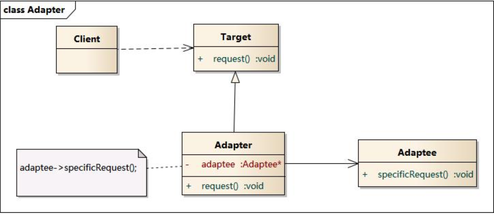

# 适配器模式

适配器模式为了实现对现有代码的重用，当底层代码可以实现现有功能，但是与上层使用的接口不一致时，使用适配器模式将底层接口转换成上层接口。

## 适配器组成

类适配器结构


实例对象适配器结构体



##适配器代码

```swift
// 底层数据库查询
class DBManager{
    func select(sql:String) ->[[String:Any]]{
        return [["stu_id":"200213", "stu_name":"john", "stu_age":18, "stu_sex":true]];
    }
}

// model
class StudentModel{
    var stu_id:String = ""
    var stu_name:String = ""
    var stu_age:Int = 0
    var stu_sex:Bool = false
}

// 业务接口
protocol Manager {
    func getData(sql:String)->[StudentModel]
}

// 适配器，将底层查询数据转换成model
class DataManagerAdapter: Manager{
    var manager:DBManager = DBManager()
    func getData(sql: String) -> [StudentModel] {
        let arr = manager.select(sql: sql)
        var arrM:[StudentModel] = [];
        for value in arr {
            let temp = StudentModel()
            temp.stu_id = value["stu_id"] as! String
            temp.stu_name = value["stu_name"] as! String
            temp.stu_age = value["stu_age"] as! Int
            temp.stu_sex = (value["stu_sex"] != nil)
            arrM.append(temp)
        }
        return arrM
    }
}

func main(){
  let arr = DataManagerAdapter().getData(sql: "")
	print(arr)
}
```


## 现实例子

现实中经常使用适配器模式，例如`数据模型转换`、`时间格式化`等，一般对底层提供的服务进行业务封装时，都会使用适配器模式，适应各种业务。