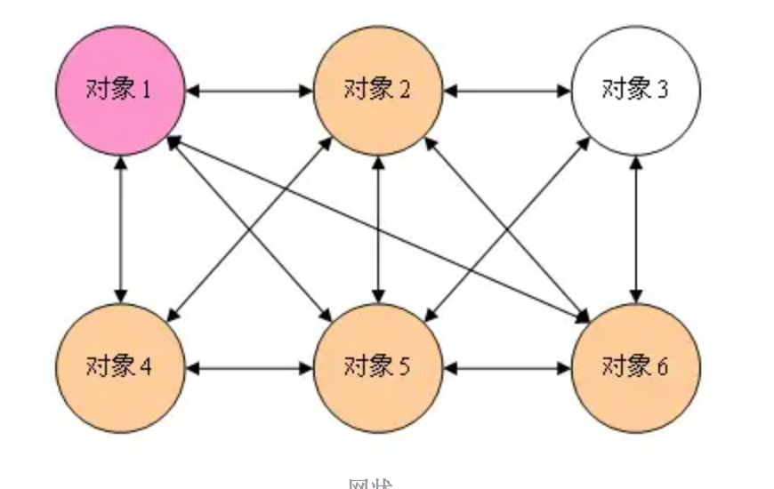
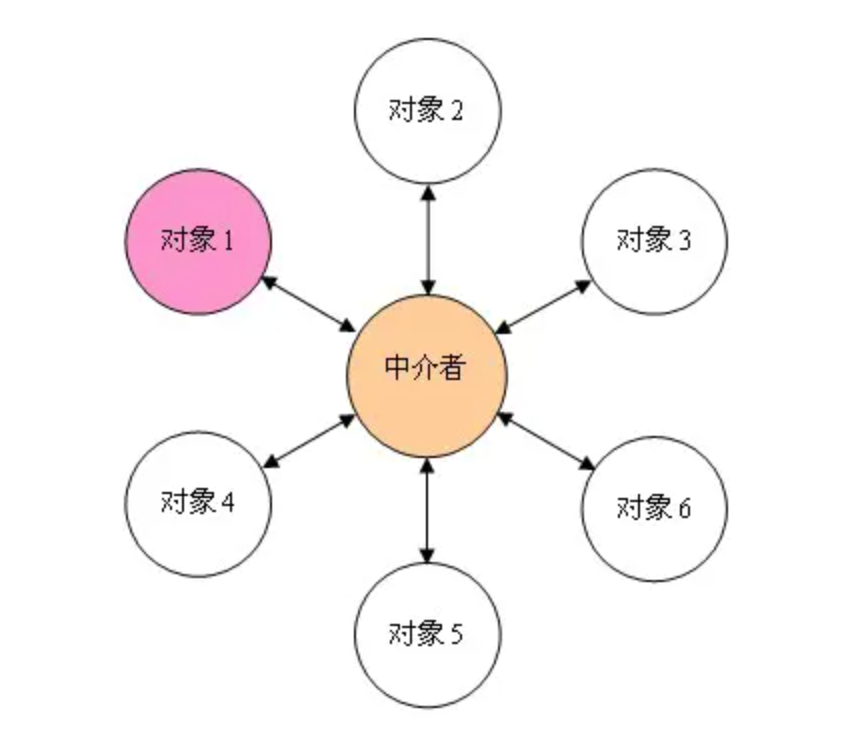
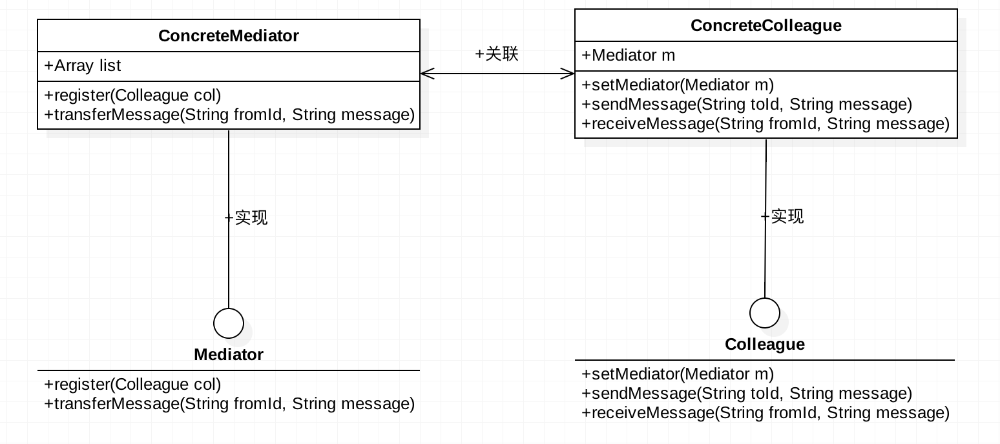

# 中介模式

处理多对多的对象交互，建立中间方，由中间方传递消息，这样保持对象间交互整洁。





上面两种情况，后者使用中介者模式，统一处理对象间的交互，不会出现前者那样交互杂乱的情况

## 模式结构




## 模式代码

```swift
// 抽象交互对象
protocol Colleague{
  func receiveMessage(from:String, message:String)
  func sendMessage(to:String, message:String)
  func setMediator(mediator:Mediator)
}
// 中介者协议
protocol Mediator{
  func transferMessage(from:String, to:String, message:String)
  func register(id:String, target:Colleague)
}

// 具体中介者
class ConcreteMediator{
  var list:[String, Colleague] = [:]
  func register(target:Colleague){
    self.list[target.id] = target
    target.setMediator(self)
  }
  
	func transferMessage(from:String, to:String, message:String)	{
    let target = self.list[to]
    target.receiveMessage(from, message)
  }
}

// 具体交互对象
class ConcreteColleague1: Colleague{
  private var center:Mediator?
  private var lastTarget:String?
	var id:String
  init(id: String){
    self.id = id
  }
  // 接收信息
  func receiveMessage(from:String, message:String)		{
    self.lastTarget = from
    print("\(from)发来的消息：\(message)")
  }
  // 发送信息
  func sendMessage(to:String message:String){
    self.center.transferMessage(from:self.id, to:to, message:message)
  }
  func setMediator(mediator:Mediator){
    self.center = mediator
  }
}

func main(){
  let p1 = ConcreteColleague1(id:"10001")
  let p2 = ConcreteColleague1(id:"10002")
  let center = ConcreteMediator()
  center.register(target: p1)
  center.register(target: p2)
  p1.sendMessage(to:"10002", message:"我是p1")
  p2.sendMessage(to:"10001", message:"我是p2")
}
```

## 实例

app中的消息模块就是使用中介者模式设计，再比如MVC这个经典模式本质上也是中介模式，controller作为中介者，帮助view和model之间实现通讯。

苹果提供的中介者模式

> Notification：
>
> 一种使用订阅-发布机制的方式实现事物间通信，利用中介者模式建立消息中心，通过向消息中心发送通知实现对象之间通信功能。


## 优缺点

> 优点：
>
> 1. 简化了系统中对象交互的复杂性，将通信集中在一个对象中，方便管理。
> 2. 减少对象间的耦合。
>
> 缺点：
>
> 1. 由于对象的交互都集中管理，因此中介者会变得臃肿，最典型的例子MVC中的Controller，随着页面逻辑越来越复杂，导致代码越来越多。
> 2. 健壮性差，对象的交互基于中介对象，如果中介对象崩溃，则通信系统瘫痪。

