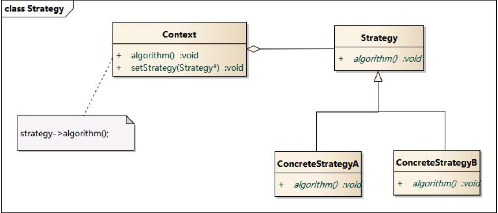

# 命令模式

> 不用命令模式之前：
>
> 以前处理事物时调用者直接调用处理类执行处理方法，缺点就是当需要批量处理不同事件时需要一个个调用处理类不仅麻烦而且灵活性差(替换处理类非常麻烦)。
>
> 使用命令模式之后：
>
> 将所有需要处理的不同事件转换成一个个命令，在命令中指定处理事件的接收者，由于调用者不处理命令，而是激活命令(即让接收者开始处理命令)，因此在调用者眼中这些命令都是一样没有区别，可以实现命令的批量处理。

## 命令模式结构

> Command: 抽象命令类
>
> ConcreteCommand: 具体命令类
>
> Invoker: 调用者
>
> Receiver: 接收者
>
> Client:客户类


## 代码

```swift
// 创建命令接口
protocol Command{
  func execute()
}

// 创建相应命令的接收者
class DrawImageReceive{
  func drawImage(){ }
}

class DrawImageCommand: Command{
  var receive:DrawImageReceive
  func execute{
    receive.drawImage()
  }
}

// 创建相应命令的接收者
class HandleNetWorkReceive{
  func handleNetWork(){ }
}

class NetWorkingCommand: Command{
  var receive:HandleNetWorkReceive
  func execute{
    receive.handleNetWork()
  }
}

// 创建发送命令的发送者
class Queue{
  var list:[Command] = []
  func invoke(){
    var command = list.removeFirst()
    command.execute()
  }
}

func main(){
  var queue = Queue()
  var network = NetWorkingCommand(HandleNetWorkReceive())
  var drawImage = DrawImageCommand(DrawImageReceive())
  queue.list.append(network)
  queue.list.append(drawImage)
  
  queue.invoke()
}
```


## 实例

> 开发中经常使用命令模式，例如程序中的`消息队列`就是使用命令模式实现的，消息队列本身不处理消息，而是激活消息，由消息绑定的接收者处理消息。

# 策略模式

将处理逻辑与具体处理地方分离，不写死处理逻辑，根据业务需求随时更换处理逻辑，提供代码灵活性。一般用在需要用户来决定程序处理方式的地方。

## 策略模式结构体

> Context: 环境类
>
> Strategy: 抽象策略类
>
> ConcreteStrategy: 具体策略类



## 代码

```swift
// 策略抽象类
class Filter<Element>{
    
    func filterData(arr:[Element]){ }
}

// 具体策略类
class FilterIllegal<T>: Filter<T>{
    override func filterData(arr:[T]){
        print("清除非法数据")
    }
}

// 需要对类中数据进行过滤
class DataManager<T>{

    var list:[T] = []
    typealias Element = T
    var filter:Filter<T>
    init(filter:Filter<T>) {
        self.filter = filter
    }

    func filterList(){
        self.filter.filterData(arr: self.list)
    }
}

// 创建过滤策略
var filter = FilterIllegal<String>()
// 将过滤策略传递给数据管理类
var manager = DataManager<String>(filter: filter)
// 过滤数据
manager.filterList()
```


## 实例

> 有些业务逻辑使用算法实现时，经常使用策略模式，例如`排序功能`、`过滤功能`都是使用策略模式来实现的。
>
> 一般当某个功能需要根据不同场景使用不同的处理方式时，就使用到策略模式。

# 命令模式和策略模式区别

> 从上面的例子可以很明显看出命令模式和策略模式的差异，两种思维方式不同，解决的问题也不相同。
>
> 命令模式：将事件和处理者绑定在一起，每个事件对应一个处理者，上层并不区分这些事件，实现事件的批量处理。就像现实中测试人员测试各个平台的bug，并发布出来，程序员自己去认领bug并修复。
>
> 策略模式：针对的不是一批事件而是某一个事件，需要根据不同的场景选择不同的处理方式。就像现实中测试人员对于一个bug，根据出现bug的平台，编写bug说明。