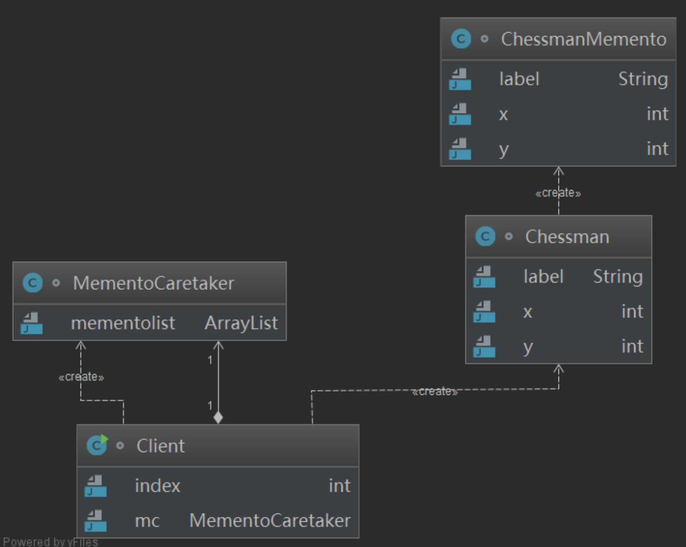

# 备忘录模式

> 模式作用：对实例对象当前的状态进行保存和恢复，因此应该称这个模式为备份模式。

## 模式结构

- ChessmanMemento：需要进行备份和恢复的目标类
- Chessman：保存目标类属性的备份类
- MementoCaretaker：管理备份类



## 模式代码

```swift
// 棋子类型
enum ChessmanType{
	case blackChessman; // 黑棋
  case whiteChessman; // 白棋
}

// 棋子
class Chessman{
  var chessmanType:ChessmanType
  var x:Int
  var y:Int
  
  init(){
    self.chessmanType = .blackChessman
    self.x = 0
    self.y = 0
  }
  init(type:ChessmanType, x:Int, y:Int){
    self.chessmanType = chessmanType
    self.x = x
    self.y = y
  }
  
  // 保存该棋子属性
  func saveChessman()->Memento{
    let temp = Memento()
    temp.chessmanType = self.chessmanType
    temp.x = self.x
    temp.y = self.y
    return temp
  }
  
  // 恢复该棋子属性
  func restoreChessman(memento: Memento){
    self.chessmanType = memento.chessmanType
    self.x = memento.x
    self.y = memento.y
  }
}

// 备份类
class Memento{
  var chessmanType:ChessmanType
  var x:Int
  var y:Int
  
}

// 备份管理类
class MementoCareTaker{
  var list: [Memento] = []
  func addMemento(item: Memento){
    self.list.append(item)
  }
  
  func removeMemento() -> Memento{
    return self.list.removeLast()
  }
}

func main(){
  let manager = MementoCareTaker()
  let chessman1 = Chessman(type:.blackChessmanType, 12, 3)
  let chessman2 = Chessman(type:.whiteChessmanType, 1, 3)
  // 备份棋子属性，并由管理者保存
  manager.addMemento(chessman1.saveChessman())
  manager.addMemento(chessman2.saveChessman())
  
  let chessman3 = Chessman()
  // 根据备份恢复棋子
  chessman3.restore(manager.removeMemento())
}
```

## 实例

备忘录模式在开发使用的不如享元模式多，大部分都是直接将原始类保存，而不是抽取出其中数据保存。

iOS中也有使用到该模式，例如实例对象的归档与解档。