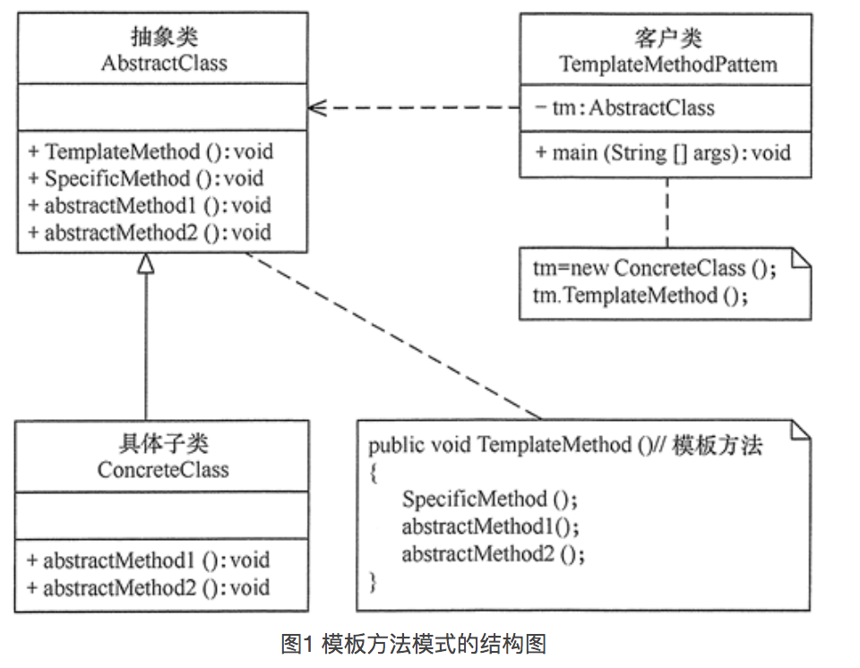

# 模版方法模式

这个模式我们经常使用，例如面向对象编程时，将所有子类都有的方法和属性放在父类中，这就是模版方法模式。

> 该模式就是为了提高代码的复用性，共同的方法和属性在父类中写一遍就行，哪个子类需要特殊功能，可以重写父类方法和属性。

## 模式结构



## 模式代码

```swift
class View{
  var frame:CGRect
  var backgroundColor:Color
  var superView: View
  var childViews: [View]
  
  func addSubView(sub: View){ }
  func removeFromSubView(){ }
}

class Label: View{
  var text:String
}

class Button: View{
  var target:AnyObject
}

class ImageView: View{
  var image: UIImage?
}
```

> 上面代码就是使用的模版方法模式，将各个子类中公共内容放到父类中。

## 实例

模版方法模式在面向对象开发过程中无处不在，只要使用继承就用到了模版方法模式，例如我们UIView和UIView的子类就是模版方法模式，继承NSObject类的子类也是使用的模版方法模式。


## 模版方法模式和策略模式区别：

两种模式共同点：

> 两种相同的地方都是将类中可变部分抽离出来，单独放置方便修改。

两种模式区别：

> 策略模式：使用关联的方式(作为类的属性、方法的参数)实现对可变部分的抽离，即将其抽离到其他类中。
>
> 模版方式模式：使用继承的方式(子类中重写父类方法)实现对可变部分的抽离，即将其抽离到子类中。

## 优缺点

	>  优点：
	>
	>  1. 提供代码复用性。
	>  2. 将子类相同部分抽离到父类中统一管理，一改全改，方便。
	>
	>  缺点：
	>
	>  1. 子类个数无法控制，可能每一种业务一个子类。
	>  2. 使用继承方式的缺点就是耦合性非常高。