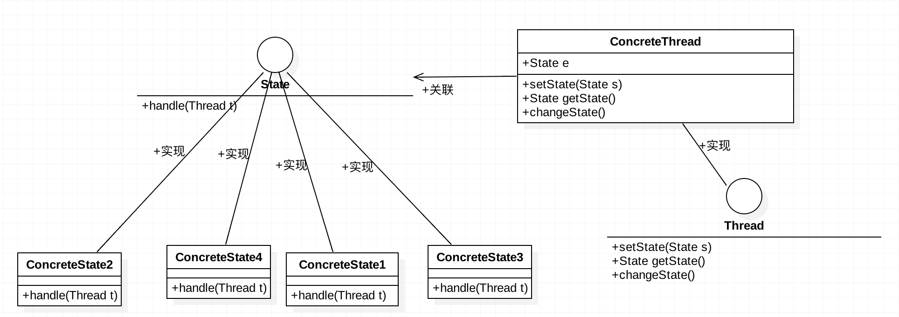
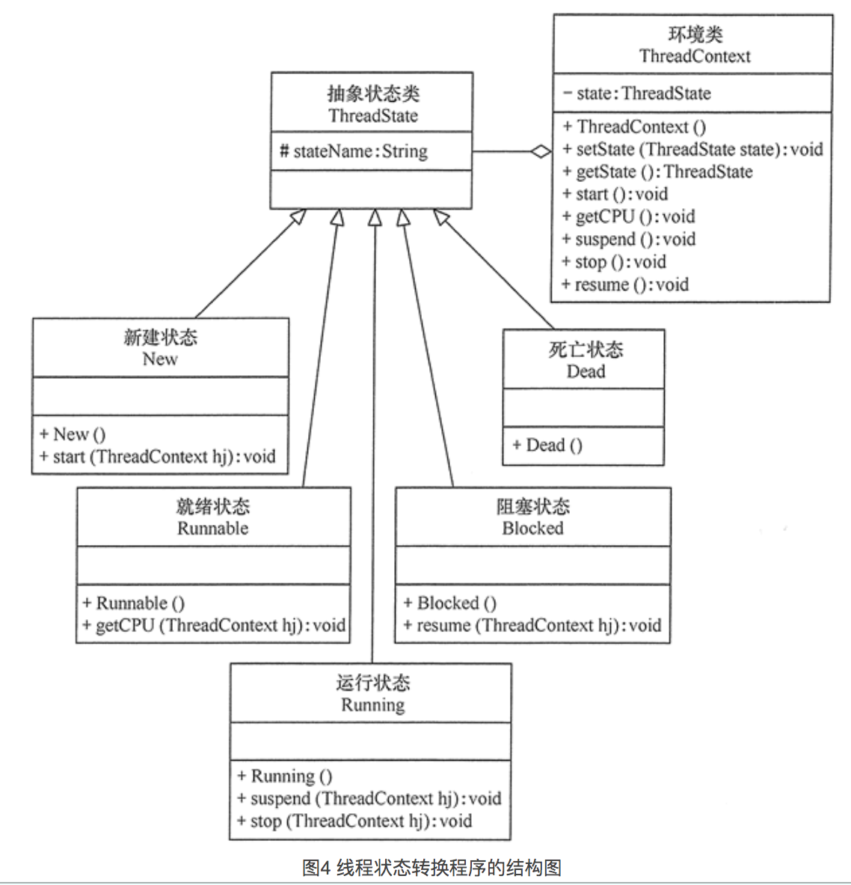

# 状态模式

开发中存在一些有多种状态的对象，对象在不同状态下会有不同的操作，这样造成在一些方法中需要使用if-else判断对象状态，然后做相应的操作。状态模式就是将这些状态和相应的操作分离各个子类中，将各个状态的操作分类管理，避免在使用if-else管理状态，增加修改的风险。

> 状态模式其实就是解决对象中if-else过长，不太好修改。

## 模式结构



## 模式代码



```swift
class THreadContext{
  var state:ThreadState
  init(){
    self.state = NewState()
  }
  func start(){
    let temp = self.state as? NewState
		temp?.start(self)
  }
  
  func run(){
		let temp = self.state as? RunnableState
    temp?.run(self)
  }
  
  func suspend(){
    let temp = self.state as? RunningState
    temp?.suspend(self)
  }
  
  func stop(){
    let temp = self.state as? RunningState
    temp.?stop(self)
  }
  
  func resume(){
    let temp = self.state as? BlockedState
    temp?.resume()
  }
}

// 线程状态
protocol ThreadState{
  var state:String{get set}
}

class NewState:ThreadState{
  var state:String = "新建状态"
  // 切换到就绪状态
  func start(context: ThreadContext){
    context.state = RunnableState()
  }
}

class RunnableState: ThreadState{
  var state:String = "就绪状态"
  // 切换到运行状态
  func run(context: ThreadContext){
    context.state = RunningState()
  }  
}

class RunningState: ThreadState{
  var state:String = "运行状态"
  // 切换到停止状态
  func stop(context: ThreadContext){
    context.state = StopState()
  }
  // 切换到阻塞状态
  func suspend(context: ThreadContext){
    context.state = BlockedState()
  }
}

class StopState: ThreadState{
  var state:String = "停止状态"
}

class BlockedState: ThreadState{
  var state:String = "阻塞状态"
  // 切换到就绪状态
  func resume(context: ThreadContext){
    context.state = RunnableState()
  }
}

func main{
  let thread = ThreadContext()
  thread.strat()
  thread.run()
  thread.suspend()
  thread.resume()
  thread.stop()
}
```

## 实例

我们在一些OA这样的流程模块中经常看到状态模式，不需要我们手动去管理状态，有操作去管理状态。

上面的线程其实也是使用的状态模式。将线程状态和线程操作从线程对象中分离，放到状态子类中管理。

## 优缺点

> 优点：
>
> 1. 由于状态放在子类中了，避免了因过长if-else判断而增加的修改风险。
> 2. 将状态和状态对应的操作集中在相应子类中(运行状态和运行状态时的操作，阻塞和停止集中在RunningState类中)，方便修改。
> 3. 由各自的状态子类管理自己的状态的切换逻辑，避免传统方式即需要用管理状态下支持的操作，又要管理当前状态可以切换到哪些状态上。
>
> 缺点：
>
> 1. 某个状态都需要建立一个子类，增加大大增加类和对象的个数。
> 2. 由于状态子类中包含了切换逻辑，因此当需要`调整或者添加`状态切换逻辑是，需要修改子类代码，违反开闭原则。
> 3. 代码可读性较差，使用不好系统会变得复杂和代码会变得混乱。