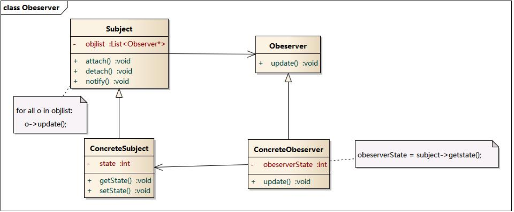

# 观察者模式

观察监视目标状态的两种方式：

1. 每个一定时间段查看目标状态。
   1. 好处：不需要侵入目标内部，不会和目标建立关系，耦合低。
   2. 坏处：要死循环查看目标状态，且不能立即知晓目标状态变更。
2. 按照窃听器。
   1. 好处：目标状态更新时目标会通知观察者，无需实时查看。
   2. 坏处：需要侵入目标内部，与目标建立关联关系。

> 观察者模式采用第二种方式，观察者作为目标的属性，在观察的目标属性的setter方法中通知观察者。
>
> 观察者模式是`一对多`方式，一个目标可以被多个观察者监听。
>
> 观察者模式所解决的问题：建立事物间的`联动关系`，即我随你的改变而改变。

## 模式结构

- Subject: 目标
- ConcreteSubject: 具体目标
- Observer: 观察者
- ConcreteObserver: 具体观察者



> 目标对象中有保存观察者列表的属性，用来记录有多少对象观察自己。需要观察目标哪些属性变化就在该属性的setter方法中调用观察者。

## 代码实现

```objective-c
// 观察者接口
@protocol Observer
  -(void)handleEvent:(NSString *)change;
@end
 
// 具体观察者类
@interface ConcreteObserver: Observer
  
@end
@interface ConcreteObserver()
  @property(nonatomic, strong) Person * target;
@end
@implemented
  -(instancetype)initWithTarget:(Person *)person{
  if(self = [super init]){
    self.target = person
    // 将观察者添加到目标对象中
    [self.target addObserver:self]
    return self;
  }
  return nil;
}
	-(void)handleEvent:(NSString *)change{
  NSLog(@"Target的Address属性变更为%@", change);
}

@end 

// 目标对象
@interface Person: NSObject
  @property(nonatomic, strong) NSMutableArray<Observer> *list;
	@property(nonatomic, copy) NSString * address;
@end
  
@implemented
  -(void)setAddress:(NSString *address){
  self.address = address;
  for Observer *temp in list{
    temp.handleEvent(address);
  }
}
	// 添加观察者
	-(void)addObserver:(Observer *)obs{
    [self.list addObject:obs]
  }
@end

void main(){
  Person *p = [Person new];
  ConcreteObserver *observer = [[ConcreteObserver alloc] initWithTarget:p];
  p.address = @"北京"
}
```


```swift
protocol Observer{
  func handleEvent(change:String)
}

class ConcreteObserver: Observer{
  weak var target:Person?
  init(target: Person){
    self.target? = target
    self.target?.addObserver(self)
  }
  
	func handleEvent(change:String){
    print("目标对象的address属性改变为\(change)")
  }
}

class Person{
  var list:[Observer] = []
  var address:String = ""{
    didSet{
      // 通知所有观察者
      for temp in list{
        temp.handleEvent(self.address)
      }
    }
  }
  
  // 添加观察者
  func addObserver(obes:Observer){
    self.list.append(obes)
  }
}

func main(){
  let p = Person()
  let obs = ConcreObserver(target:p)
  p.address = "上海"
}
```

## 实例

观察者模式在开发中经常被使用到，一般用来建立业务间的`联动关系`，例如某个实例对象值改变时，修改页面样式。

### iOS提供了观察者模式

> KVO：
>
> 这种就是使用观察者模式实现事物间联动关系，原理就像上面代码展示的一样，在setter方法中调用观察者的方法，不同的是不会在目标类中添加任何代码，而是创建一个该类的子类，在子类中重写setter(调用父类setter和观察者方法)，然后让实例对象的isa指针指向子类的类对象。

