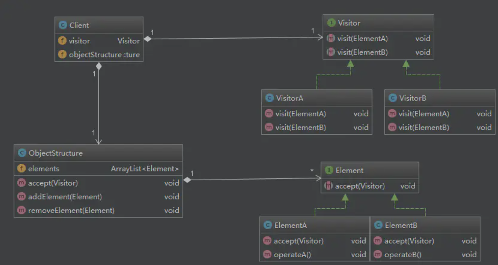

# 访问者模式

访问者模式，提供对集合中元素的属性访问的多种方式，例如在调试过程中遍历集合对象，以某种格式打印对象内容。一般是description方法，不同的场景下，我们修改修改description方法的实现。`访问者模式就是将对象属性的访问从类中抽离出来，单独放在一个类中`。

## 迭代器和访问者区别

> 迭代器模式：它的目的为了隐藏集合的数据结构，客户端无需知道集合是使用数组、链表还是树等数据结构实现的。
>
> 访问者模式：它针对的是元素的属性访问，将其抽离出来，根据业务需要而变，例如类不在使用description方法，而是根据业务需求将description功能封装到访问者类中。

## 模式结构



## 模式代码1(打印文件)

```swift
// 需要访问的抽象元素
protocol Composite {
    var depth: Int{set get}
    func addItem(el: Composite)
    func visit(v: Visitor)
}

// 文件类
class File: Composite{
    var name:String
    var depth: Int = 0
    init(_ name:String) {
        self.name = name
    }
    func addItem(el: Composite) {
    }
  	// 使用访问者打印文件名 
    func visit(v: Visitor){
        v.visit(file: self)
    }

}

// 文件夹类
class Directory: Composite{
    var list:[Composite] = []
    var name:String
    var depth: Int
    init(_ name:String, _ depth:Int) {
        self.name = name
        self.depth = depth
    }
    
    func addItem(el: Composite) {
        var temp = el
        temp.depth = self.depth + 3
        self.list.append(temp)
    }
    
    func visit(v: Visitor){
        v.visit(directory: self)
    }
}

// 抽象访问者
protocol Visitor{
    func visit(file: File)
    func visit(directory: Directory)
}

// 只打印文件的访问者
class FileVisitor: Visitor{
    func visit(file: File){
        print("|--\(file.name)")
    }
    
    func visit(directory: Directory){
        var it = directory.list.makeIterator()
        while let temp = it.next() {
            temp.visit(v: self)
        }
    }
}

// 打印文件和文件夹的访问者
class ListVisitor: Visitor{
    func visit(file: File){
        let str = "|-----------"
        print("\(str.prefix(file.depth+2))-\(file.name)")
    }
    
    func visit(directory: Directory){
        let str = "|-----------"
        print("\(str.prefix(directory.depth+2))-\(directory.name)")
        var it = directory.list.makeIterator()
        while let temp = it.next() {
            temp.visit(v: self)
        }
    }
}

func main(){
    let root = Directory("用户", 0)
    let d2 = Directory("桌面", 0)
    let d3 = Directory("应用", 0)
    let d4 = Directory("下载", 0)
    let d5 = Directory("book", 0)
    
    let f1 = File("safiri")
    let f2 = File("印象笔记")
    let f3 = File("微信")
    let f4 = File("酷狗")
    let f5 = File("数据结构")
    let f6 = File("数据库分析")
    let f7 = File("算法")
    
    root.addItem(el: d2)
    root.addItem(el: d3)
    root.addItem(el: d4)
    d2.addItem(el: d5)
    
    d3.addItem(el: f1)
    d3.addItem(el: f2)
    d3.addItem(el: f3)
    d3.addItem(el: f4)
    
    d5.addItem(el: f5)
    d5.addItem(el: f6)
    d5.addItem(el: f7)
    
    let vi1 = FileVisitor()
    let vi2 = ListVisitor()
    
    root.visit(v: vi1)
    print("--------------")
    root.visit(v: vi2)
}

打印结果：
|--数据结构
|--数据库分析
|--算法
|--safiri
|--印象笔记
|--微信
|--酷狗
--------------
|--用户
|-----桌面
|--------book
|-----------数据结构
|-----------数据库分析
|-----------算法
|-----应用
|--------safiri
|--------印象笔记
|--------微信
|--------酷狗
|-----下载

```

> 上面代码描绘的就是电脑查看文件的两种方式：
>
> 1. FileVisitor查看某文件夹中的所在文件，忽略文件结构。
> 2. ListVisitor查看某个文件夹结构。

> 注意上面用到了三种模式：
>
> 1. 访问者模式
> 2. 迭代器模式
> 3. 组合模式，Directory中有一个Composite集合。


## 模式代码2(加工原料)

```swift
//抽象访问者:公司
protocol Company
{
   func create(element: Paper )
   func create(element: Cuprum)
}
//具体访问者：艺术公司
class ArtCompany: Company
{
    func create(element: Paper)
    {
       print("讲学图")
    }
    func create(element: Cuprum)
    {
			 print("朱熹铜像")
    }
}
//具体访问者：造币公司
class Mint: Company
{
    func create(element: Paper)
    {
       print("人民币")
    }
    func create(element: Cuprum)
    {
			 print("钢镚")
    }
}
//抽象元素：材料
protocol Material
{
   func accept(visitor: Company)
}
//具体元素：纸
class Paper: Material
{
    func accept(visitor: Company)
    {
			visitor.create(self)
    }
}
//具体元素：铜
class Cuprum implements Material
{
    func accept(visitor: Company)
    {
			visitor.create(self)
    }
}
//对象结构角色:材料集
class SetMaterial
{   
    var list= Array<Material>()  
		func accept(visitor: Company)
    {
				let it = list.makeIterator()
        while let tmp = it.next()
        {
            tmp.accept(visitor)
        }    
    }
    func add(element: Material)
    {
        list.add(element)
    }
    func remove()
    {
        list.removelast()
    }
}

func main(){
  let v1=new ArtCompany()//艺术公司
	let v2=new Mint() //造币公司    
  var arrs = SetMaterial()      
	arrs.append(Cuprum()) // 添加铜
	arrs.append(Paper()); // 添加纸
  
  arrs.accept(v1) // 艺术公司加工
  arrs.accept(v2) // 造币公司加工
}
```

## 优缺点

> 优点：
>
> 1. 将访问类的属性方法放到单独的类中，根据业务不同，扩展不同的访问者，非常灵活。
>
> 缺点：
>
> 1. 类的属性发送改变(删除属性，修改属性结构)时，访问者类也会随着一起修改，如果该类访问者过多时非常麻烦。
> 2. 如果类扩充子类时，也可能需要修改所有的访问者，适配新子类。

