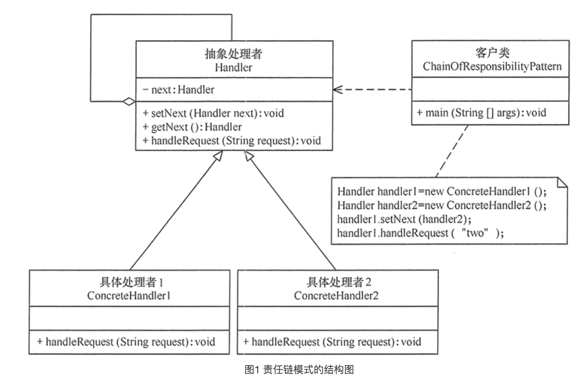

# 责任链模式

责任链模式：解决请求发起者多个请求处理者之间的耦合，例如事件的流程审批，需要经过一层层的流程都处理，如果让发起者找每个处理者取出来他们相应的步骤，耦合性太大，想想我们在工作中，出现问题告诉直系领导，需要再越级报给部门领导吗。

> 将问题解决步骤形成一个链条，一步步解决。

## 模式结构



## 模式代码

```swift
// 触屏事件
class Event{
  var point:CGPoint
  var message:String
  
  init(p:Point, m:String){
    point = p
    message = m
  }
}

// 触屏事件处理者
class View{
  var name:String
  var subViews:[View] = []
  var frame:CGRect
  init(name:String){
    self.name = name
  }
  
  func addSubView(sub: View){
    self.subViews.append(sub)
  }
  // 判断触屏点是否在该视图中
  func pointInView(e: Event) -> Bool{
    let rightX = self.frame.origin.x + self.frame.size.width
    let leftX = self.frame.origin.x
    let leftY = self.frame.origin.y
    let rightY =  self.frame.origin.y + self.frame.size.height
    let x = leftX < e.x && rightX > e.x
    let y = leftY < e.y && rightY > e.y
    if x && y{
      return true
    }else{
      return false
    }
  }
  
  // 处理事件
  func handleEvent(e: Event) -> Bool{
    let inView = self.pointInView(e)
		guard inView == true else{
      return false
    }
    for temp in self.subViews{
      let tempE = e.mutableCopy()
      tempE.point.x -= self.frame.origin.x
      tempE.point.y -= self.frame.origin.y
      if temp.handleEvent(tempE){
        return true
      }  
    }
    print("\(self.name)处理事件：\(e.message)")
  }
}


func main(){
  let v1 = View(name:"first")
  let v2 = View(name:"second")
  let v3 = View(name:"third")
  let v4 = View(name:"Four")
  v1.addSubView(v2)
  v1.addSubView(v3)
  v2.addSubView(v4)
  let e = Event(p:CGPoint(10,13), m:"处理触屏点击")
}
```

>上面代码就是使用责任链模式处理触屏点击事件。

## 模式应用

在app中责任链经常被使用到，例如事件传响应链机制就是使用的责任链模式。

## 责任链与状态区别

在处理请假审批流程时，状态模式和责任链模式处理思维

状态模式：将审批事件状态作为主体，客户端根据审批事件当前状态去取切换下一个状态，至于谁审批由状态自己去管理。

责任链模式：将审批对象作为主体，隔离客户端与这些审批对象，客户端只需要与审批流程开始的审批对象交互即可，无需关系接下来需要走几步和由哪些审批对象审批。

> 从上面可以看出责任链与状态区别：
>
> 状态模式关注事物状态，即请假审批状态，各个状态管理自己的处理流程，因此这些状态会全部暴露给客户端，需要客户端管理状态切换(审批流程)。
>
> 责任链模式关注客户端与审批流程处理对象的隔离，使用链表串联处理对象，客户端只需要关系将请假审批交给谁就行，不需要关系审批流程有多少，有谁处理。

## 优缺点

> 优点：
>
> 1. 隔离客户端与多个处理对象，降低耦合性。
> 2. 由于是使用链条形式处理，因此增删节点非常容易。
> 3. 屏蔽处理过程，就像银行前台一样，无需关系具体如何处理。
>
> 缺点：
>
> 1. 方法调用一层层嵌套，说白了就是递归调用，容易栈溢出，经常函数进入和退出，性能不好。