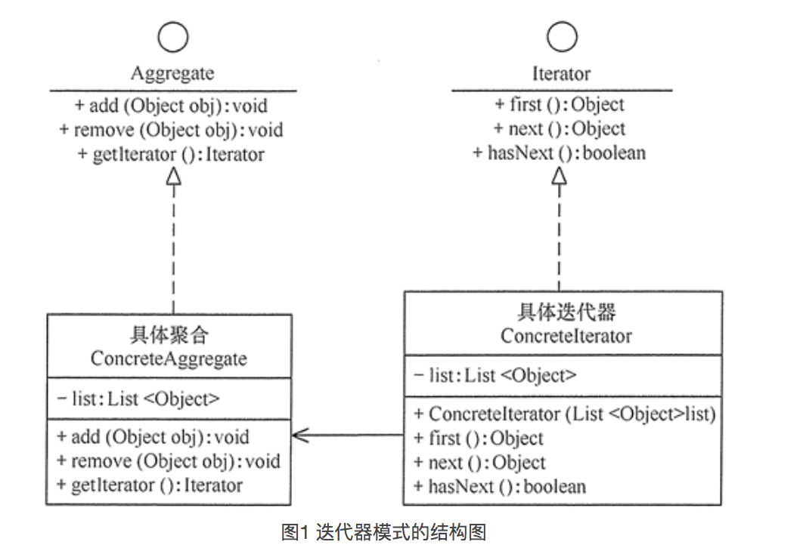

# 迭代器模式

该模式的作用就是为集合数据的遍历提供简单并且统一的方式。

> 不使用迭代器情况：
>
> 在不使用迭代器情况，我们需要了解集合的数据结构，并需要自己实现遍历方式。无法复用只能在每个使用的地方在写一遍。
>
> 使用迭代器情况：
>
> 客户端无需了解集合的数据结构，只需要关心元素内部的结构。由于遍历方式都封装到一类中，因此不管是替换遍历方式还是复用遍历方式都很方便。

## 模式结构




## 模式代码

```swift
// 迭代器抽象类
class Iterator<Element>{
    
    func first() -> Element?{
        return nil
    }
    func next() -> Element?{
        return nil
    }
    func hasNext() -> Bool{
        return false
    }
    
}

// 具体迭代器
class ArrayIterator<Element>: Iterator<Element>{
    
    var list:[Element] = []
    private var index:Int = -1
    
    override func first() -> Element?{
        if self.list.count > 0 {
            return self.list.first
        }
        return nil
    }
    override func next() -> Element?{
        self.index += 1
        return self.list[index]
    }
    
    override func hasNext() -> Bool{
        if self.index < self.list.count-1 {
            return true
        }else{
            return false
        }
    }
}

// 抽象集合
protocol Aggregate{
    associatedtype Element
    func add(e: Element)
    func removeLast()
    func getIterator() -> Iterator<Element>
}

// 具体集合类
class ZPArray<T>: Aggregate{
    var list:[T] = []
    
    typealias Element = T
    func add(e: T) {
        self.list.append(e)
    }
    
    func removeLast() {
        self.list.removeLast()
    }
    
    func getIterator() -> Iterator<T> {
        let it = ArrayIterator<T>()
        it.list = list
        return it
    }
}

func main(){
  var arr = ZPArray<String>()
	arr.add(e: "aaaa")
	arr.add(e: "bbbb")
	arr.add(e: "cccc")
	arr.add(e: "dddd")

	let it = arr.getIterator()

	while it.hasNext(){
    print(it.next())
	}
}
```

## 实例

迭代器模式一般用在集合遍历中，隐藏集合保存数据的`数据结构`，基本现在的面向对象语言的API库中都有迭代器模式，例如java中的集合，swift中的集合。

## 优缺点

> 优点：
>
> 1. `隐藏集合类的数据结构`，客户端无需关系元素是如何保存的。
> 2. 将遍历集合的方法从集合类中分离出来，扩展集合类或者遍历类无需修改原来代码。
> 3. 遍历不同的聚合结构提供一个统一的接口，简化上手过程。
>
> 缺点：
>
> 1. 每个集合类都需要至少一个迭代器类，增加系统复杂度。

