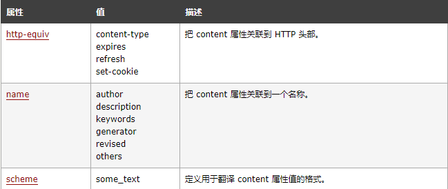

##  <!DOCTYPE>

> ​		该标签并不是html标签，用来通知浏览器如何解析html文件。
>
> ​		作为html文档的声明，用来告诉浏览器，当前html文档基于哪种版本创建的，HTML中的标签都是在DTD文档中定义的，不同版本中对于标签的定义是有差距的(有些版本的html不在支持前一个版本的标签也是很可能的)，因此，为了正确的让浏览器解析我们编写的html文档，需要使用该标签告诉浏览器我们使用哪种版本的html。

```html
<!-- html5 -->
<!DOCTYPE html>
```

```html
<!-- html4.0.1 Strict -->
<!DOCTYPE HTML PUBLIC "-//W3C//DTD HTML 4.01//EN" "http://www.w3.org/TR/html4/strict.dtd">

<!-- html4.0.1 Transitional -->
<!DOCTYPE HTML PUBLIC "-//W3C//DTD HTML 4.01 Transitional//EN" 
"http://www.w3.org/TR/html4/loose.dtd">

<!-- html4.0.1 Frameset  -->
<!DOCTYPE HTML PUBLIC "-//W3C//DTD HTML 4.01 Frameset//EN" 
"http://www.w3.org/TR/html4/frameset.dtd">
```

```html
<!-- xhtml1.0 Strict -->
<!DOCTYPE html PUBLIC "-//W3C//DTD XHTML 1.0 Strict//EN" 
"http://www.w3.org/TR/xhtml1/DTD/xhtml1-strict.dtd">

<!-- xhtml1.0 Transitional -->
<!DOCTYPE html PUBLIC "-//W3C//DTD XHTML 1.0 Transitional//EN" "
http://www.w3.org/TR/xhtml1/DTD/xhtml1-transitional.dtd">

<!-- xhtml1.0 Frameset  -->
<!DOCTYPE html PUBLIC "-//W3C//DTD XHTML 1.0 Frameset//EN" 
"http://www.w3.org/TR/xhtml1/DTD/xhtml1-frameset.dtd">
```

```html
<!-- xhtml1.1  -->
该 DTD 等同于 XHTML 1.0 Strict，但允许添加模型（例如提供对东亚语系的 ruby 支持）。

<!DOCTYPE html PUBLIC "-//W3C//DTD XHTML 1.1//EN" "http://www.w3.org/TR/xhtml11/DTD/xhtml11.dtd">
```


>strict：不包含展示性和弃用的元素、也不包括框架
>
>transitional：包括展示性和弃用的标签，但不包括框架
>
>frameSet：包括展示性、弃用的标签、框架

> 由于HTML5不基于SGML解析规则，因此不需要像html4和XHTML一样说明类型和DTD。

## html

> xmls：用来规定html的命名空间，不太常用，一般出现在XML中，当在XML中编写html标签时，XML与html定义的标签同名不同用法时，为了区分使用下xmls来区分。

```
<h:table xmlns:h="http://www.w3.org/TR/html4/">
   <h:tr>
   <h:td>Apples</h:td>
   <h:td>Bananas</h:td>
   </h:tr>
</h:table>

<f:table xmlns:f="http://www.w3school.com.cn/furniture">
   <f:name>African Coffee Table</f:name>
   <f:width>80</f:width>
   <f:length>120</f:length>
</f:table>
```


## head

​	用来定义html文件相关的配置信息。

### meta



```html
<meta name="keywords"   content="<head>标签描述">
<meta name="description"   content="这篇文章主要对<head>标签进行详细讲解">
<meta name="author"   content="author">
<meta name="copyright"   content="本站所有教程均为原创，版权所有，禁止转载。否则将追究法律责任。">
// 告诉搜索引擎，该文档的关键字
<meta name="keywords" content="HTML,ASP,PHP,SQL" />

// 告诉浏览器文档类型和文档的字符集
<meta http-equiv="Content-Type" content="text/html; charset=utf-8" />
// 告诉浏览器文档的过期时间
<meta http-equiv="expires" content="31 Dec 2008" />
// 告诉浏览器5秒后，跳转到指定地址
<meta http-equiv="Refresh" content="5;url=http://www.w3school.com.cn" />
// 告诉浏览器每隔5秒后，刷新一次界面
<meta http-equiv="Refresh" content="5" />
```

### base

>使用`href`属性定义页面的基础地址，之后页面的一些标签(，<a>，<link>，<form>等标签)可以使用相对地址了。
>
>使用`target`属性定义本页面打开新链接时，打开方式

```html
<!-- 之后使用相对路径访问时，会直接使用base定义的地址拼接，并且打开新标签窗口 -->
<base href="http://www.baidu.com/" target="_blank"/>
<body>
	<a href="a.html">访问下一个链接</a>
</body>
```

###  link

>用来链接外部文档
>
>常用的标签属性：
>
>1、href：外部文档的地址
>
>2、rel：外部文档与关系，css一般使用stylesheet，该页面的样式表。
>
>3、type：外部文档的文件类型，text/css。

```html
<link rel="stylesheet" type="text/css" id="style1" href="test.css" />
```

### script

	> 该标签用来包裹页面中编写的javascript代码。
	>
	> 如果浏览器不支持javascript时，使用<noscript>标签说明。

```html
<script type="text/javascript">
document.write("Hello World!")
</script>

<noscript>Sorry, your browser does not support JavaScript!</noscript>
```


### style

>该标签用来包裹页面中编写的css代码。

```html
<style type="text/css">
	h1 {color:red}
	p {color:blue}
</style>
```

## body

> 用来包裹文档主体内容。

## frameSet

>使用frameset标签加载多个网页到一个窗口。
>
>参数：
>
>cols：设置框架中的页面水平排列。
>
>rows：设置框架中的页面垂直排列。

> frame标签用来配置框架中展示的页面文件，使用name标签与其他标签的target属性配合使用，可以实现导航效果。
>
> target中的`_self`,`_top`,`_parent`,`name`需要配合frameSet来使用，根据设置的不同跳转链接显示到不同位置。
>
> _self：在当前所处的框架位置中显示。
>
> _top：在浏览器窗口中显示。
>
> _parent：在上一个所属的框架中的位置显示。
>
> name：在与frame的name属性相同的位置显示。

```html
<html>
<frameset rows="50%,50%">
	<frame src="/example/html/frame_a.html">
	<frameset cols="120,*">
		<frame src="/example/html/frame_b.html">
		<frame src="/example/html/frame_c.html">
	</frameset>
</frameset>
</html>
```

```html
<!DOCTYPE html>
<html>
    <frameset cols="120, *">
        <frame src="test1.html" />
        <frame src="frame_a.html" name="content"/>
    </frameset>
</html>

<!-- test1.html -->
<!DOCTYPE html>
<html>
<head></head>
<body bgcolor="red">
 	 <a href="frame_a.html" target="ttst">frame_a</a><br/>
	 <a href="frame_b.html" target="ttst">frame_b</a><br/>
     <a href="frame_c.html" target="content">frame_c</a><br/>
</body>
</html>


<!-- frame_a.html -->
<!DOCTYPE html>
<html>
<head></head>
<body bgcolor="orange">frame_a</body>
</html>

<!-- frame_b.html -->
<!DOCTYPE html>
<html>
<head></head>
<body bgcolor="orange">frame_a</body>
</html>

<!-- frame_c.html -->
<!DOCTYPE html>
<html>
<head></head>
<body bgcolor="orange">frame_a</body>
</html>
```

