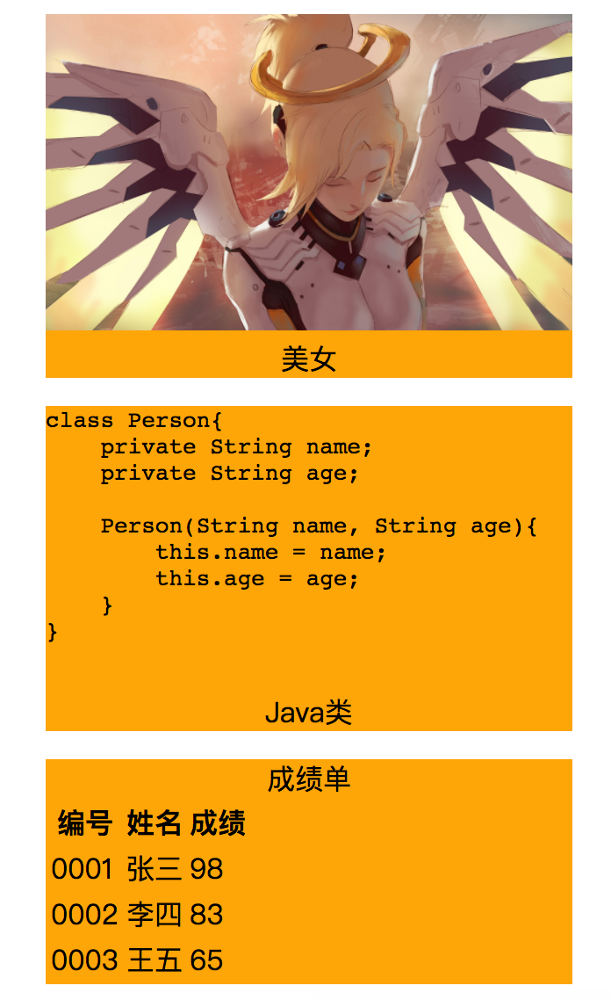

# html的语义标签

> ​	html是用来说明`文档结构`的，但是以前的网页都是使用div划分页面不同区域，使用class或者id属性值来标识该区域是做什么的，h5版本新增了一些语义化标签，这些标签本质上和div没什么区别，只不过是让开发者在维护时能迅速知道当前区域是做什么的。

## 之前的语义标签

> `address标签：`
>
> ​		用来包含当前文档或者某个区域的文章的作者联系信息，其中的字体会以斜体形式展示，本质就是一个div，但是不能添加任何与联系信息无法的内容，因为这样就不符合该标签的语义了(用address替代div实现就是为了语义)。
>
>  
>
> `h1~h6：`
>
> ​		用来定义标题。一个网页最好只有一个一级标题，这样搜索引擎在搜索时可以更加方便找到当前网页的重点。

## html5新增的语义标签

> H5新增的语义标签，IE8及以下版本的IE浏览器不支持，其他浏览器和IE9支持。
>
> ​	
>
> `header：`
>
> ​		用来包含文档的首部区域，将首部的html标签放在header标签中，本质是一个div。
>
> 
>
> `footer：`
>
> ​		用来包含文档的尾部区域，将尾部的html标签放在footer标签中，本质是一个div。
>
> 
>
> `nav：`
>
> ​		用来包含网页的导航区域，将导航的html标签放在nav标签中，并且将nav标签放在header标签中，本质也是一个div。
>
> 
>
> `section：`
>
> ​		用来包含网页主体内容区域，将主体内容html标签放在nav标签中，本质也是一个div。
>
> 
>
> `article：`
>
> ​		用来包含一段独立内容的区域，大到一个网页，小到一个评论区域，一个可复用的内容模版。
>
> 
>
> `aside：`
>
> ​		用来包含一个侧边栏或者注解栏。
>
> 
>
> `main：`
>
> ​		一个页面只能有一个main标签，因此常常作为body标签的唯一子元素。`IE浏览器不支持`
>
>  
>
> ` figure：`
>
> ​		用来表示一个对主文本的解释，例如文章中提到的图片、代码、插图、表格等等，常常用在博客中，讲解一段知识点时，展示一段实例代码时，可以使用figure，该标签常常与`figcaption`标签一起使用，它作为一个标题，作为figure第一个或者最后一个元素节点。
>
> 
>
> `注意：PC中一般使用div，因为这些标签IE8不支持，移动端可以使用这些标签也可以不使用`

```html
<!-- 不使用语义标签，全都是使用div完成，使用class来区分网页的各个部分 -->
<!DOCTYPE html>
<html>
<head></head>

<body>
    <!-- 网页最外层包含块 -->
    <div class="wrap">
        <div class="header">
            网页头部
            <div class="nav"> 网页导航栏 </div>
        </div>

        <div class="section"> 
          <!-- 主体内容 -->
          <div> 轮播图</div>
          <!-- 网页侧边栏 -->
          <div class="scrollItem"> 侧边栏</div>
          
          <div> 内容讲解</div>
          <!-- 插图 -->
          <div>
          	
            <p> 大自然风景 </p>
          </div>
      	</div>

        <div class="footer"> 网页尾部</div>
    </div>
</body>

</html>
```

```html
<!-- 使用h5语义标签，非常清晰的展示出网页的各个部分， article标签既可以包含这个网页，也可以包含一个单独的可复用的组件(轮播图)-->
<!DOCTYPE html>
<html>
<head> </head>
<body>
  	<!-- 一般用在网页内容的最外层的div，所有编写的标签都放在main标签内部 -->
    <main>
  			  <article>
          <header> 网页首部
              <nav> 导航栏</nav>
          </header>

 	        <section>
            	网页主体
            	<article> 轮播图 </article>
          		<aside> 侧边栏 </aside>
              
            	<div> 内容讲解</div>
		          <!-- 插图 -->
    		      <figure>
        		  	
            		<figcaption> 大自然风景 </figcaption>
  			      </figure>
        	</section>

        	<footer> 网页尾部 </footer>
    		</article>
  	</main>
</body>

</html>
```


### figure

> figure标签本质上就是一个div，只不过它带有语义。figure标签不仅可以包含图片、还可以包含表格、文章、代码等等。

```html
<!DOCTYPE html>
<html>

<head>
    <style>
        html,
        body {
            height: 100%;
            width: 100%;
            overflow: hidden;
        }
        img {
            width: 300px;
            height: auto;
        }

        figure {
            width: 300px;
            background-color: orange;
        }

        figcaption {
            text-align: center;
        }
    </style>
</head>

<body>
    <figure>
        
        <figcaption>美女</figcaption>
    </figure>

    <figure>
        <pre>class Person{
    private String name;
    private String age;
    
    Person(String name, String age){
        this.name = name;
        this.age = age;
    }
}
        </pre>
        <figcaption>Java类</figcaption>
    </figure>


    <figure>
        <figcaption>成绩单</figcaption>
        <table>
            <tr>
                <th>编号</th> <th>姓名</th> <th>成绩</th>
            </tr>
            <tr>
                <td>0001</td> <td>张三</td> <td>98</td>
            </tr>
            <tr>
                <td>0002</td> <td>李四</td> <td>83</td>
            </tr>
            <tr>
                <td>0003</td> <td>王五</td> <td>65</td>
            </tr>
        </table>
    </figure>
</body>
</html>
```

