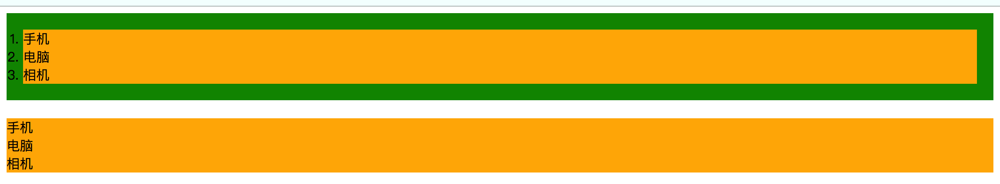
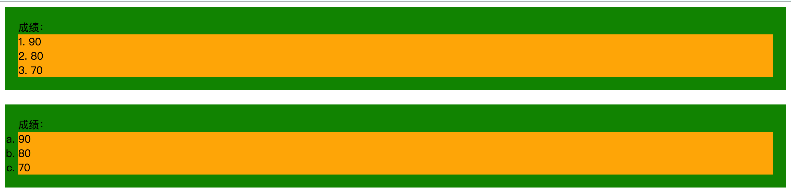
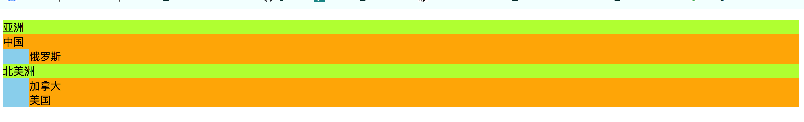
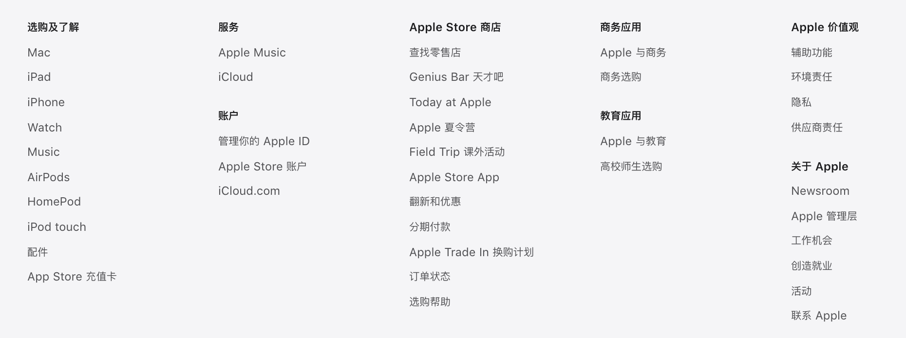

# 列表标签

```html
<!-- 无序列表 -->
<ul>
    <li>手机</li>
    <li>电脑</li>
    <li>相机</li>
</ul>

<!-- 有序列表 -->
<ol>
   <li>90</li>
   <li>80</li>
   <li>70</li>
</ol>

<!-- 自定义列表 -->
<dl>
   <dt>亚洲</dt>
     <dd>中国</dd>
     <dd>俄罗斯</dd>
  <dt>北美洲</dt>
    <dd>加拿大</dd>
    <dd>美国</dd>
</dl>
```


## 无序列表

> 无序列表：使用ul-li两个标签来创建，li为列表项，无序列表非常常用，一般网站中大部分列表都是使用无序列表来实现的。
>
> ​	
>
> `无序列表特点：`
>
> 1. `ul`和`li`标签都是块元素，可以包含其他元素，但是ul标签中最好只包含li元素，由li元素来包含其他元素。
> 2. 无序列表中列表项的顺序，由代码编写顺序来决定的。

```html
<!DOCTYPE html>
<html>

<head>
    <style>
      .customul{
        	/* list-style-type控制每项前面的标识，decimal、disc、none三种属性值*/
          list-style-type:decimal;
        	/*外边距为0*/
          margin: 0;
	        /*一般*/
          padding: 20px;
        }
      
      /* 清楚列表默认样式*/
      .clearul{
        	list-style-type:none;
        	margin:0;
        	padding:0;
      }
      
      li{
        background-color:orange;
      }
      ul{
        background-color:green;
      }
    </style>
</head>

<body>
    <!-- 无序列表 -->
    <ul class="customul">
        <li>手机</li>
        <li>电脑</li>
        <li>相机</li>
    </ul>
    <br>
      <!-- 无序列表 -->
    <ul class="clearul">
        <li>手机</li>
        <li>电脑</li>
        <li>相机</li>
    </ul>
</body>

</html>
```



## 有序标签

> 有序列表：使用ol-li两个标签定义，li表示列表项。
>
>  
>
> 有序列表特点：
>
> 1. `ol`和`li`标签都是块元素，都可以包含其他元素，但是ol标签中最好只包含li元素，由li元素来包含其他元素。
> 2. 有序列表的每项都是由顺序的，顺序为代码编写顺序。
> 3. 通过css或者标签属性可以修改每项头部样式，建议使用css。
>
> css属性：
>
> 1. list-style-type：下面代码效果，第1个列表标识是数字，第2个列表标识是英文字母。
> 2. list-style-position：下面代码效果，第1个列表标识放在li内部，第2个列表标识放在li外部。
> 3. list-style-imge：使用图片代替列表标识。

```html
<!DOCTYPE html>
<html>

<head>
    <style>
        .customol1 {
            /* list-style-type控制每项前面的标识样式*/
            list-style-type: decimal;
            /*标识放在li中*/
            list-style-position: inside;
            /*外边距为0*/
            margin: 0;
            padding: 20px;
        }

        /* 清楚列表默认样式*/
        .customol2 {
            list-style-type: lower-alpha;
            /*标识放在li外部*/
            list-style-position: outside;
            margin: 0;
            padding: 20px;
        }

        li {
            background-color: orange;
        }

        ol {

            background-color: green;
        }
    </style>
</head>

<body>
    <!-- 有序列表 -->
    <ol class="customol1">
        成绩：
        <li>90</li>
        <li>80</li>
        <li>70</li>
    </ol>
    <br>
    <ol class="customol2">
        成绩：
        <li>90</li>
        <li>80</li>
        <li>70</li>
    </ol>
</body>

</html>
```



## 自定义列表

> 自定义列表：分类的列表，将列表分组展示，使用dl-dt-dd三个标签来实现。
>
> 
>
> 自定义列表特点：
>
> 1. `dl`、`dt`和`dd`标签都是块元素，都可以包含其他元素。dt标签后面跟着n个dd标签，表示该组下的列表项。
> 2. 没有列表项标识，就是无序列表中每项前面的小圆点。
>
> 自定义列表也是一个语义标签，展示效果同样可以使用ul标签来实现。

```html
<!DOCTYPE html>
<html>

<head>
    <style>
      	/* 	清楚自定义列表默认样式 */
        .clearStyledd{
            margin-inline-start: 0;
        }

        dd {
            background-color: orange;
        }

        dl {

            background-color: skyblue;
        }

        dt {
            background-color: greenyellow;
        }
    </style>
</head>

<body>
    <!-- 自定义列表 -->
    <dl>
        <dt>亚洲</dt>
        <dd class="clearStyledd">中国</dd>
        <dd>俄罗斯</dd>
        <dt>北美洲</dt>
        <dd>加拿大</dd>
        <dd>美国</dd>
    </dl>
</body>

</html>
```



### dd和dt个数

> dl标签中的dd和dt的个数可以任意搭配：
>
> * 一个dt后面跟一个dd
> * 一个dt后面可以跟多个dd
> * 多个dt后面跟一个dd。

```html
<dl>
    <dt>标签1</dt>
    <dt>标题2</dt>
    <dd>内容1</dd>
</dl>

<dl>
    <dt>标题1</dt>
    <dd>内容1</dd>
    <dd>内容2</dd>
</dl>

<dl>
    <dt>标签1</dt>
    <dt>标题2</dt>
    <dd>内容1</dd>
    <dd>内容2</dd>
</dl>
```


### 自定义列表应用

> 公司官网首页底部的列表都是使用自定义列表实现的，例如苹果官网。



## 有序列表和无序列表的选择

> ​		无序列表也可以使用css变成有序列表的样式，本质实现上没有区别，就算你使用一个ul标签实现一个有序列表或者使用ol标签实现一个无序列表在显示效果没什么区别，它们只是表达语义，让开发者知道当前列表是一个无序的，或者是一个有序的。因此根据数据实际情况来选择是有序还是无序。
>
> `举例：`
>
> 1. 使用列表表示一个成绩单排名时，由于每项都是有顺序的不能调换，因此使用有序列表。
> 2. 使用列表表示购物清单时，每项商品没有什么前后顺序，因此使用无序列表表示。
