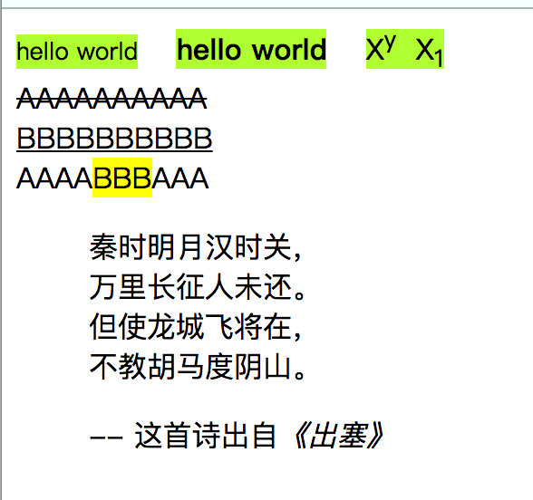
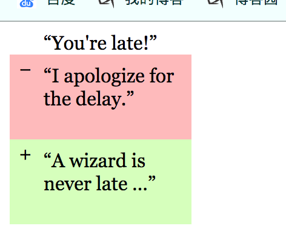

# 文本格式语义标签

> 文本格式标签都是行内元素：
>
> 1. strong：修饰的文字字体变大
> 2. small：修饰的文字字体变小
> 3. sub：修饰的文字作为前一个文字的下标
> 4. sup：修饰的文字作为前一个文字的下标
> 5. del：修饰的文字出现删除线，当前文本是错误的。一般用在文章的修改，对应错误的地方使用这个标签标识出来。
> 6. ins：修饰的文字出现下划线，注明该段文本是后期网页维护时添加上的。
> 7. cite：修饰的文字出现斜体，表示该文本是一个书名、作者名或者其他名称，常用在引用中，表示引用的出处。
> 8. mark：修饰的文本会有背景色，用来强调修饰的文本的重要性。

```html
<!DOCTYPE html>
<html>

<head>
    <style>
        small,
        strong,
        span {
            background-color: greenyellow;
        }
    </style>
</head>

<body>
    <!-- 小一字号 -->
    <small>hello world</small> &nbsp;&nbsp;
    <!-- 大一字号 -->
    <strong>hello world</strong> &nbsp;&nbsp;
    <!-- 下标和上标 -->
    <span>X<sup>y</sup>&nbsp;&nbsp;X<sub>1</sub></span> <br>
    <!-- 删除线 -->
    <del>AAAAAAAAAA</del> <br>
    <!-- 替换线 -->
    <ins>BBBBBBBBBB</ins> <br>

    AAAA<mark>BBB</mark>AAA <br>

    <blockquote>
        <p>秦时明月汉时关，<br>
           万里长征人未还。 <br>
           但使龙城飞将在， <br>
           不教胡马度阴山。</p>
        -- 这首诗出自<cite>《出塞》</cite>
    </blockquote>
</body>

</html>


```



## 实现git样式的文本删除和替换

```html
<!DOCTYPE html>
<html>

<head>
    <style>
        del,
        ins {
            /* 解决margin塌陷问题 */
            overflow:hidden;
            display: block;
            /* 取消ins和del默认样式 */
            text-decoration: none;
            position: relative;
            width: 150px;
            height: 70px;
        }

        del {
            background-color: #fbb;
        }

        ins {
            background-color: #d4fcbc;
        }
        p{
            font-family: Georgia, serif;
            font-size: 1rem;
            margin: 0;
            margin-top:8px;
            margin-left: 28px;
        }

        del::before {
            content: "-";

        }
        ins::before {
            content: "+";
        }

        del::before, ins::before{
            position: absolute;
            left: 8px;
        }
    </style>
</head>

<body>
    <p>“You're late!”</p>
    <del>
        <p>“I apologize for the delay.”</p>
    </del>
    <ins cite="../howtobeawizard.html" datetime="2018-05">
        <p>“A wizard is never late …”</p>
    </ins>

</body>

</html>
```



