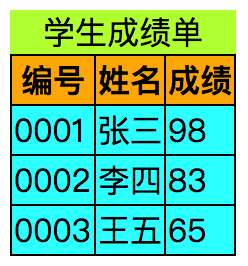
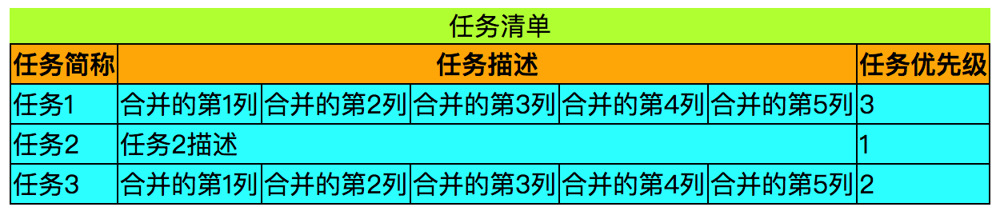
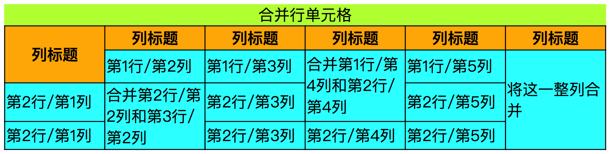
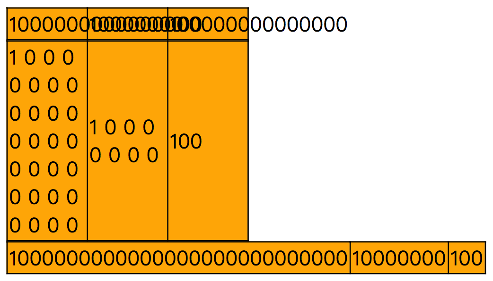

# 表格标签

> Html提供的表格标签：
>
> * table：表格标签
> * thead：表格头部标签
> * tbody：表格主体标签
> * tfoot：表格尾部标签
> * tr：表格行标签
> * td：表格列标签
> * th：表格列标题
> * caption：表格的标题
>
> 下面代码展示表格的各个结构，caption标签是表格的标题，th标签为表格的每列的列标题。
>
>  
>
> `th和td区别`：
>
> 1. 样式区别，th单元格中文本会居中显示，td单元格中文本会左对齐。
> 2. 语义区别，th用来表示表格的列标题，td用来表示表格记录的数据，下面的例子中编号、姓名、成绩就是列标题，而001、张三是数据。

```html
<!DOCTYPE html>
<html>

<head>
    <style>
        table {
            border: 1px solid black;
            border-collapse: collapse;
            box-sizing: border-box;
            border-spacing: 2px;
        }
        tr,th,td{
            border: 1px solid black;
        }

        caption{
            background-color: greenyellow;
        }
        th{
            background-color: orange;
        }

        td{
            background-color: aqua;
        }
    </style>
</head>

<body>


    <table>
        <caption>学生成绩单</caption>
        <thead>
            <tr>
                <th>编号</th>
                <th>姓名</th>
                <th>成绩</th>
            </tr>
        </thead>
        <tbody>
            <tr>
                <td>0001</td>
                <td>张三</td>
                <td>98</td>
            </tr>
            <tr>
                <td>0002</td>
                <td>李四</td>
                <td>83</td>
            </tr>
            <tr>
                <td>0003</td>
                <td>王五</td>
                <td>65</td>
            </tr>
        </tbody>
    </table>

    <script>

    </script>
</body>

</html>
```



## 单元格合并

> th和td中有两个属性分别为`colspan`和`rowspan`实现行列合并。
>
>  
>
> `colspan属性`：合并列，属性值表示合并当前行中多少列个单元格。
>
> `rowspan属性`：合并行，属性值表示合并当前列中多少行个单元格。
>
>  
>
> `合并注意：`
>
> 1. 在合并是必须保证存在这些列或者行，如果该表格只有3列，却设置将4列合并，这样就会奇怪的效果。
> 2. `thead和tbody之间的单元格不能合并，只能是thead内部或者tbody内部的自己的单元格进行合并`

### 合并列

```html
<style>
    table {
        border: 1px solid black;
        border-collapse: collapse;
        box-sizing: border-box;
        border-spacing: 2px;
    }

    tr,th,td {
        border: 1px solid black;
    }

    caption {
        background-color: greenyellow;
    }

    th {
        background-color: orange;
    }

    td {
        background-color: aqua;
        width: 100px;
    }
</style>
<!-- 合并5列单元格 -->
<table>
    <caption>任务清单</caption>
    <thead>
        <tr>
            <th>任务简称</th>
          	<!-- 使用colspan属性设置以当前单元格为起点，将其和右边的4个单元格合并。 -->
            <th colspan="5">任务描述</th>
            <th>任务优先级</th>
        </tr>
    </thead>
    <tbody>
        <tr>
            <td>任务1</td>
            <td>合并的第1列</td>
            <td>合并的第2列</td>
            <td>合并的第3列</td>
            <td>合并的第4列</td>
            <td>合并的第5列</td>
            <td>3</td>
        </tr>
        <tr>
            <td>任务2</td>
            <td colspan="5">任务2描述</td>
            <td>1</td>
        </tr>
        <tr>
            <td>任务3</td>
            <td>合并的第1列</td>
            <td>合并的第2列</td>
            <td>合并的第3列</td>
            <td>合并的第4列</td>
            <td>合并的第5列</td>
            <td>2</td>
        </tr>
    </tbody>
</table>
```



### 合并行

> 上面也提到过，thead中的单元格不能和tbody中的单元格进行合并，只能是各自标签内部的子元素进行合并。

```html
<!DOCTYPE html>
<html>

<head>
    <style>
        table {
            border: 1px solid black;
            border-collapse: collapse;
            box-sizing: border-box;
            border-spacing: 2px;
        }

        tr,
        th,
        td {
            border: 1px solid black;
        }

        caption {
            background-color: greenyellow;
        }

        th {
            background-color: orange;
        }

        td {
            background-color: aqua;
            width: 100px;
        }
    </style>
</head>

<body>

    <!-- 合并两行 -->
    <table>
        <caption>合并行单元格</caption>

        <tbody>
            <tr>
                <th rowspan="2">列标题</th>
                <th>列标题</th>
                <th>列标题</th>
                <th>列标题</th>
                <th>列标题</th>
                <th>列标题</th>
            </tr>
            <tr>
                <!-- <td>第1行/第1列</td> -->
                <td>第1行/第2列</td>
                <td>第1行/第3列</td>
                <td rowspan="2">合并第1行/第4列和第2行/第4列</td>
                <td>第1行/第5列</td>
                <td rowspan="3">将这一整列合并</td>
            </tr>
            <tr>
                <td>第2行/第1列</td>
                <td rowspan="2">合并第2行/第2列和第3行/第2列</td>
                <td>第2行/第3列</td>
                <td>第2行/第5列</td>
            </tr>
            <tr>
                <td>第2行/第1列</td>
                <td>第2行/第3列</td>
                <td>第2行/第4列</td>
                <td>第2行/第5列</td>
            </tr>
        </tbody>
    </table>
</body>

</html>
```




## css样式

> 设置每个单元格宽高：设置td的width和height。
>
> 修饰table标签的css属性：
>
> 1. Border-collapse：设置单元格与单元格之间的边框、单元格与表格之间边框是否合并在一起。不合并则单元格边框会变粗。
> 2. Border-spacing：设置单元格之间的间距，border-collapse必须设置为不合并，否则单元格之间没有间距。
> 3. Table-layout：当单元格中`单词长度`超出单元格宽度时，是否增加单元格宽度。
>
> 注意：table-layout说的是单元格中单词的长度超过单元格宽度，可以比较一下第1个表格和第2个表格样式区别，第2个表格由于每个单词没有超过单元格宽度，因此会自动增加单元格height来将其包裹(css中单元格的height设置无效，设置width有效，为了能包裹内容，只能将height撑大)。
>
>   
>
> table的高度的计算步骤：
>
> 1. table高度是由table的width算出每个单元格宽度cell-width。
> 2. 以单元格宽度计算能包裹单元格中文本的最小区域的高度，cell-height.
> 3. 然后以这个高度*行数获得table高度，即cell-height * rowNum = table.height。
>
> 
>
> 单词：
>
> 1. 没有空格的连续数字。
> 2. 没有空格的连续字母。
> 3. 每个中文字就是一个单词。

```html
<!DOCTYPE html>
<html>

<head>
    <style>
        .table1 {
            border: 1px solid black;
            border-collapse: collapse;
            table-layout: fixed;
            width: 190px;
        }

        .table2 {
            border: 1px solid black;
            border-collapse: collapse;
            table-layout: auto;
            width: 190px;
        }

        td {
            width: 30px;
            /* 即使设置单元格高度，也是无效，根据内容和单元格width来确定单元格高度 */
            height: 30px;
            border: 1px solid black;
            background-color: orange;
        }
    </style>
</head>

<body>
    <!-- table-layout：fixed -->
    <table class="table1">
        <tr>
            <td>1000000000000000000000000000</td>
            <td>10000000</td>
            <td>100</td>
        </tr>
    </table>

    <!-- 当每个单词不超过单元格宽度 -->
    <table class="table1">
        <tr>
            <td>1 0 0 0 0 0 0 0 0 0 0 0 0 0 0 0 0 0 0 0 0 0 0 0 0 0 0 0</td>
            <td>1 0 0 0 0 0 0 0</td>
            <td>100</td>
        </tr>
    </table>

    <!-- table-layout：auto -->
    <table class="table2">
        <tr>
            <td>1000000000000000000000000000</td>
            <td>10000000</td>
            <td>100</td>
        </tr>
    </table>

</body>

</html>
```

