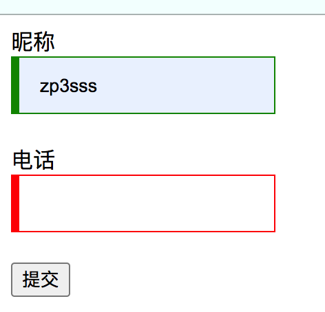

# 表单

> 用来向服务器提交数据用的标签，会自动提取input标签中的name和value属性值，以key-value方式发送给服务器。
>
> 
>
> HTML的表单元素：
>
> * input标签
> * select标签
> * textarea标签
> * button标签
> * meter标签
> * output标签
> * datalist标签

```html
<form action="#" method="GET">
    <label for="name">姓名</label>
    <input type="text" name="name" id="name" autocomplete="on"><br>
    <label for="age">年龄</label>
    <input type="text" name="age" id="age"><br>
    <label for="address">地址</label>
    <input type="text" name="address" id="address"><br>
    <label for="textA">评论</label>
    <textarea name="command" id="textA" cols="10" wrap="hard" rows="3" autocomplete="on"></textarea><br>
    <button type="submit">提交</button>
</form>
```

## form表单属性

> `accept-charset`：用来告诉浏览器服务器支持的字符串，让浏览器在提交表单文本数据时，按照顺序选择一个浏览器自己支持的字符集进行编码发送给服务器，如果服务器支持多个字符集时使用空格隔开。
>
>  
>
> `action`：填写url地址，告诉浏览器将表单中的信息发送到哪里，在提交按钮中可以通过formaction属性修改表单url地址。
>
>  
>
> `method`：设置请求方式，post还是get方式，在提交按钮中可以通过formmethod属性重新设置表单的请求方式。
>
>  
>
> `novalidate`：表示当前表单在提交时不需要进行验证，直接提交。
>
>  
>
> `target`：表示当前提交完数据后服务器发送的相应信息在哪里展示，当前标签页还是新建一个标签页显示。
>
> 		1.  _self
>   		2.  _parent
>   		3.  _top
>   		4.  _blank
>   		5.  指定框架名称
>
>  
>
> `enctype`：表示浏览器将数据发送给服务器时的格式。
>
> 1. application/x-www-form-urlencoded：默认提交数据的格式，以key=value&key=value。
> 2. multipart/form-data：一般用在文件上传时的数据格式。
> 3. application/json：使用json格式提交数据。
> 4. text/xml：使用xml格式提交数据。


## 表单验证实例

> 表单验证方式：
>
> 1. 通过JS方式，给每个表单元素添加onblur属性，即给每个表单元素添加失去焦点处理函数，当输入完成会自动调用JS函数检查输入合法性。
> 2. 使用H5新特性，`pattern`和`required`属性，这两个属性前者是添加正则验证，后者是设置为必填项，使用伪类`:valid`和`:invalid`，改变标签样式提示用户，提交表单时，只有有一个表单元素不符合正则表达式或者设置为必填却不填写不会提交。

```html
<!DOCTYPE html>
<html>

<head>

    <style>
   input{
            display: block;
            padding: 0 20px;
            outline: none;
            border:1px solid #ccc;
            width: 150px;
            height: 40px;
            transform: all 300ms;
        }
        /* input内容合法，边框颜色是绿色 */
        input:valid{
            border-color: green;
            box-shadow: inset 5px 0 0 green;
        }
         /* input内容非法，边框颜色是红色 */
        input:invalid{
            border-color: red;
            box-shadow: inset 5px 0 0 red;
        }
    </style>

</head>

<body>
    <form action="#" method="GET">
        <label for="name">昵称</label>
        <!-- 设置pattern属性正则表达式，设置required，必填项 -->
        <input type="text" name="name" id="name" minlength="1" pattern="[a-zA-Z0-9]{4,8}" required><br>
        <label for="phone">电话</label>
        <input type="text" name="address" id="address" pattern="^1(3|4|5|8)[0-9]{9}$" required><br>
        <button type="submit">提交</button>
    </form>
</body>
</html>
```

