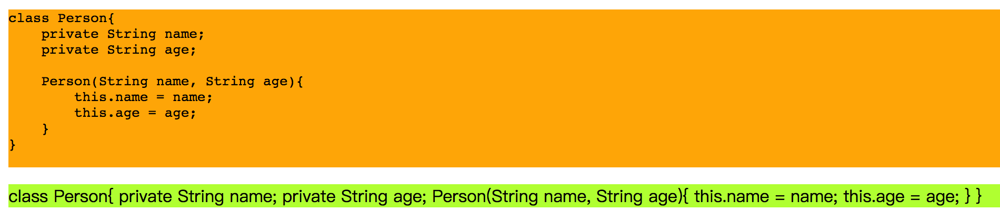
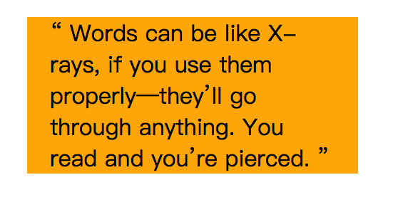

# 段落标签

> * p标签
> * pre标签：用来原样将代码中的文本显示在网页上。
> * blockquote标签：本质上是p标签，但是它带有语义，表示标签中的文本是一段引用，从别地地方抄来的。
>
> p标签和pre标签的区别：
>
> ​		p标签和pre标签对于文本中的空格和换行的处理不同，p标签中单词之间无论有多少空格或者换行都看出一个空格，而pre标签单词之间有多少空格和换行原样保留并显示。

```html
<!DOCTYPE html>
<html>

<head>
    <style>
        html,
        body {
            height: 100%;
            width: 100%;
            overflow: hidden;
        }
        pre{ background-color: orange;}
        p{background-color: greenyellow;}
    </style>
</head>

<body>
    <pre>class Person{
    private String name;
    private String age;
                
    Person(String name, String age){
        this.name = name;
        this.age = age;
    }
}
    </pre>
    <p>class Person{
            private String name;
            private String age;
            
            Person(String name, String age){
                this.name = name;
                this.age = age;
            }
        }
    </p>
</body>

</html>
```




## blockquote

> blockquote有一个cite属性，记录文本出处的url地址。

```html
<!DOCTYPE html>
<html>

<head>
    <style>
        html,
        body {
            height: 100%;
            width: 100%;
            overflow: hidden;
        }
        blockquote{
            width: 200px;
            background-color: orange;
            padding: 0 16px 0 16px;
        }
      	/* 添加双引号 */
        blockquote::before{
            content: "\201C";
        }

        blockquote::after{
            content: '\201D';
        }
    </style>
</head>

<body>
   <blockquote cite="https://www.huxley.net/bnw/four.html">
        Words can be like X-rays, if you use them properly—they’ll go through anything. You read and you’re pierced.
   </blockquote>
</body>

</html>
```

