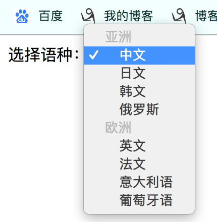
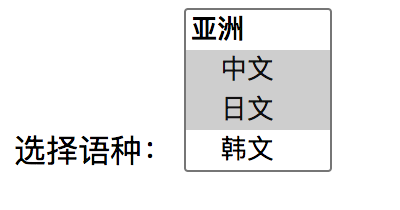

# select

> select标签为下拉选择框，应用在让用户从给定的几个值中选择其中一个或者多个。
>
> `select：`下拉框标签，name属性值会作为key发送给服务器。
>
> `optgroup：`将下拉框选项分组。
>
> `option：`下拉框选项，value属性值会作为value，与select的name属性值组成key-value发送给服务器。

```html
<select name="lang" id="languageS" >
    <optgroup label="亚洲">
        <option value="ch">中文</option>
        <option value="jap">日文</option>
        <option value="han">韩文</option>
        <option value="ran">俄罗斯</option>
    </optgroup>

    <optgroup label="欧洲">
        <option value="en">英文</option>
        <option value="fan">法文</option>
        <option value="ldi">意大利语</option>
        <option value="p">葡萄牙语</option>
    </optgroup>
</select>
```



## select中的属性

> `select标签的属性`：
>
> 1. autofocus：自动获取焦点
> 2. disabled：禁止交互
> 3. form：所属于哪个form表单，值为form标签的id值
> 4. multiple：支持多选。
> 5. name：name属性值会作为key发送给服务器。
> 6. required：该下拉框为必填项，否则无法提交表单。
> 7. size：下拉框一次显示几个选项，默认显示一个。
>
>  
>
> `optgroup标签的属性`：
>
> 1. disabled：禁止任何交互，默认optgroup标签中有disabled属性，optgroup只是对选项进行分组没有其他用处，因此不需要交互。
> 2. label：分组标题。
>
> `option标签的属性:`
>
> 1. selected：默认下拉框选中的选项

```html
<label for="languageS">选择语种：</label>
<!-- 下拉框可以显示4个选项，支持多选 -->
<select name="lang" id="languageS" size="4" multiple>
    <optgroup label="亚洲">
        <option value="ch" selected>中文</option>
        <option value="jap" selected>日文</option>
        <option value="han">韩文</option>
        <option value="ran">俄罗斯</option>
    </optgroup>

    <optgroup label="欧洲">
        <option value="en">英文</option>
        <option value="fan">法文</option>
        <option value="ldi">意大利语</option>
        <option value="p">葡萄牙语</option>
    </optgroup>
</select>
```




