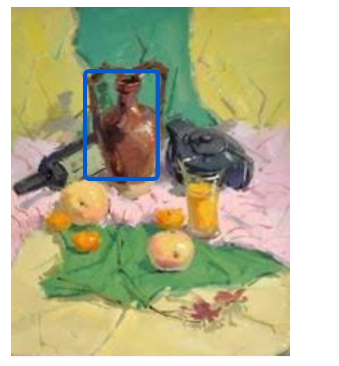

# img

> 图片标签，它的属性
>
> * alt：图片替换文本，当图片显示不出来时，浏览器会显示alt属性值。
> * src：图片的url地址。
> * usemap：客户端映像映射
> * sizes：指定不同页面布局的图像大小
> * srcset：与sizes配合使用，不同布局请求不同url的图片。
> * ismap：服务器映像映射

```html

```


## 客户端映像映射

> usemap属性用来关联map标签，在map标签中划分图片区域，点击不同区域跳转到相应页面，`usemap值 = #map标签id值`。
>
> 客户端映像映射条件：
>
> 1. img中必须使用`usemap属性`，属性值为map标签的id值。
> 2. 在map标签创建area标签，area标签用来给图片规定点击区域，点击不同区域跳转到不同页面。

```html
<!DOCTYPE html>
<html lang="en">
<head>
    <meta charset="UTF-8">
</head>
<body>

<map name="workmap">

    <area shape="rect" coords="53,46,105,123" alt="酒壶" target="_blank" href="images/j2.jpg">

    <area shape="rect" coords="122,112,149,166" alt="酒杯" target="_blank" href="images/j3.jpg">
</map>
</body>
</html>
```



## 服务端映像映射

> 服务端映像映射，用户点击图片时将服务器发送鼠标在图片中点击的坐标，坐标原点为图片左上角。
>
> 将图片转换为服务端映像映射条件：
>
> * html中，img标签添加`ismap`属性。
> * xhtml中，img标签添加`ismap=imap`属性。

```html
<!-- 点击图片时，将发送一个坐标给服务器 -->
<a href="/jc_script/action.php">
  
</a>
```

	


# area

> ​		将某个图片划分成几个区域，点击不同区域跳转到不同的页面，常用语淘宝中家具展示页面，点击页面不同的产品跳转到对应产品的介绍详情页。
>
>  
>
> area属性：
>
> * shape：划分区域的形状。
> * coords：坐标值。
> * href：跳转地址
> * target：打开位置
> * alt：图片的替代文本。
>
>  
>
> shape与coords值说明：
>
> * rect：矩形，coords属性定义矩形位置和大小，(x,y , x,y)，表示矩形`左上角`和`右下角`点的坐标。
> * circle：圆形，coords属性定义圆形位置和大小，(x, y, r)，表示圆形的`中心点坐标`和`半径`
> * poly：多边形，coords属性定义多边形位置和大小，(x,y, x,y, x,y, x,y)，表示多边形每个角的坐标，第一个角坐标必须等于最后一个角坐标，保证能使用线段连接成一个闭合图形。

