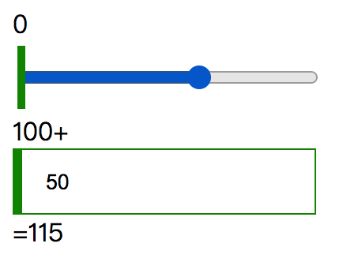
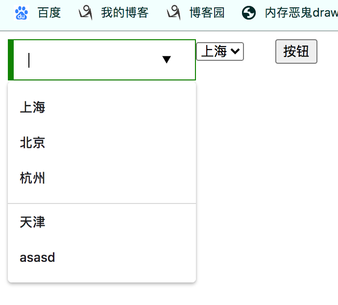

# output标签

> 用于将多个输入结果进行计算，该标签计算出来的数据无法提交。
>
>  
>
> 注意：IE浏览器不支持该标签

```html
<form oninput="x.value=parseInt(a.value)+parseInt(b.value)" action="#">
    0<input type="range" id="a" value="50">100
    +<input type="number" id="b" value="50">
    =<output name="x" for="a b"></output>
</form>
```



# meter

> meter标签用来显示占用比的标签，例如磁盘占有率，房屋占有率、电量等等，meter在不同值时颜色不一样，分为三种颜色红色、黄色和绿色。
>
> meter中的属性：
>
> * min：当前meter范围的左区间
> * low：当前区间中某个低位置
> * high：当前区间中某个高位置
> * max：当前meter范围的右区间
> * optimum：当前范围最优值
> * value：当前所处的值。
>
> 对上面属性的说明：
>
> min、low、hight和max将区间分为了三段，value表示当前所处范围位置，optimum值用来定义哪一段为最优即显示为绿色，紧挨着最优段的为黄色，离最优段最远的段显示红色，如果value在那一段meter显示哪一段颜色。
>
> 
>
> `注意：IE浏览器不支持该标签，虽然可以放在表单中，但无法提交`

```html
<!-- 默认不使用optimum、low和hight，则都是绿色 -->
<meter min="0" max="100"  value="21" ></meter><br>
        
<!-- [0,30,70,100]，最优段为70-100显示为绿色，次一段为30-70显示黄色，最次段为0-30显示红色 -->
<meter min="0" max="100" low="30" high="70" optimum="71" value="21" ></meter>
<meter min="0" max="100" low="30" high="70" optimum="71" value="55"></meter>
<meter min="0" max="100" low="30" high="70" optimum="71" value="80"></meter><br>

<!-- [0,30,70,100]，最优段为30-70显示为绿色，次一段为70-100和0-30显示黄色，因为最优段在中间左右两段都紧挨着最优的因此为黄色 -->
<meter min="0" max="100" low="30" high="70" optimum="55" value="21" ></meter>
<meter min="0" max="100" low="30" high="70" optimum="71" value="55"></meter>
<meter min="0" max="100" low="30" high="70" optimum="71" value="80"></meter>
```


# datalist

> ​		H5新出的下拉框选择器，和select标签具有一样的功能(下拉菜单选择其中一项)，但是它与select标签唯一的不同在于，select不支持用户自定义选项，而datalist支持用户手动给它设置一个新选项，因此常常与input-text配合使用。
>
>  
>
> datalist使用方法：
>
> ​		使用input标签的`list属性`，让它的属性值为某个datalist标签的id属性，这样input就和datalist关联上了。
>
>  
>
> 下面的例子很好的解释了select和datalist区别，在让用户选择所著城市时，如果选项中没有自己的城市时，datalist允许用户自己输入，而select不允许。

```html
<!DOCTYPE html>
<html>

<head>
    <style>
        input {
            display: block;
            padding: 0 20px;
            outline: none;
            border: 1px solid #ccc;
            width: 150px;
            height: 40px;
            transform: all 300ms;
          	float:left;
        }

        /* input内容合法，边框颜色是绿色 */
        input:valid {
            border-color: green;
            box-shadow: inset 5px 0 0 green;
        }

        /* input内容非法，边框颜色是红色 */
        input:invalid {
            border-color: red;
            box-shadow: inset 5px 0 0 red;
        }
      
    </style>

</head>

<body>
    <form action="#" method="get">
      <!-- 地址中没有天津，可以手动输入一个天津发送给服务器 -->
        <input type="text" list="addr" name="address1"/>
        <datalist id="addr" >
            <option value="上海">上海</option>
            <option value="北京">北京</option>
            <option value="杭州">杭州</option>
        </datalist>

	      <!-- 地址中没有天津，没办法只能随便选择一个 -->
        <select name="address2">
            <option value="上海">上海</option>
            <option value="北京">北京</option>
            <option value="杭州">杭州</option>
        </select> &nbsp;&nbsp;&nbsp;&nbsp;
        <button type="submit">按钮</button>
    </form>
</body>
</html>

```

