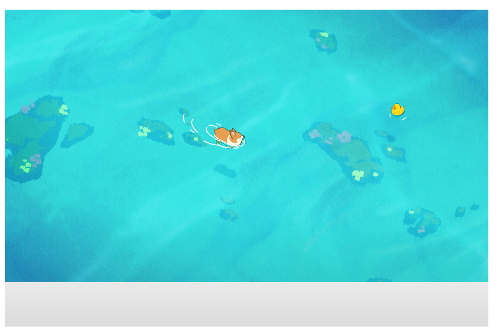

# video标签

> ​		H5新增的视频播放标签，用来播放视频。与source标签配合使用，实现视频的播放，在video标签内部添加source标签，source标签指定播放的视频源。
>
> ​	
>
> video中提供的多个视频源：
>
> ​		一般会在video中提供多个不同视频格式的视频源，浏览器会按照source标签的编写顺序选择支持的视频格式的视频源进行播放。

```html
<!-- 首先播放webm格式，浏览器不支持的话播放mp4格式，如果还不支持的话，显示video中的文本 -->
<video  controls autoplay width="250">

    <source src="/media/cc0-videos/flower.webm"
            type="video/webm">

    <source src="/media/cc0-videos/flower.mp4"
            type="video/mp4">

    Sorry, your browser doesn't support embedded videos.
</video>
```

## video标签属性

> * height：标签高度
> * Width：标签宽度
> * autoplay：网页加载完自动播放，布尔值
> * controls：显示视频控制控件，例如音量滑块、暂停/播放按钮、播放进度条。
> * preload：预加载方式。
> * poster：视频未播放前显示的图片。
> * loop：循环播放，视频播放完从头开始再次播放
> * currentTime：获取当前视频播放进度，也可以通过该属性指定播放位置。
>
> 视频控制属性：
>
> * volume：设置音量`0～1`。
> * buffered：返回当前视频缓冲范围。
> * defaultMuted：设置视频是否静音，布尔值
> * defaultPlaybackRate：设置视频播放速度。`0.5、1、1.5、2`
> * duration：返回视频时长。
>
> 视频预加载方式proload：
>
> 1. auto：当页面加载后会先加载一段长度的视频资源。
> 2. meta：当页面加载后只载入元数据，例如视频格式，视频长度和视频第一帧画面作为poster等信息。
> 3. none：当页面加载后不载入任何视频相关数据，默认值

```html
<!-- video兼容写法，IE8不支持video标签 -->
<video controls width="400px" height="300px" poster="./a1920.jpg">
  <source src="./EP03.mp4" type="video/mp4">
  <source src="./EP03.mp4" type="video/wav">
  <a href="./EP03.mp4">当前不支持该功能，请跳转查看</a>
</video>
```




# 音频标签

> ​	H5新增的音频播放标签，用来播放音频。与source标签配合使用，实现音频的播放，在video标签内部添加source标签，source标签指定播放的音频源。`IE8及以下版本不支持该标签`
>
> 
>
> audio标签支持的三种格式：
>
> 1. Mp3
> 2. Wav
> 3. Ogg
>
> 最好使用mp3格式音频源，因为所有高级浏览器都支持(IE9及以上版本和其它浏览器)，Wav和Ogg格式部分浏览器不支持。
>
>  

## audio标签属性

> * autoplay：网页加载完自动播放，布尔值
> * controls：显示视频控制控件，例如音量滑块、暂停/播放按钮、播放进度条。
> * preload：预加载方式。
> * loop：循环播放，视频播放完从头开始再次播放
> * currentTime：获取当前视频播放进度，也可以通过该属性指定播放位置。
>
> 预加载方式proload：
>
> 1. auto：当页面加载后会加载一部分歌曲资源
> 2. meta：当页面加载后只载入元数据，例如音频格式，音频长度等信息。
> 3. none：当页面加载后不载入任何音频相关数据，默认值

```html
<!-- video兼容写法，IE8不支持audio标签 -->
<audio controls>
  <source src="horse.ogg" type="audio/ogg">
  <source src="horse.mp3" type="audio/mpeg">
您的浏览器不支持 audio 元素。
  <a href="horse.mp3">请下载</a>
</audio>
```


# JS重新audio标签和video标签页面

> audio和video都有controls属性，该属性控制audio和video的控制条的显示和隐藏，由于不同浏览器的控制条存在不一致的情况，一般在开发时，会使用div、button等标签重新定义播放器样式，通过JS来控制播放器的动作(暂停、播放、速度、声音等)。

## audio和video中的JS事件

> * onplay：当前播放器开始播放时，会触发`play事件`。
> * onpause：当前播放器停止播放时，会触发`pause事件`。
> * onloadedmetadata：当播放器元数据加载完毕时触发 ，该事件的回调方法中可以获得资源的总时长，需要开启预加载，否则只能点击播放时才会去获取资源的元数据。
> * ontimeupdate：当前音视频播放进度，该事件回调方法用来控制进度条的移动。
> * onvolumechange：调整音视频声音时会调用该事件方法，在静音时修改图标。

## 音视频的事件属性

> 可读可写属性
>
> - currentTime   音频已经播放时长(返回未格式化的秒)，通过调整该值可以设置从某个时间点播放。
> - volume     0 ~ 1的任意值。控制音量。
> - muted       布尔值。静音。（ture表示静音，false表示非静音）
> - playbackRate   播放速率
>
> 只读属性
>
> - duration   音频总时长（返回未格式化的秒），一般在`onloadedmetadata`回调函数中使用，设置页面的总时长。
> - paused     布尔值。音频文件是否暂停。（ture表示暂停，false表示播放）
> - ended       布尔值。音频文件播放结束（ture表示播放结束，false表示播放中或者暂停）

## 音视频方法

> * play()：播放
> * pause()：暂停