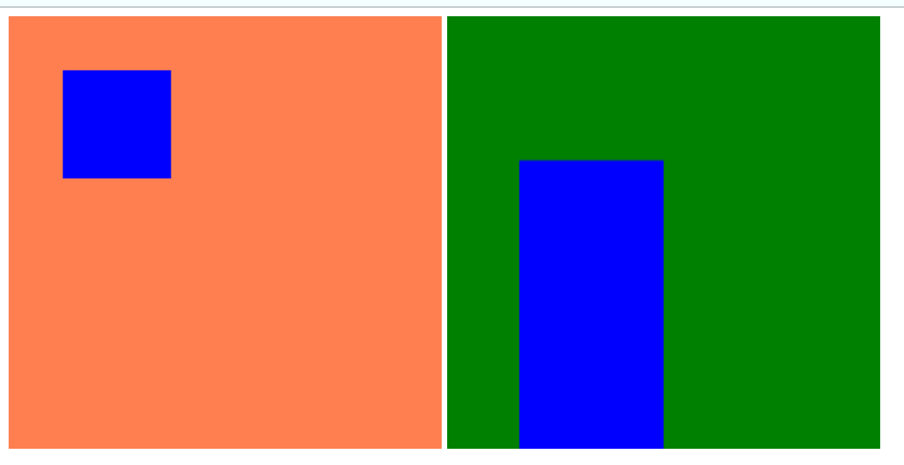
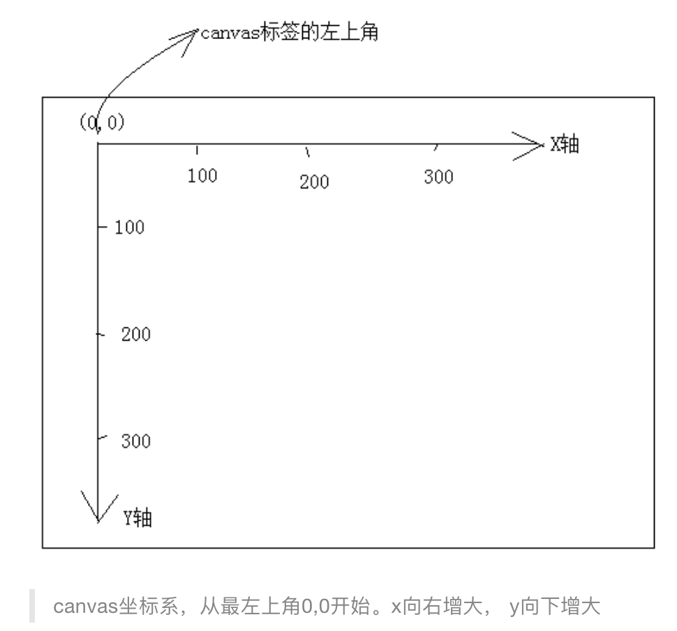

# canvas标签

> canvas为H5新增的标签，用来实现绘图功能。canvas标签为`行内块`，可以将其当成一个img标签。
>
> ​	
>
> canvas标签与img的区别：
>
> 1. canvas中可以添加子元素，而img标签是自结束标签。
> 2. canvas标签的兼容性，在canvas标签添加兼容标签，当浏览器支持canvas标签时，浏览器不会解析canvas标签中的内容，当浏览器不支持canvas标签时，浏览器将其当成一个span标签，读取其中内容显示。

```html
<!-- width和height用来定义canvas标签的宽高 -->
<canvas width=400 height=500>
 		<!-- 该浏览器不支持canvas标签，显示内部图片 -->
  	
</canvas>
```

## canvas属性

> canvas标签只有两个属性：`width`和`height`，这两个属性默认值为`300px * 150px`
>
> 
>
> 存在两种设置canvas宽高的方式，1是通过属性直接设置，2是通过css设置，两者的区别：
>
> * 使用属性设置宽高时，设置的是画布的宽高，改变画布宽高时，其中绘制的内容的大小不会改变。
> * 使用css设置宽高时，设置的是浏览器渲染的宽高，是先将绘制的内容绘制在默认宽高的画布上， 然后伸缩画布到指定的宽高，这样会导致`绘制的内容变形`。
>
> `不要使用css给canvas设置宽高的效果，会造成图形的变形和失真。`

```html
<!DOCTYPE html>
<html>

<head>
    <meta charset="utf-8" />
    <style type="text/css">
        #cav {
          background-color: coral;
        }
	      #cav1{
          background-color: green;
          width:400px;
          height:400px;
      }
    </style>
</head>

<body>
    <canvas id="cav" width="400px" height="400px"></canvas>
  	<canvas id="cav1"></canvas>
  
  	<script>
  			var cav1 = document.querySelector('#cav');
      	var ctx1 = cav1.getContext('2d');
      	ctx1.fillStyle = "#0000ff";
      	ctx1.fillRect(50, 50, 100, 100);
      	
	      var cav2 = document.querySelector('#cav1');	
        var ctx2 = cav2.getContext('2d');
      	ctx2.fillStyle = "#0000ff";
      	ctx2.fillRect(50, 50, 100, 100);
    </script>
</body>

</html>
```



## 绘图上下文

> 绘图上下文：可以理解画布，想要在canvas中绘制图形，必须要获得canvas对应的绘制上下文。
>
> 
>
> 绘图上下文维度：
>
> 1. 2d：获取绘制2d图形的上下文，getContext('2d')
> 2. Webgl：获取绘制3d图形的上下文，getContext('webgl')

### 绘图坐标系

> 绘图上下文的坐标系：
>
> ​		以canvas标签的左上角为原点，水平向右为X轴方向，垂直向下为Y轴方向，垂直屏幕指向用户方向为Z轴方向。




### 绘图步骤

> 1. 获取canvas元素对象
> 2. 通过canvas对象获取该对象的绘制图形上下文。
> 3. 开启路径。
> 4. 绘制图形。
> 5. 根据路径绘制图形。

```html
<html>
  <body>
    <canvas class="cas">
    	当前浏览器不支持canvas标签
    </canvas>
  </body>
  
  <script>
	  // 1、获取canvas标签
		var canvasNode = document.querySelector('.cas');
    // 2、获取当前canvas的绘图上下文
    var ctx = canvasNode.getContext('2d');
    // 3、开启路径
    ctx.beginPath();
    // 4、制定绘制的路线
    ctx.moveTo(10, 10);
    ctx.lineTo(100, 10);
    // 5、根据路径描边，将路线画到画布上。
    ctx.stroke();
    
  </script>
</html>
```


## 兼容性处理

> 对于一些低版本浏览器(IE8及以下版本浏览器)，会将canvas标签看成div标签，读取canvas标签中的内容显示，而支持canvas标签的高版本浏览器会忽略canvas标签中的内容。

# 具体canvas用法请看绘图模块

