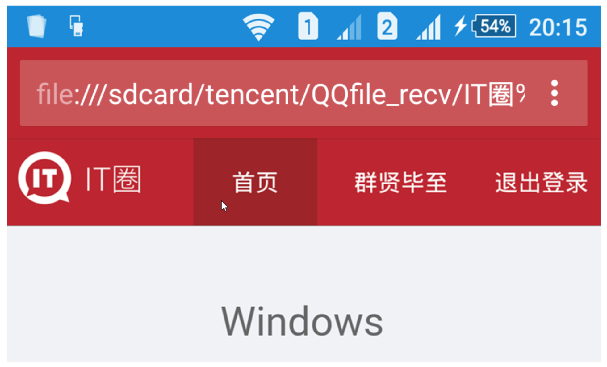

# meta标签

> 网页元数据标签，该标签是用来给浏览器和搜索引擎看的，浏览器根据meta标签来规定如何显示网页。
>
>  
>
> meta标签的属性：
>
> * charset：网页显示时所用的字符集。
> * name：指定一些例如author、description、keywords等信息。
> * http-equiv：指定http一些头部信息。
> * content：该属性用来指定name和http-equiv属性值对应的value。

```html
<!DOCTYPE html>
<html>

<head>
    <!-- 使用utf-8字符集打开文档 -->
    <meta charset="utf-8">
    <!-- 文档类型 -->
    <meta http-equiv="content-type" content="text/html; charset=utf-8">
    <!-- 3秒后，重定向到指定页面 -->
    <meta http-equiv="refresh" content="3;url=https://www.mozilla.org">
    <!-- 天猫官网的关键字，给搜索引擎看的，让其能搜索到-->
    <meta name="keywords" content="商城,网上购物,网购,进口食品,美容护理,母婴玩具,家用电器,手机数码,家居生活,服饰内衣,营养保健,钟表珠宝,饰品箱包,汽车生活,图书音像,礼品卡">
    <!-- 网页描述 -->
    <meta name="description" content="天猫，中国线上购物的地标网站，亚洲超大的综合性购物平台，拥有10万多品牌商家。每日发布大量国内外商品！正品网购，上天猫！天猫千万大牌正品,品类全，一站购，支付安全，退换无忧！理想生活上天猫!">
</head>

<body>
</body>

</html>
```

## http-equiv="refresh"

> 它的值有两种情况：
>
> 1. 当content中只有一个正整数时，表示每隔几秒刷新页面。
> 2. 当content中包含一个正整数和一个url时，表示过几秒后跳转到指定页面。


## 修改andriod手机浏览器地址栏颜色


```html
<meta name="theme-color" content="#00ff00" />
```

