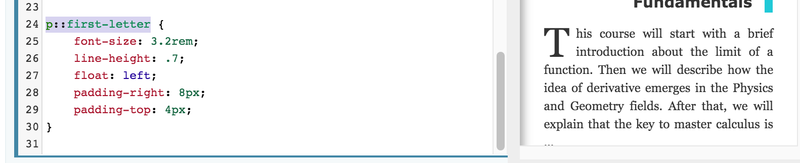

```css
input:valid {
  background-color: powderblue;
}
```





## 列表样式

```
disc
```

- 实心圆点 (默认值)

```
circle
```

- 空心圆点

```
square
```

- 实心方块

```
decimal
```

- 十进制阿拉伯数字
- 从1开始

```
ecimal-leading-zero
```

- Decimal numbers
- Padded by initial zeros
- E.g. 01, 02, 03, … 98, 99

```
lower-roman
```

- Lowercase roman numerals
- E.g. i, ii, iii, iv, v…

```
upper-roman
```

- Uppercase roman numerals
- E.g. I, II, III, IV, V…

```
lower-greek
```

- Lowercase classical Greek
- alpha, beta, gamma…
- E.g. α, β, γ…

```
lower-alpha
lower-latin
```

- Lowercase ASCII letters
- E.g. a, b, c, … z
- `lower-latin` is unsupported in IE7 and earlier
- See [Browser compatibility](https://wiki.developer.mozilla.org/zh-CN/docs/Web/CSS/list-style-type#Browser_compatibility) section.

```
upper-alpha
upper-latin
```

- Uppercase ASCII letters
- E.g. A, B, C, … Z
- `upper-latin` is unsupported in IE7 and earlier