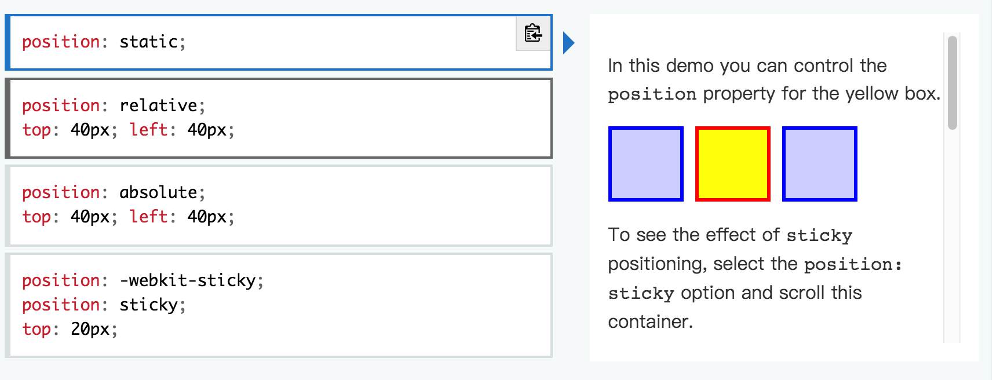

# 文档流

> `何为文档流：`
>
> ​		英文文档中为`normal flow`，即普通流，就是html中元素在浏览器呈现时的排列顺序。元素的排列是基于`盒子模型`进行排列的，元素按照在html文件中编写顺序，从上而下依次按顺序进行排列。
>
> 
>
> html有三种类型元素，分别为`行内元素`、`行内块`和`块元素`，它们各自的排列规则是不同的，分别说明：
>
> 1. 行内元素以`父元素内容区域`左上角为原点，`自身内容区域`左上角为起点，进行排列的，当前行剩下位置能装下则放在兄弟元素之后，如果不能，则另起一行显示。`记住行内元素以自身(左边框，内容区域上边界)为起点，算偏移位置，因此设置上边框和上内边距会造成覆盖`。
> 2. 行内块以`父元素内容区域`左上角为原点，`自身边框区域`左上角为起点，进行排列，和行内元素相同当前行能装下就放在兄弟元素之后，不能另起一行显示，和行内元素不同的地方`行内块是以自身边框左上角为起点，算偏移的。`
> 3. 块元素以`父元素内容区域`左上角为原点，`自身边框区域`左上角为起点，进行排列，独占一行显示，如果当前行中有元素了，必须另起一行显示。
>
> 元素消失时的文档流处理：
>
> ​		当元素因为事件消失时，它将不在占用位置，后面的兄弟元素会抢占它所占用的位置。
>
>  
>
> 不同显示模式元素的起点：
>
> 
>
> 
>
> 下面的例子来展示元素的排列特点，以及元素消失的处理：

```html
<!DOCTYPE html>
<html>
    <head>
        <style>
            html, body{
                width: 100%;
                height:100%;
            }

            .span1{
                background-color: greenyellow;
            }
            /* 设置行内元素边框，查看它是否以内容区域左上角为起点进行排序 */
            .span2{
                background-color: red;
                display: inline;
                border: 10px solid black;
            }

            /* 设置行内元素边框，查看它是否以边框区域左上角为起点进行排序 */
            .span3{
                display: inline-block;
                background-color: orange;
                border: 10px solid black;
            }
						/* 块元素，独占一行，即使当前行有位置也要另起一行*/
            .divs{
                background-color: cornflowerblue;
                display: block;
                /* border: 40px solid black; */
            }

        </style>
    </head>
    <body>
        <div class="divs">11111</div>
        <span class="span1">AAAAAAAAAAASSSS</span>
        <span class="span2">BBBBBBBBBBB</span>
        <div class="divs">DDDDDDDDDD</div>
        <span class="span3">CCCCCCCCCCC</span>
        <span class="span3">EEEEEEEEEEEE</span>

        <script>
            // 点击后让内容为CCCCCCC的行内块消失时，后面的元素抢占它的位置
            document.documentElement.onclick = function(){
                var item = document.getElementsByClassName('span3').item(0);
                item.style.display="none";
            }
        </script>
        <!-- <div id="div1">
            <div class="div2_absolute div2_relative">sdfsdf</div>
        </div>
      
    </body>
</html>
```


# css定位

> CSS定位方式：
>
> 1. static：默认定位方式，元素不使用定位
> 2. relative：相对定位，基于自身位置进行偏移，并没有脱离文档流。
> 3. absolute：绝对定位，脱离文档流，相对于包含块定位。
> 4. fixed：固定定位，相对于视口左上角的定位。

## 不开启定位(static)

> 默认定位方式，当元素不设置定位时，默认就是这种定位方式，也就是说当前元素不使用定位，元素会按照文档流方式进行排列。
>
> 定位中的属性，top、left、bottom、right、z-index这些属性都不能用

## 相对定位(relative)

> 该定位方式特点：
>
> 1. 它是基于自身在文档流中的位置进行的偏移，`保留了元素类型在文档流中的特点(例如块元素占用一行)`。
> 2. 处于相对定位的元素未脱离文档流，因此当元素偏移后，空出来的位置不会被后面的兄弟元素抢占。
> 3. top、left、bottom、right、z-index这些属性可以修改偏移量。
>
> 各种元素类型的相对定位特点：
>
> 1. 行内元素，依据当前在`文档流中的位置`的内容区域左上角为起点进行偏移。
> 2. 行内块，依据当前在`文档流中的位置`的边框区域左上角为起点进行偏移。
> 3. 块元素，依据当前在`文档流中的位置`的边框区域左上角为起点进行偏移。
>
> `一定要注意相对定位是以元素在非定位(static)时的位置作为初始位置，进行偏移`

```html
<!DOCTYPE html>
<html>
    <head>
        <style>
            html, body{
                width: 100%;
                height:100%;
            }
						
          /* 参照物，没有设置定位时行内元素的位置，查看行内元素定位的原点和起点*/
            .span1{
                background-color: greenyellow;
                display: inline;
                border: 10px solid black;
            }
            /* 以行内元素在非定位状态下的位置的内容左上角为原点和起点进行偏移 */
            .span2{
                background-color: red;
                display: inline;
                border: 10px solid black;
                position: relative;
                top:10px;
            }

            /* 以行内块元素在非定位状态下的位置以边框左上角为原点和起点进行偏移 */
            .span3{
                display: inline-block;
                background-color: orange;
                border: 10px solid black;
                position: relative;
                top:10px;
            }

	          /* 以块元素在非定位状态下的位置以边框左上角为原点和起点进行偏移 */
            .span4{
                display: block;
                background-color: orange;
                border: 10px solid black;
                position: relative;
                top:10px;
            }

            .divs{
                background-color: cornflowerblue;
                display: block;
            }

        </style>
    </head>
    <body>
        <div class="divs">11111</div>
        <span class="span1">AAAAAAAAAAASSSS</span>
        <span class="span2">BBBBBBBBBBB</span>
        <div class="divs">DDDDDDDDDD</div>
        <span class="span3">CCCCCCCCCCC</span>
        <span class="span4">EEEEEEEEEEEE</span>
    </body>
</html>
```


## 绝对定位(absolute)

> 绝对定位特点：
>
> 1. 以最近的非static属性值的祖先元素的内边距左上角为原点，进行偏移。
> 2. 脱离文档流：
>    1. 虽是父元素的子元素，但是父元素在计算自身宽高时不在算处于绝对定位的元素(在没有设置父元素的宽高时，父元素的宽高由子元素撑起来的)。
>    2. 不在占用父元素的内容区域，出现元素堆叠的情况。子元素在文档流中的位置会被后面的兄弟元素抢占。
>    3. 在父元素中所有处于文档流中的子元素层级之上。
>    4. 行内元素和块元素不在具有各自特点(行内元素不能设置高度，由内容决定，块元素独占一行)，行内元素可以设置高度，块元素不在独占一行，`块元素的宽高由内部非绝对定位或者固定定位的元素撑起来`。
>
> 各个类型元素的绝对定位特点：
>
> 1. 行内元素，以父元素内边距左上角为原点，以边框的左上角为起点，进行偏移。
> 2. 行内块，以父元素内边距左上角为原点，以边框的左上角为起点，进行偏移。
> 3. 块元素，以父元素内边距左上角为原点，以边框的左上角为起点，进行偏移。
>
> `注意：当元素设置为绝对定位时，它所参照的是最近的非static属性值的祖先元素，如果所有祖先元素都没有开启定位，则当前元素的原点为视口的左上角，或者说是初始包含块的左上角`。

```html
<!DOCTYPE html>
<html>
    <head>
        <style>
            html, body{
                width: 100%;
                height:100%;
            }
						/* 父元素，定位必须设置为非static，保证内部元素参照自身内边距区域左上角*/
            .divs{
                background-color: cornflowerblue;
                display: block;
                border: 10px solid black;
                padding-top: 10px;
                position: relative;
            }

            /* 参照物*/
            .span1{
                background-color: greenyellow;
                display: inline;
                border: 10px solid red;
            }

             /* 行内元素，以父元素内边距左上角为原点，以边框的左上角为起点 */
             .span2{
                background-color: rgb(0, 247, 255);
                display: inline;
                border: 10px solid red;
                position: absolute;
                top:10px;
                /* top: 0; */
            }

             /* 行内块元素，以父元素内边距左上角为原点，以边框的左上角为起点 */
             .span3{
                display: inline-block;
                background-color: orange;
                border: 10px solid red;
                position: absolute;
                top:10px;
                left:130px;
            }
            /* 块元素，以父元素内边距左上角为原点，以边框的左上角为起点 */
            .span4{
                display: block;
                background-color: green;
                border: 10px solid red;
                position: absolute;
                top:10px;
                left:200px;
            }

        </style>
    </head>
    <body>
        <div class="divs">
            <span class="span1">AAAA</span>
            <span class="span2">BBBB</span>
            <span class="span3">CCCC</span>
            <span class="span4">EEEE</span>
        </div>
    </body>
</html>
```


### 使用绝对定位设置元素宽高

> 可以使用绝对定位设置元素的宽高，不设置width和height时，
>
> 	1.  浏览器根据父元素的`height` - `bottom`和`top`属性值算出元素的`height`。
>	
> 	2.  浏览器根据父元素的`width` -` left`和`right`属性值算出元素的`width`。


## 固定定位(fixed)

> 固定定位特点：
>
> 1. 元素脱离文档流：
>    1. 不在占用父元素位置，并且当由浏览器根据内容自动设置父元素宽高时，不在算上该元素。
>    2. 行内元素和块元素不在具有各自特点(行内元素不能设置高度，由内容决定，块元素独占一行)，行内元素可以设置高度，块元素不在独占一行。
> 2. 定位所参照的原点为初始包含块的左上角。

```html
<!DOCTYPE html>
<html>
    <head>
        <style>
            html, body{
                width: 100%;
                height:100%;
            }

            .div0{
                position: relative;
                background-color: pink;
                width:500px;
                height:500px;
                top: 30px;
            }
            
            /* 行内元素开启固定定位 */
            .div1{
                background-color: cornflowerblue;
                top:0px;
                left:20px;
                position: fixed;
                display: inline;
                width:100px;
                height:100px;
            }

            /* 行内块开启固定定位 */
            .div2{
                background-color: orange;
                width:100px;
                height:100px;
                position: fixed;
                display: inline-block;
                top:0px;
                left:130px;
            }

            /* 块元素开启固定定位 */
            .div3{
                background-color: green;
                display:block;
                width:100px;
                height:100px;
                top:0;
                left:240px;
                position: fixed;
            }
        </style>
    </head>
    <body>
        <div class="div0">
                <div class="div1"></div>
                <div class="div2"></div>
                <div class="div3"></div>
        </div>
    </body>
</html>
```


## 粘性定位

> 粘性定位：相当于固定定位和相对定位的混合版。必须使用top、bottom、left或者right其中一个属性才能开启粘性定位，否则就是相对定位。
>
> 
>
> `作用:` 用来在页面滚动时，满足某些条件时在屏幕中。例如通讯录中的字母(下面的例子)。
>
>  
>
> 用法：基于可滚动的最近祖先元素的内容区域左上角进行定位，top或者left有两个作用：
>
> 1. 确定到可滚动祖先元素内容区域的上边距和左边距位置，父元素与可滚动祖先元素有距离时，子元素设置top或者left为0也不能出父元素的内容区域。
> 2. 当滚动时，元素距离视口边缘小于top或者left值时，保持与视口边缘top或者left值的距离，当父元素滚出视口时，当前元素也会滚出视口。

```html
<!DOCTYPE html>
<html>

<head>
    <style>
        * {
            box-sizing: border-box;
        }

        dl {
            margin: 0;
            padding: 24px 0 0 0;
        }

        dt {
            background: #B8C1C8;
            border-bottom: 1px solid #989EA4;
            border-top: 1px solid #717D85;
            color: #FFF;
            font: bold 18px/21px Helvetica, Arial, sans-serif;
            margin: 0;
            padding: 2px 0 0 12px;
            position: -webkit-sticky;
            position: sticky;
            top: -1px;
        }

        dd {
            font: bold 20px/45px Helvetica, Arial, sans-serif;
            margin: 0;
            padding: 0 0 0 12px;
            white-space: nowrap;
        }

        dd+dd {
            border-top: 1px solid #CCC
        }

    </style>
</head>

<body>
    <div>
        <dl>
            <dt>A</dt>
            <dd>Andrew W.K.</dd>
            <dd>Apparat</dd>
            <dd>Arcade Fire</dd>
            <dd>At The Drive-In</dd>
            <dd>Aziz Ansari</dd>
        </dl>
        <dl>
            <dt>C</dt>
            <dd>Chromeo</dd>
            <dd>Common</dd>
            <dd>Converge</dd>
            <dd>Crystal Castles</dd>
            <dd>Cursive</dd>
        </dl>
        <dl>
            <dt>E</dt>
            <dd>Explosions In The Sky</dd>
        </dl>
        <dl>
            <dt>T</dt>
            <dd>Ted Leo & The Pharmacists</dd>
            <dd>T-Pain</dd>
            <dd>Thrice</dd>
            <dd>TV On The Radio</dd>
            <dd>Two Gallants</dd>
        </dl>
    </div>
</body>

</html>
```


# 原点与起点

> 对上文中所说的原点与起点进行解释：
>
> ​		原点就是物体的参照点(坐标系原点)，元素的位置依据该点进行计算。
>
> ​		起点就是物体在进行移动时，挪动该点进行移动，例如定位时的left值=起点.x - 原点.x，top值=起点.y - 原点.y。


# MDN定位图解




