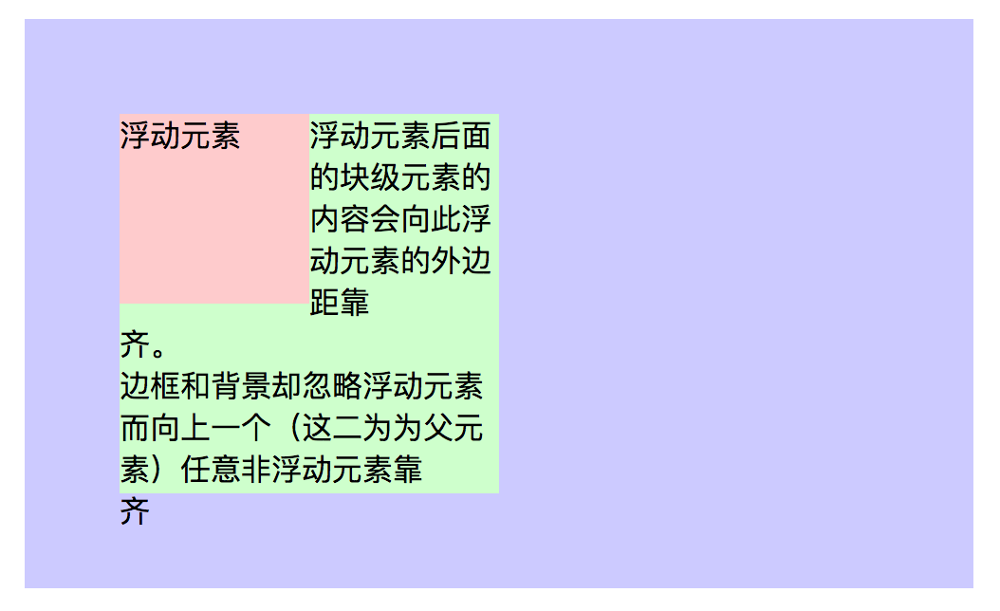
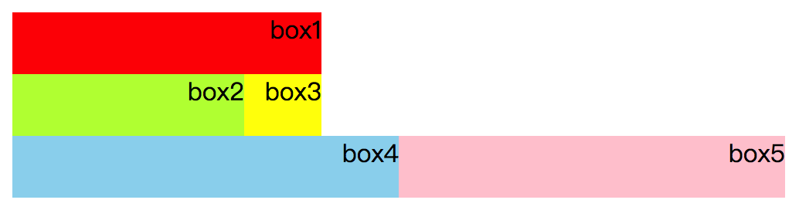
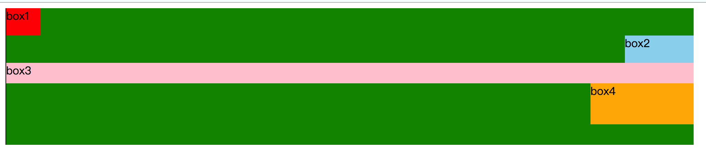

# 浮动

> ​		css浮动，让块元素脱离文档流，打破块元素占整行的情况，实现块元素的水平并列排布。在网页开发中大量使用，例如导航栏并列按钮、轮播图、并排内容块都是使用浮动实现的。
>
> 
>
> 浮动特点：
>
> 1. 脱离文档流，层级提高，不在占用父元素的空间，举例说明本来都在一层居住，突然有人搬到上一层(脱离文档流)，不在占用当前层的空间。
> 2. 浮动元素后面元素的文本会会围绕着浮动元素显示，称其为文本环绕。

```html
<!DOCTYPE HTML >
<html>
<head>
    <meta charset='utf-8'/>
    <title>浮动元素的性质</title>
    <style type="text/css">
        *{
            margin:0;
            padding:0;
        }
        .box{
            width: 400px;
            height: 200px;
            padding: 50px;
            margin: 50px;
            background: #ccf;
        }
        .inner{
            width: 100px;
            height: 100px;
            background: #fcc;
            float: left;
        }
        .notfloat{
            width: 200px;
            height: 200px;
            background: #cfc;
        }
    </style>
</head>
<body>
    <div class='box'>
        <div class='inner'>浮动元素</div>
        <div class='notfloat'>浮动元素后面的块级元素的内容会向此浮动元素的外边距靠齐。　　　　　　　　　　　　　　　　　　　　边框和背景却忽略浮动元素而向上一个（这二为为父元素）任意非浮动元素靠齐　　　　　　　</div>
    </div>
</body>
</html>
```



## 浮动元素位置

> `浮动元素前面的兄弟元素是处于文档流中的元素时`：
>
> ​		浮动元素会另起一行，不与文档流的元素处于同一行，并且紧贴文档流元素的下边界。
>
>  
>
> `浮动元素前面的兄弟元素是浮动元素时`：
>
> ​		紧跟在前一个浮动元素的后面，如果同一行撑不下时，该浮动元素会换行显示。
>
>  
>
> `浮动元素后面的兄弟元素是浮动元素时`：
>
> ​		后面浮动的兄弟元素的左边界会紧贴当前元素的右边界。
>
>  
>
> `浮动元素后面的兄弟元素是处于文档流中的元素时`：
>
> ​		后面的处于文档流元素会直接抢占该浮动元素在未浮动时所占位置。
>
>  
>
> 总结：
>
> 1. 当浮动元素前面是处于文档流中的元素时，位置不会浮动，和正常块元素一样。
> 2. 当浮动元素前面也是浮动元素时，会浮动到前面浮动元素后面，并排显示。

```html
<!DOCTYPE html>
<html>

<head>
    <meta charset="utf-8" />
    <base href="http://www.baidu.com">
    <style type="text/css">
    /* 
        浮动元素box4前面是处于文档流的box3元素，另起一行紧贴box3.
        浮动元素box2后面是处于文档流的box3元素，box3抢占box2位置。
        浮动元素box4后面是浮动元素box5时，box5跟在box4后面
    */
        #box0 {
            background-color: white;
            width: 100%;
            height: 100%;
        }

        #box1{
            background-color: red;
            width: 200px;
        }

        #box2{
            background-color: greenyellow;
            width: 150px;
            float: left;
        }

        #box3{
            background-color: yellow;
            width: 200px;
        }

        #box4{
            background-color: skyblue;
            width: 250px;
            float: left;
        }
        #box5{
            background-color: pink;
            width: 250px;
            float: left;
        }
        #box1, #box2, #box3, #box4, #box5{
            
            height:40px;
            text-align: right;
        }
        
    </style>
</head>

<body>
    <div id="box0">
        <div id="box1">box1</div>
        <div id="box2">box2</div>
        <div id="box3">box3</div>
        <div id="box4">box4</div>
        <div id="box5">box5</div>
    </div>
</body>

</html>
```



### 浮动的边界

> 浮动边界：
>
> 1. 上一个浮动兄弟元素的左或者右边界。
> 2. 父元素内容区域的左或者右边界


## 清除浮动


### 浮动副作用

> 浮动的副作用：
>
> 1. 由于脱离文档流，导致父元素高度塌陷。
> 2. 脱离文档流，与文档流不在同一层级，导致文档流元素抢占浮动元素位置。
> 3. 出现文本环绕效果。

### 使用clear属性误区

> clear属性的三大误区：
>
>  	1. 当元素使用clear属性，以为是清除左右两边的浮动元素，即让左右两边不要出现浮动元素
>  	2. 使用clear属性，以为清除了当前元素的浮动效果，即删除元素的float属性。
>  	3. clear:both属性，是让当前元素不与左右两边的浮动元素同行。
>
> 解释：
>
> 1. clear属性是作用在使用clear属性的元素本身上，并不是用来作用左右两边的兄弟元素的。
> 2. clear属性的作用并不是用来清除浮动，而是`让当前元素不与前面的浮动元素同行`，也就是说使用该属性后，不会删除元素的float属性，元素还是脱离文档流。
> 3. clear:both属性，并不是让当前元素左右没有浮动元素的，而是给处于文档流中的元素使用的，告诉处于文档流中的元素，不管前面的兄弟元素是左浮动还是右浮动，给我另起一行显示。

```html
<!DOCTYPE html>
<html>

<head>
    <meta charset="utf-8" />
    <base href="http://www.baidu.com">
    <style type="text/css">
    /* 
        浮动元素box4前面是处于文档流的box3元素，另起一行紧贴box3.
        浮动元素box2后面是处于文档流的box3元素，box3抢占box2位置。
        浮动元素box4后面是浮动元素box5时，box5跟在box4后面
    */
        #box0 {
            background-color: green;
            width: 1000px;
            height: 200px;
            border-left: 1px solid black;

        }

        #box1{
            background-color: red;
            width: 50px;
            height: 40px;
            float: left;

        }

        #box2{
            background-color: skyblue;
            width: 100px;
            height: 40px;
            float: right;
            clear: left;
        }


        #box3{
           height: 30px;
           clear: both;
           background-color: pink;
        }

        #box4{
            background-color: orange;
            width: 150px;
            height: 60px;
            float: right;
        }

        
    </style>
</head>

<body>
    <div id="box0">
        <div id="box1">box1</div>
        <div id="box2">box2</div>
        <div id="box3">box3</div>
        <div id="box4">box4</div>
    </div>
</body>

</html>
```



### 清除浮动

> 清除浮动原理：创建一个处于文档流的元素，添加下面的选择器。
>
> #box3::after{
>
> ​     visibility: hidden;  // 元素隐藏并且占位，后面兄弟元素以它的位置开始再排列。
>
> ​      height: 0; 		// 清除元素中的文本 ，消除visibility属性所占像素。
>
> ​      clear: both;     // 不管前面是左浮动还是右浮动，给我另起一行显示。
>
> ​        }