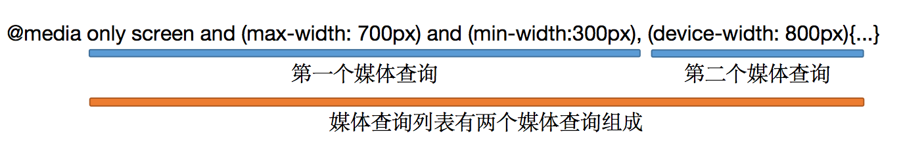

# media queries(媒体查询)

> ​		媒体查询是CSS2版本引入的一项技术，只支持在link标签中的media属性中使用，用来分辨设备的类型，功能比较单一，并且一部分浏览器支持的并不好，CSS3版本大大增强了媒体查询，新增了许多的功能。
>
>  
>
> 媒体查询的作用：
>
> ​		媒体查询主要针对市面上各种各样的设备，提供的一种适配方案，经常用在对PC、平板和手机这三种设备进行适配，浏览器根据不同设备和设备特性选择不同的css文件进行样式渲染。


## 媒体查询写法

> 媒体查询在各个版本的差距：
>
> ​		在CSS2中媒体查询只能写在link标签的media中，并且只能根据媒体类型(屏幕、打印机)选择相应的css显示。
>
> ​		在CSS3中不仅可以在link中，还可以写在css文件中，并增加了逻辑运算符和媒体特性。
>
>  
>
> CSS3媒体查询写法：
>
> `@media 媒体类型 only/and/not/， (媒体特性)`

```html
<!DOCTYPE html>
<html>

<head>
    <meta charset="utf-8" />
    <base href="http://www.baidu.com">
  	<!-- 在屏幕视口大小为765px ～ 900px之间使用test01.css文件 -->
		<link rel="stylesheet" type="text/css" href="./test01.css" media="only screen and (min-width: 765px) and (max-width: 900px)">
</head>

<body>
    <div id="box1">
        <div id="box2"></div>
    </div>
</body>

</html>
```


### 媒体类型

> 媒体类型：
>
> * screen     计算机屏幕（默认值）  
> * tty      电传打字机以及使用等宽字符网格的类似媒介
> * tv       电视类型设备（低分辨率、有限的屏幕翻滚能力）
> * projection   放映机
> * handheld    手持设备（小屏幕、有限的带宽）
> * print     打印预览模式 / 打印页
> * braille    盲人用点字法反馈设备
> * aural     语音合成器
> * all      适合所有设备
>
> 常用媒体类型为`all`和`screen`。

### 媒体特性

> 常用媒体特性为：
>
> * min-width：最小视口宽度，即视口宽度不能小于这个数值
> * max-width：最大视口宽度，即视口宽度不能大于这个数值
> * min-height：最小视口高度
> * max-height：最小视口高度
> * width：视口宽度
> * height：视口高度
> * min-device-width：最小设备宽度
> * max-device-width：最大设备宽度
> * min-device-height：最小设备高度
> * max-device-height：最大设备高度
> * device-width：设备宽度
> * device-height：设备高度

### 逻辑运算

>  媒体查询提供了4种逻辑判断，分别是
>
> * only：仅仅，只有，用在排除不支持媒体查询特性的浏览器。
> * not：逻辑非判断。
> * and：逻辑与判断。
> * ,：逻辑或判断，使用逗号代替or。
>
> 媒体查询结构是由多个媒体查询组成的媒体查询列表，媒体查询列表中使用逗号(逻辑或)将每个媒体查询隔开，每个媒体查询是有多个媒体查询条件组成。



```css
/* 显示网页的设备必须是屏幕并且像素在300～700之间，或者设备像素在800px可以使用其中的css样式*/
@media only screen and (max-width: 700px) and (min-width:300px), (device-width: 800px){...}
/* 等价于 */
@media (only screen and (max-width: 700px) and (min-width:300px)), (device-width: 800px){...}


/* 如果用户设备的最小高度为680px或为纵向模式的屏幕设备时，可以使用其中的css样式*/
@media (min-height: 680px), screen and (orientation: portrait) { ... }
/* 等价于 */
@media (min-height: 680px), (screen and (orientation: portrait)) { ... }

/* not应用于整个媒体查询，而不是单个媒体查询条件*/ 
@media not all and (monochrome) { ... }
/* 等价于 */
@media not (all and (monochrome)) { ... }

@media not screen and (color), print and (color) { ... }
/* 等价于 */
@media (not (screen and (color))), print and (color) { ... }
```


### 实际使用注意

> 1. 注意媒体查询的编写顺序，包裹在媒体查询内部的css代码并不会提升权重，因此注意编写顺序导致的覆盖问题。
> 2. 将针对不同场景的css使用link标签引入时，浏览器都会先下载下来，然后再根据media属性判断。
> 3. 媒体类型前要加only，用来甄别哪些不支持媒体查询或者只支持CSS2的媒体查询的老旧浏览器。
> 4. 在媒体查询中的css代码如果使用`rem`作为单位的话，需要注意此时`rem不在参照html标签的字体大小(1rem=12px)，而是浏览器设置的默认字体大小`，也就是说`1rem = 16px`
>
> 解释only：
>
> ​		不写only时，哪些只支持css2媒体查询的浏览器，一看screen则直接使用，忽略后面的媒体特性条件曲解媒体查询本意导致显示不正确(浏览器视口不满足媒体特性条件也可以使用)，因此使用only过滤。

```css

/* 这样写会导致第二个body选择器中的属性覆盖第一个body选择器中的属性，因为媒体查询不会增加内部css的权重，因此一定要注意顺序 */
@media only screen and (max-width: 900px) and (min-width: 765px){
  body{
    	background-color: red;
  }
}

body{
  background-color:green;
}
```

```html
<!DOCTYPE html>
<html>

<head>
    <meta charset="utf-8" />
    <base href="http://www.baidu.com">
  
  	<!--
				下面三个文件都会下载，然后再判断应该使用哪个css文件，而不是先判断哪个符合条件然后再下载，可能有些浏览器会做这样的优化。

				screen前加only，过滤掉哪些不支持媒体查询或者只支持CSS2的媒体查询的老旧浏览器，例如不写only时，哪些只支持css2媒体查询的浏览器，一看screen则直接使用，忽略后面的媒体特性条件，导致显示不正确，因此使用only过滤。
		-->
  
  
  	<!-- 在屏幕视口大小大于900px使用test01.css文件，应用于PC -->
	  <link rel="stylesheet" type="text/css" href="./test01.css" media="only screen and (min-width: 901px)">
  	<!-- 在屏幕视口大小为765px ～ 900px之间使用test02.css文件，应用于平板 -->
		<link rel="stylesheet" type="text/css" href="./test02.css" media="only screen and (min-width: 765px) and (max-width: 900px)">
  	<!-- 在屏幕视口大小小于765px使用test03.css文件，应用于手机 -->
  	<link rel="stylesheet" type="text/css" href="./test03.css" media="only screen and (max-width: 764px)">
  
</head>

<body>
    <div id="box1">
        <div id="box2"></div>
    </div>
</body>

</html>
```


## 媒体查询兼容性

> 媒体查询兼容性主要是针对移动端和IE浏览器：
>
> 1. 移动端中禁止缩放
> 2. IE浏览器中，有些用户虽然使用高版本IE，但是内核使用的是IE7、IE8。

```html
<!-- 针对移动端(平板和手机)，视口宽度为屏幕宽度，最大最小缩放比例为1，不支持手动缩放 -->

<meta name="viewport" content="width=device-width, initial-scale=1.0, maximum-scale=1.0, user-scalable=no">

<!-- 针对IE浏览器，使用高版本配低版本内核的情况。告诉IE浏览器永远使用最新的内核渲染该网页，如果IE浏览器有chrome内核插件，直接使用chrome内核渲染 -->
<meta http-equiv="X-UA-Compatible"content="IE=Edge，chrome=1">


<!-- 使用IE的条件判断，主要针对IE8浏览器不支持h5和css3中的media，因此使用js实现 -->
<!--[if lt IE 9]>

<script src="https://oss.maxcdn.com/libs/html5shiv/3.7.0/html5shiv.js"></script>

<script src="https://oss.maxcdn.com/libs/respond.js/1.3.0/respond.min.js"></script>

<![endif]-->
```

