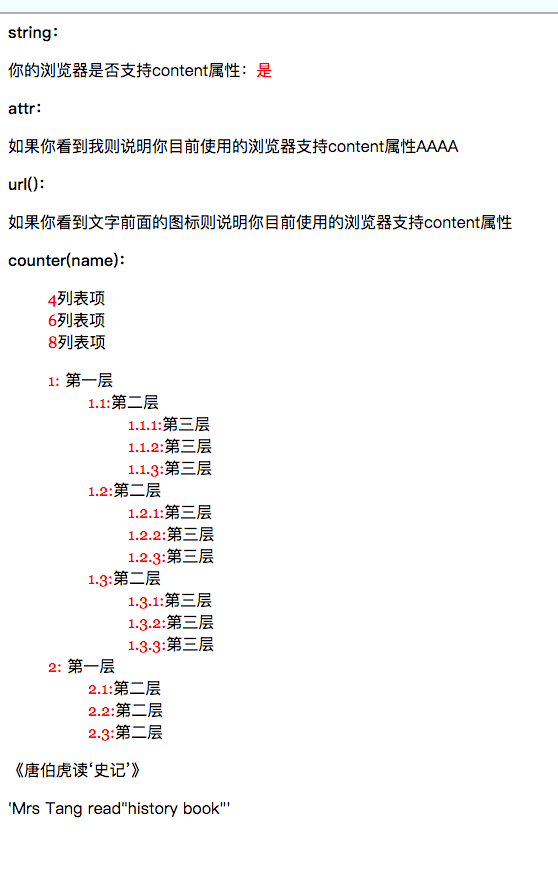

# 元素背景

> 1. `background`：复合属性，使用这一个标签来统一设置下面这几个标签的属性。
> 2. `background-color`：背景颜色
> 3. `background-image`：背景图片
> 4. `background-repeat`：背景图片是否进行平铺(repeat-x、repeat-y、no-repeat).
> 5. `background-attachment`：设置背景图片参照谁固定，发生滚动时背景图是否跟着滚动。
> 6. `background-position`：背景图摆放位置。
> 7. `background-origin`：背景图背景图的原点，从border开始、padding开始、从content开始。
> 8. `background-clip`
> 9. `background-size`：设置背景图大小，cover完全覆盖元素，等比缩放，contain等比缩放到与元素宽度或者高度一致。
>
> 注意：
>
> 1. CSS3中可以给元素设置多个背景图，相应的其它属性也添加了针对多背景图的设置，例如background-image:url(...), url(...), url(...)，但是IE8及以下版本不支持。
> 2. `background-origin`、`background-clip`、`background-size`为CSS3新增属性，因此IE8及以下版本不支持。
> 3. `background-repeat`属性接收1～2个值，2个值表示分别设置水平和垂直方向的平铺。
> 4. `background-position`属性可以接收1～4个值，当多于2值时，需要指定方向(left|right|top|bottom)，例如`background-position: right 10px bottom 10px`，表示图片设置在元素的右下方距离底部边框和右边框为10px。
> 5. `background-size`属性接收1～2个值，一个值时为cover或者contain，两个值时为分别设置背景图宽度和高度。

# 边框


# 颜色

> 设置颜色方式有7种：
>
> 1. 颜色名称
> 2. Hex，十六进制表示法
> 3. rgb函数，255-255-255
> 4. rgba函数，可以设置透明度
> 5. hsl()函数
> 6. hsla()函数
> 7. transparent值，全黑且透明，相当于rgba(0,0,0,0)

# 透明度

> `Opacity属性`：IE8及以下版本不支持，因此透明度写法：
>
> 1. 其他浏览器写法：opactiy:0.5
> 2. IE8及以下版本浏览器写法：filter:alpha(opacity = 50)

# 字体

> `font-style`：字体样式，斜体或者正常，italic、oblique、normal，设置字体推荐使用oblique。
>
> `font-variant`：大写字体字号，normal和small-caps(小型大写字母)
>
> `font-weight`：字体粗细，粗中细，也可以设置数字，注意有的字体可能没有设置这个数字对应的粗细，导致使用默认粗细。
>
> `font-size`：字号，字体大小
>
> `font-family`：字体库，多个字体使用逗号隔开，字体中有中文、空格时使用引号包裹。
>
>  
>
> 特殊说明：
>
> 1. italic和oblique都是显示斜体样式，前者是使用字体库中的斜体字，后者使用代码让字体倾斜，推荐使用后者，因为有些字体库中可能对于一些生僻字没有斜体样式。
> 2. font-family设置字体库，可以设置多种字体库用逗号隔开，浏览器按顺序检查自己是否支持其中一个。

# 文本格式

> * `text-transform`：文本的大小写
> * white-space：文本的格式显示，如何处理输入文本的空格和换行。
> * tab-size：tab键代表宽度。
> * work-break：单词的换行
> * word-spacing：文本中空格的宽度
> * letter-spacing：字符之间的宽度
> * text-indent：文本首行缩进。
> * text-align：文本对齐方式，justify属性值对多行时的最后一行或者只有一行的情况无效，还是左对齐。
> * text-align-last：文本对齐方式，justify属性值对多行时的最后一行或者只有一行的情况，也是两段对齐，浏览器支持的不好(`IE浏览器下，如果text-align-last要生效，必须先定义text-align为justify；`)。
> * vertical-align：针对行内块或者行内元素在父元素中排列时，`同行之间的对齐方式`，`主要作用消除图片底部留白`。
> * line-height：设置行高。
> * `text-size-adjust`：根据视口宽度改变字体大小(针对移动端的样式，网页中必须添加`meta-viewport`才能使用该属性)

# 文本修饰

> `text-decoration`：设置文本装饰(下划线、上划线、删除线等)，一般用来做css格式化，删除<a>标签的下划线。
>
> `text-shadow`：文本阴影，4个值(水平方向偏移，垂直方向偏移，阴影模糊效果，阴影颜色)，多组阴影使用逗号隔开。
>
>  
>
> `p{text-shadow:5px 1px 5px rgba(255,0,255,1),1px 5px 5px rgba(0,85,0,.8);}`

# 文本书写模式

> `direction`：文本书写方式，`ltr`从左向右，`rtl`从右向左。
>
> `writing-mode`：该元素考虑到垂直方向，从上而下，从左到右，古代中文书籍的编写格式。
>
>  
>
> writing-mode中的属性：
>
> * horizontal-tb，正常书写方式，从左向右，自上而下。
> * vertical-rl，古代书写方式，从上到下，从右到左。
> * vertical-lr，从上到下，从左到右。
> * lr-tb，IE提供的属性值，等于horizontal-tb。
> * tb-rl，IE提供的属性值，等于vertical-lr。
>
> writing-mode使用：
>
> {	
>
> ​		writing-mode:vertical-rl; 
>
> ​		-webkit-writing-mode:vertical-rl;  // 适配chrome和safari
>
> ​		-ms-writing-mode:vertical-rl;  // 适配IE
>
> }

# 列表

> `List-style`：设置列表中li标签前的标识，
>
> `list-style-type`：设置标识样式
>
> `list-style-position`：设置标识的位置，放在li中(inside)还是放在ul中(outside)，
>
> `list-style-image`：使用图片标识
>
>  
>
> 这些属性使用注意：
>
> 1. 这些属性用来修饰display为list-item的显示样式，也就是li标签，一般放在ul标签的css中。
> 2. list-style的编写顺序，`List-style: type position image`。

```html
<!DOCTYPE html>
<html lang="zh-cmn-Hans">
<head>
<meta charset="utf-8" />
<title>list-style_CSS参考手册_web前端开发参考手册系列</title>
<meta name="author" content="Joy Du(飘零雾雨), dooyoe@gmail.com, www.doyoe.com" />
<style>
ul{
    list-style:upper-alpha outside none;
}
</style>
</head>
<body>
<ul class="test">
	<li class="colorname">列表项一</li>
	<li class="colorname">列表项一</li>
	<li class="colorname">列表项一</li>
	<li class="colorname">列表项一</li>
</ul>
</body>
</html>
			
```

# 表格

> `table-layout`：设置表格单元格宽高计算方式，auto和fixed，建议使用fixed，无论内容多长，单元格都是等份，计算速度快。
>
> `border-collapse`：设置表格边框和单元格边框是否融合，separate，collapse(融合)。
>
> `border-spacing`：设置单元格之间的间距，border-collapse属性值必须为separate时，该值才有效。。
>
> `caption-side`：设置表格标题位置，在表格上面还是下面，caption标签。
>
> `empty-cells`：设置当前单元格没有内容时，是否还显示边框。默认show(显示)，border-collapse属性值必须为separate，该值才有效。
>
> 
>
> 注意：
>
> ​		IE7及以下浏览器中默认隐藏无内容的单元格边框，要想使其获得与show参数值相同的效果，可以变相给该空单元格加个占位且不可见的元素，例如全角空格或 等等。


# 内容

> `content`：常常与伪元素::after和::before配合使用，添加内容。
>
> `content-reset`：创建一个计数器，接收2个参数(计数器名称，初始值)。
>
> `content-increment`：对该名称的计数器+1。
>
>  
>
> 说明：ol-li有序列表的计数，或许就是使用这个实现的。

```html
<!DOCTYPE html>
<html lang="zh-cmn-Hans">

<head>
    <meta charset="utf-8" />
    <style>
        /* 使用content配合::after，给元素添加文本 */
        .str p:after {
            margin-left: -16px;
            background: #fff;
            content: "是";
            color: #f00;
        }

        /* 使用attr函数读取标签属性值，使用content显示文本 */
        .attr p:after {
            content: attr(title);
        }

        /* 使用url函数加载图片，使用content将其添加进去 */
        .url p:before {
            content: url(../../skin/ico.png);
        }

        /* 父类中创建一个计数器，如果不设置初始值，默认为0*/
        .counter1 ol {
            counter-reset: testname 2;
            list-style: none;
        }

        /* 对父类中的计数器+2 */
        .counter1 li {
            counter-increment: testname 2;
        }

        /* 显示计数器中的值 */
        .counter1 li:before {
            content: counter(testname);
            color: #f00;
            font-family: georgia, serif, sans-serif;
        }

        /* 对于嵌套列表，使用counters解决嵌套列表中显示问题 */
        .counter2 ol {
            list-style: none;
            counter-reset: testname2;
        }

        .counter2 li {
            counter-increment: testname2;
        }

        .counter2 li:before {
            content: counters(testname2, '.')':';
            color: #f00;
            font-family: georgia, serif, sans-serif;
        }

        /* 使用quotes给引用语句添加特殊符号 */
        .ch{
            
            quotes: '《' '》' '‘' '’';
        }
        .en{
            quotes: '\'' '\'' '"' '"';
        }
    </style>
</head>

<body>

    <div class="str">
        <strong>string：</strong>
        <p>你的浏览器是否支持content属性：否</p>
    </div>

    <div class="attr">
        <strong>attr：</strong>
        <p title="如果你看到我则说明你目前使用的浏览器支持content属性AAAA"></p>
    </div>

    <div class="url">
        <strong>url()：</strong>
        <p>如果你看到文字前面的图标则说明你目前使用的浏览器支持content属性</p>
    </div>


    <div class="counter1">
        <strong>counter(name)：</strong>
        <ol>
            <li>列表项</li>
            <li>列表项</li>
            <li>列表项</li>
        </ol>
    </div>

    <div class="counter2">
        <ol>
            <li>
                第一层
                <ol>
                    <li>第二层
                        <ol>
                            <li>第三层</li>
                            <li>第三层</li>
                            <li>第三层</li>
                        </ol>
                    </li>
                    <li>第二层
                        <ol>
                            <li>第三层</li>
                            <li>第三层</li>
                            <li>第三层</li>
                        </ol>
                    </li>
                    <li>第二层
                        <ol>
                            <li>第三层</li>
                            <li>第三层</li>
                            <li>第三层</li>
                        </ol>
                    </li>
                </ol>
            </li>
            <li>
                第一层
                <ol>
                    <li>第二层</li>
                    <li>第二层</li>
                    <li>第二层</li>
                </ol>
            </li>
        </ol>
    </div>

   <p class="ch"> <q >唐伯虎读<q>史记</q></q> </p>
    <p class="en"><q>Mrs Tang read<q>history book</q></q></p>

</body>

</html>
```




# 用户界面相关

> `appearance`：设置控件的系统样式，主要用来取消系统设置的外观样式，浏览器支持的不好，`需要加前缀使用`。
>
> `text-overflow`：文本溢出处理，裁剪或使用省略号代替，该属性要想生效需要满足3个条件，overflow != visible，固定width，white-space为nowrap(不换行)，这样才能生效。
>
> `outline`：设置盒子轮廓，好处是它不像border属性占用空间。可以拆分成3个属性，宽度、形状和颜色。
>
> `outline-offset`：设置盒子轮廓到盒子边界的距离或者叫做内间距，IE7不支持。
>
> `cursor`：设置鼠标的样式。
>
> `box-sizing`：设置盒子宽高的计算方式，content-box=width+paddingWidth+borderWidth，设置border-box值时，width和height就包含了内边距和边框。
>
> `resize`：针对行内块和块元素，可以调整元素大小，条件是overflow != visible
>
> `use-select`：元素中的文本不能被选中，浏览器支持的不好，`需要加前缀`，IE9及以下版本不支持该属性使用标签属性 ，使用事件代替`onselectstart="return false;`
>
> `pointer-events`：阻止当前元素所谓事件源触发事件，也就是说添加该属性后，给其设置点击事件，不会出现点击事件回调。但是通过事件冒泡和事件捕获方式可以触发当前元素的事件回调。`IE10及以下版本不支持`
>
> 

```html
<!DOCTYPE html>
<html lang="zh-cmn-Hans">

<head>
    <meta charset="utf-8" />
    <style>
        /* 取消下拉选项框的系统样式 */
        select {
            -webkit-appearance: none; /* 适配chrome和safari*/
            appearance: none;
            -moz-appearance: none;
            border: 0;
        }

        /* 添加盒子轮廓 */
        .test {
            width: 100px;
            padding: 10px;
            outline: 1px dashed #f00;
            outline-offset: 4px;
            border: 3px solid #333;
        }
    </style>
</head>

<body>

    <select name="n" id="">
        <option value="v1">aaaa</option>
        <option value="v2">aaaa</option>
        <option value="v3">aaaa</option>
        <option value="v4">aaaa</option>
    </select>

    <div class="test">注意边框线外面的红色轮廓</div>
</body>

</html>
```


# 多列显示(报纸排版)

> `columns`：是`column-width`和`column-count`属性复合写法，设置元素内部文本如何排列，将其分为几列，列宽多少。
>
> `column-gap`：设置列间距
>
> `column-rule`：是`column-rule-width`、`column-rule-style`、`column-rule-color`的复合写法，设置列间距之间的边框样式。
>
> `column-span`：是设置元素是否跨行显示，即还是按照以前文本显示一样，将划分的列当初背景。all跨行、none不跨行
>
> `column-fill`：设置列高，auto(列高自适应内容)，balance(所有列的高度以其中最高的一列统一)
>
> `column-break-before`：设置元素中既有文本又有子标签的情况，设置子标签的文本无论前面是否还有空，另起一行显示。
>
> `column-break-after`：设置元素中既有文本又有子标签的情况，设置子标签的文本无论后面是否还有空，后面的文本另起一行显示。
>
> `column-break-inside`：设置子元素文本是否必须只能在一列全部显示完毕，当列承不下时增加列高，或者当一列显示不开时，另起一列显示。 
>
>  
>
> 注意：
>
> 1. 上述所有标签都没有适配好，都处于实验阶段，因此在使用这些属性时，都有加前缀，chrome为`-webkit`、Firefox为`-moz`，IE无需加前缀。
> 2. column-break-after、column-break-bofore、column-break-inside这三个属性是用来修饰子元素中的文本排版。
> 3. 多列显示无法给定列高，列高由浏览器自动算出，因为无论父元素设置宽度多大，列宽和列间距如何小、最终列都会将宽占满，通过修改列高。

```html
<!DOCTYPE html>
<html lang="zh-cmn-Hans">
<head>
<meta charset="utf-8" />
<style>
body{font:14px/1.5 georgia,serif,sans-serif;}
.test p,.test div{margin:0;padding:5px 10px;background:#eee;}
h1{margin:10px 0;font-size:16px;}
.test{
	width:600px;
    border:10px solid #000;
    /* 设置列数，适配所有浏览器 */
    -moz-column-count:4;
    -webkit-column-count:4;
    column-count:3;
    
   /* 设置列间距，适配所有浏览器 */
    -moz-column-gap:20px;
    -webkit-column-gap:20px;
    column-gap:20px;
    
  	 /* 设置列间距边框，适配所有浏览器 */
		-moz-column-rule:3px solid #090;
    -webkit-column-rule:3px solid #090;
    column-rule:3px solid #090;
}
.test div{
	-moz-column-break-after:always;
	-webkit-column-break-after:always;
    column-break-after:always;
    
}
</style>
</head>
<body>
<h1>column-break-after:always</h1>
<div class="test">
	<p>This module describes multi-column layout in CSS. By using functionality described in this document, style sheets can declare that the content of an element is to be laid out in multiple columns.</p>
	<div>不管本列有没有填满，后面新建一列不管本列有没有填满，后面新建一列不管本列有没有填满，后面新建一列不管本列有没有填满，后面新建一列不管本列有没有填满，后面新建一列</div>
	<p>This module describes multi-column layout in CSS. By using functionality described in this document, style sheets can declare that the content of an element is to be laid out in multiple columns.</p>
</div>
</body>
</html>
			
```

