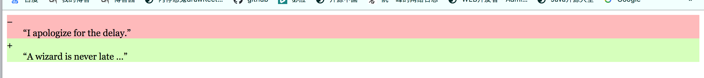

## 常用伪类

| 选择器                                                       | 例子                  | 描述                                                         |
| :----------------------------------------------------------- | :-------------------- | :----------------------------------------------------------- |
| [:active](https://www.jc2182.com/css-active-selector/1525.html) | a:active              | 选择活动链接                                                 |
| [:checked](https://www.jc2182.com/css-checked-selector/1529.html) | input:checked         | 选择每个选中的<input>元素                                    |
| [:disabled](https://www.jc2182.com/css-disabled-selector/1531.html) | input:disabled        | 选择每个禁用的<input>元素                                    |
| [:empty](https://www.jc2182.com/css-empty-selector/1532.html) | p:empty               | 选择每个没有子元素的<p>元素                                  |
| [:enabled](https://www.jc2182.com/css-enabled-selector/1533.html) | input:enabled         | 选择每个启用的<input>元素                                    |
| [:first-child](https://www.jc2182.com/css-first-child-selector/1534.html) | p:first-child         | 选择作为其父级的第一个子元素的每个<p>元素                    |
| [:first-of-type](https://www.jc2182.com/css-first-of-type-selector/1537.html) | p:first-of-type       | 选择每个<p>元素，它是其父元素的第一个<p>元素                 |
| [:focus](https://www.jc2182.com/css-focus-selector/1538.html) | input:focus           | 选择具有焦点的<input>元素                                    |
| [:hover](https://www.jc2182.com/css-hover-selector/1539.html) | a:hover               | 选择鼠标悬停时的链接                                         |
| [:in-range](https://www.jc2182.com/css-in-range-selector/1540.html) | input:in-range        | 选择具有指定范围内的值的<input>元素                          |
| [:invalid](https://www.jc2182.com/css-invalid-selector/1542.html) | input:invalid         | 选择具有无效值的所有<input>元素                              |
| [:lang(language)](https://www.jc2182.com/css-lang-selector/1543.html) | p:lang(it)            | 选择具有以“it”开头的lang属性值的每个<p>元素                  |
| [:last-child](https://www.jc2182.com/css-last-child-selector/1544.html) | p:last-child          | 选择作为其父级的最后一个子元素的每个<p>元素                  |
| [:last-of-type](https://www.jc2182.com/css-last-of-type-selector/1546.html) | p:last-of-type        | 选择每个<p>元素，它是其父元素的最后一个<p>元素               |
| [:link](https://www.jc2182.com/css-link-selector/1547.html)  | a:link                | 选择所有未访问的链接                                         |
| [:not(selector)](https://www.jc2182.com/css-not-selector/1548.html) | :not(p)               | 选择不是<p>元素的每个元素                                    |
| [:nth-child(n)](https://www.jc2182.com/css-nth-child-selector/1549.html) | p:nth-child(2)        | 选择作为其父级的第二个子元素的每个<p>元素                    |
| [:nth-last-child(n)](https://www.jc2182.com/css-nth-last-child-selector/1550.html) | p:nth-last-child(2)   | 选择每个<p>元素作为其父元素的第二个子元素，从最后一个子元素开始计算 |
| [:nth-last-of-type(n)](https://www.jc2182.com/css-nth-last-of-type-selector/1551.html) | p:nth-last-of-type(2) | 选择每个<p>元素作为其父元素的第二个<p>元素，从最后一个子元素开始计算 |
| [:nth-of-type(n)](https://www.jc2182.com/css-nth-of-type-selector/1552.html) | p:nth-of-type(2)      | 选择每个<p>元素，它是其父元素的第二个<p>元素                 |
| [:only-of-type](https://www.jc2182.com/css-only-of-type-selector/1553.html) | p:only-of-type        | 选择每个<p>元素，它是其父元素的唯一<p>元素                   |
| [:only-child](https://www.jc2182.com/css-only-child-selector/1554.html) | p:only-child          | 选择每个<p>元素，它是其父元素的唯一子元素                    |
| [:optional](https://www.jc2182.com/css-optional-selector/1555.html) | input:optional        | 选择没有“required”属性的<input>元素                          |
| [:out-of-range](https://www.jc2182.com/css-out-of-range-selector/1556.html) | input:out-of-range    | 选择<input>元素，其值超出指定范围                            |
| [:read-only](https://www.jc2182.com/css-read-only-selector/1558.html) | input:read-only       | 选择具有指定“readonly”属性的<input>元素                      |
| [:read-write](https://www.jc2182.com/css-read-write-selector/1559.html) | input:read-write      | 选择没有“readonly”属性的<input>元素                          |
| [:required](https://www.jc2182.com/css-required-selector/1560.html) | input:required        | 选择指定了“required”属性的<input>元素                        |
| [:root](https://www.jc2182.com/css-root-selector/1561.html)  | root                  | 选择文档的根元素                                             |
| :target                                                      | #news:target          | 选择当前活动的#news元素（单击包含该锚名称的URL）             |
| [:valid](https://www.jc2182.com/css-valid-selector/1564.html) | input:valid           | 选择具有有效值的所有<input>元素                              |
| [:visited](https://www.jc2182.com/css-visited-selector/1565.html) | a:visited             | 选择所有访问过的链接                                         |


## 常用伪元素

| 选择器                                                       | 例子            | 描述                        |
| :----------------------------------------------------------- | :-------------- | :-------------------------- |
| [::after](https://www.jc2182.com/css-after-selector/1526.html) | p::after        | 在每个<p>元素后插入内容     |
| [::before](https://www.jc2182.com/css-before-selector/1527.html) | p::before       | 在每个<p>元素之前插入内容   |
| [::first-letter](https://www.jc2182.com/css-first-letter-selector/1535.html) | p::first-letter | 选择每个<p>元素的第一个字母 |
| [::first-line](https://www.jc2182.com/css-first-line-selector/1536.html) | p::first-line   | 选择每个<p>元素的第一行     |
| [::selection](https://www.jc2182.com/css-selection-selector/1562.html) | p::selection    | 选择用户选择的元素部分      |


## 使用伪元素创建的节点的所属

> `使用伪元素为当前元素创建的元素节点，会作为当前元素的子元素，添加到childNodes数组中。`
>
> ​	
>
> 下面代码说明：
>
> ​		下面代码中的ins和del标签各自使用伪元素创建一个元素节点，即`ins:before`和`del:before`，这些元素节点分别是ins和del元素节点的`子节点`。
>
>  
>
> DOM树中ins元素节点的子元素节点：
>
> 1. ins:before
> 2. p元素节点
>
> DOM树中del元素节点的子元素节点：
>
> 1. ins:before
> 2. p元素节点

```html
<!DOCTYPE html>
<html>

<head>
    <style>
        del,
        ins {
            display: block;
            /* 取消ins和del默认样式 */
            text-decoration: none;
        }

        del {
            background-color: #fbb;
        }

        ins {
            background-color: #d4fcbc;
        }
        p{
            font-family: Georgia, serif;
            font-size: 1rem;
            margin: 0;
            margin-left: 28px;
        }

        del::before {
            content: "-";

        }
        ins::before {
            content: "+";
        }
    </style>
</head>

<body>
    <del>
        <p>“I apologize for the delay.”</p>
    </del>
    <ins cite="../howtobeawizard.html" datetime="2018-05">
        <p>“A wizard is never late …”</p>
    </ins>

</body>

</html>
```




## ::selection伪元素

> 给当前元素添加文本选中效果，当元素中有文本时，鼠标双击全选文本或者拖动选中部分文本时，会触发该选择器。
>
>  
>
> 注意：
>
> 1. 该伪元素样式只会设置在文本上，不会设置在对应的块元素本身上。
> 2. 该伪元素中只能添加特定的属性，color、background。
> 3. IE9+、Opera、Google Chrome 以及 Safari 中支持 ::selection 选择器。Firefox 支持替代的 ::-moz-selection。

```html
<!DOCTYPE html>
<html lang="en">
<head>
<meta charset="UTF-8">
<title>Selection</title>
<style type="text/css">
div::selection {
	background: red;
	color: green;
}

div{
	height: 40px;
	background-color: aquamarine;
}
</style>
</head>
<body>
<div>SelectionSelectionSelectionSelectionSelectionSelectionSele</div>
</body>
</html>

```


## :target伪类